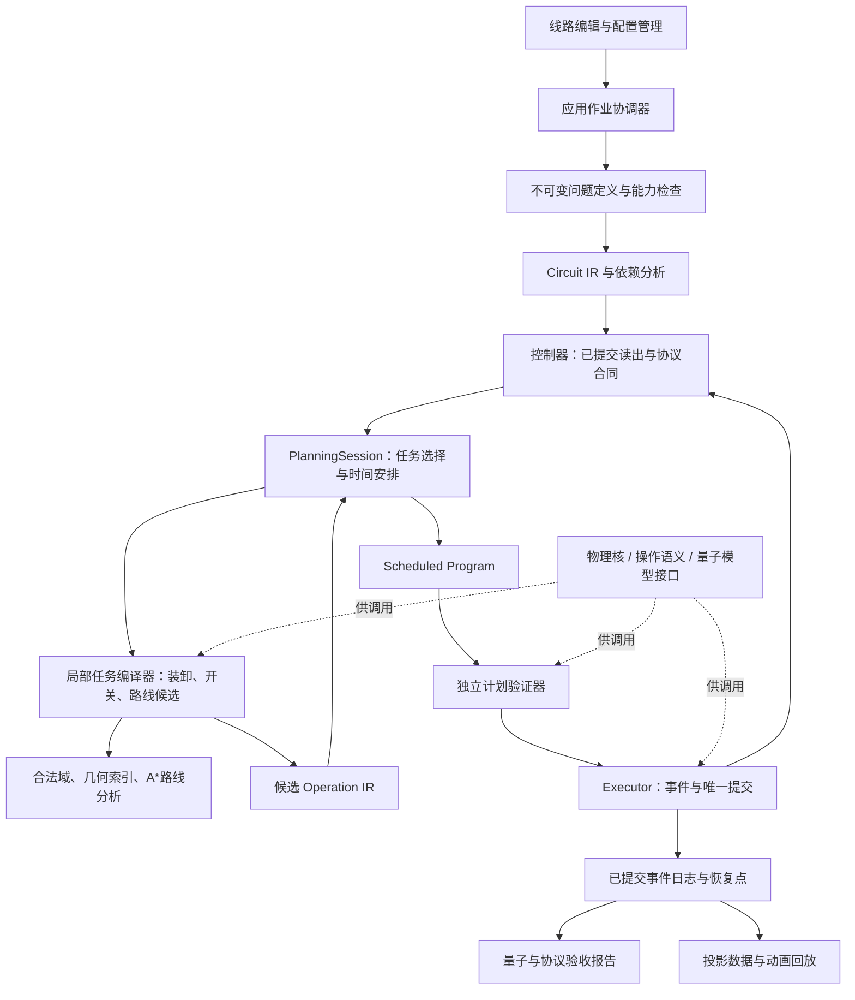
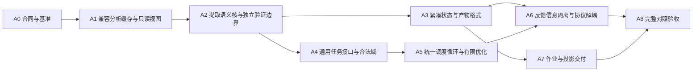

# 分层架构演进方案与实施路线

2026-09-13研究补充：[外部编译器对照](external_compiler_research.md)。ZAC/MQT/Bloqade源码支持任务、布局/运输接口与程序解释器分层；建议在A4–A5明确批次/落点双向代价，并在A6接入可选QEC离线优化前端。均为待评审建议，未改变本方案的实施状态。

日期：2026-09-13。状态：**PROPOSED，供架构评审；未实施迁移**。

本文在现有 M0–M4 与受限 QEC 成果上提出演进路线，不重定义物理模型，不把已有有限案例扩大为任意布局完备性或全噪声容错。当前运行状态仍以 [handoff](../instruction/handoff.md) 为准。前轮性能实测见 [耗时分析](compile_performance_analysis.md)；具体工作包与验收见 [实施清单](architecture_evolution_backlog.md)。

## 1. 建议做出的架构选择

保留本地 Python 后端、单个运行实例的唯一 Executor、现有物理规则和共用 viewer。先让数据和职责的边界落实到接口，再更换热点实现。采用可逐步替换的模块化单体；当前没有证据需要微服务、分布式状态或全面转用另一语言。

最重要的五项决定是：

1. **编译产物、运行产物、验证产物分开。** 操作程序说明应该做什么；ExecutionTrace 说明某次运行实际发生什么；VerificationReport 说明哪些结论已验证。完整动画来自实际运行轨迹。
2. **静态问题定义、当前运行状态、历史记录分开。** 编译候选不再携带整个累计 trace；静态 circuit/world 不在每个计划重复序列化。
3. **调度器选择任务与时间，局部编译器实现任务，硬件核只判断能力和物理合法性。** 逻辑依赖就绪、可构造候选、物理可执行分别表达，不混为 READY。
4. **仿真私有真值与控制器可观测信息分开。** 路线与调度不读取未来测量、量子态或模拟 RNG；反馈只能消费已提交的报告位。
5. **优化依靠可复用分析与有明确失效条件的缓存。** 将已有正确性检查组织成边界审计、增量核验和独立离线验收；不是设置一个“跳过物理检查”的快速模式。

推荐在固定非均匀 rigid AOD 上完成这轮架构重整，再开展动态变距、多 AOD 或 RL。后三者需要的接口应被预留，但不纳入本轮已经支持的能力。

## 2. 当前分层：哪些有效，哪些仍耦合

有效部分包括：holder 是位置来源；DAG 与几何分开；backend 支持纯预测；Executor 是提交者；界面支持配置与线路分开；独立 replay 验收；A* 路由；真实批量 CZ/Raman；真实测量与条件纠正。这些应保留。

但目录分层尚未完全变成职责分层。此次只读 AST 审计覆盖 111 个 Python 文件：hardware→simulation 2 处 import，motion→simulation 9 处，simulation→motion 52 处，simulation→visualization 1 处，visualization→simulation 13 处。这里统计静态 import 语句，包括局部 import，不是调用次数，也不是所有依赖都错误。[原始依赖清单](../artifacts/architecture-review-2026-09-13/dependencies.json)

| 已核实的耦合 | 具体后果 | 建议边界 |
| --- | --- | --- |
| `SimulationState` 同时含 world/circuit、当前状态、RNG、trace、指标，并直接导出 checkpoint | 候选指纹需要接触越来越长的历史 | 当前状态只引用静态定义；历史和 codec 外置 |
| `CompiledPlan` 含整份 `initial_dag`、初始量子态/RNG、物理操作与资源 | 一个“计划”兼任恢复快照和某次 shot 预测 | 可执行程序、运行绑定、量子运行上下文独立 |
| `motion.program` 调用 `simulation.operation_program.audit` 和量子 effects | 预测、审计、执行通过 runtime 大模块交织 | 提取共享操作语义与独立 verifier，runtime 只负责提交 |
| `hardware.raman` 导入条件求值和量子跟踪能力检查 | 物理光能力与当前模拟器是否支持 T 耦合 | 已解析的发光请求进入 physics；模拟能力单独检查 |
| `simulation.qec_temporal*` 导入特定实验的历史 ID 和 correction prefix | 协议验收要求与特定调度入口捆绑 | 协议合同/历史校验由应用控制层调用，通用策略只读依赖和已知结果 |
| qec、patch、m4 多个 runner 各持有选择、编译、提交、drain 的循环 | 更换策略不总是更换同一接口中的选择函数 | 共用 orchestration loop，逐个迁移既有策略适配器 |
| 构建、submit、pending start、start reducer 多次完整 audit | 明显重复成本，边界职责不清 | 私有预测、选中计划审计、运行提交分别建模 |
| 独立重放仍复用一部分相同语义函数 | 能查编排/状态不一致，但不能发现共享内核的所有数学错误 | 保留 replay，并对几何/量子核增加独立 oracle 与反例 |
| workbench `compile_input` 同时执行、记录、生成摘要；worker再导出大量结果并通过管道返回 | “编译”耗时混有不同阶段，结果体积带来 IPC/加载成本 | 应用作业分阶段，返回 manifest 与分块产物引用 |

已有 `_expected_prefix` 和 trace 编码/解析缓存不可忽略。不是每事件无缓存重放所有物理历史；真正仍待解决的是全历史扫描、大对象编码/哈希、重复完整计划审计和局部核的重复全量检查。

当前调度器拿到全 `SimulationState`，包含 RNG/量子态；这说明**接口没有隔离这些信息**，并不证明现有策略已经利用未来测量结果作弊。架构目标是从类型与调用方向上消除这种可能，避免未来比较策略时引入隐性先验。

选型也应有反证，而不只列新模块：

| 备选方案 | 可能收益 | 当前不作为主路线的原因 |
| --- | --- | --- |
| 继续只增大cache与timeout | 改动小，可缓解已知容量阈值 | 不消除每计划全DAG/全历史处理，内存继续增长 |
| 一次全面重写为C++/Rust | 数值核与数据布局有潜在收益 | 迁移风险大，重复数据与职责耦合仍可能原样搬过去；先profile热点 |
| 整个电路交给单个CP-SAT求解 | 可统一一些离散选择与资源约束 | 精确移动/空阱扫掠、状态依赖和反馈未成为紧凑模型；先用小窗口候选服务 |
| 直接引入完整MLIR/QIR基础设施 | 丰富IR/pass/生态互操作 | 项目当前瓶颈不是缺LLVM；先借鉴边界和分析失效机制，保持轻量接口 |
| 预先枚举全部合法动作 | 查询可能便宜 | masks×pose×holder×支撑状态巨大，动态状态使全表难复用 |
| 为每层启动服务/多进程 | 隔离与并行 | 当前已有GB级数据，先拆进程会增加IPC/复制和状态一致性成本 |
| 降低验证频率换速度 | 表面上快 | 没有证明增量检查等价时，会改变正确性合同；不采用 |

推荐的模块化单体允许以后替换几何核、solver或量子模型，不要求现在就为这些尚未证实有收益的替换付出全部迁移成本。

## 3. 目标结构：主链路与支撑模块

以下名称均为目标概念或建议新接口，不表示已有 API。



图表示数据流与调用协作，不是 Python import 图。SESSION 与 LOCAL 的反馈经值对象和接口进行；双方都不导入另一方具体实现。应用层负责组装。量子模型只在需要真实量子更新的运行/独立核验路径使用，几何路线层不需要访问它。

| 层/模块 | 拥有的决定与真值 | 输入→输出 | 不承担 |
| --- | --- | --- | --- |
| 应用层 | 本次问题配置、作业生命周期、产物目录、取消和预算 | 草稿→冻结 RunRequest/作业状态 | 光学合法性、替算法搬原子 |
| 电路语义层 | 门语义、依赖、结果依赖、优化映射 | CircuitSpec→CircuitIR/分析 | SLM 地址、路径和 AOD 资源 |
| 控制与协议层 | 已报告经典位的使用、decoder/合同检查 | ClassicalStore→已知条件/下一决策点 | 偷读真投影/未来 RNG、调整物理约束 |
| 调度层 | 先做哪些任务、保留哪些原子、何时释放资源 | PlanningView+候选→ScheduledProgram | 直接修改 live holder、假定未验证路线可行 |
| 局部任务编译层 | 如何实现指定目标和允许终态 | TaskRequest→有限候选及失败原因 | 固定全电路次序、强迫所有门往返 |
| 可行域/路径分析 | 几何必要条件、捕获闭包、合法边、距离下界 | 相关几何视图→查询结果 | 未证实的全局最优、静默加灯或改掩码 |
| 物理与操作语义核 | 物理能力、时长、支撑、扫掠、作用对、开始/完成效果 | 值对象→判断/纯状态增量 | 策略选择、UI、文件、作业 |
| 量子模型 | 声明模型内的态演化、投影与 RNG 消耗 | QuantumContext+效果→新上下文/读出 | 路径选择、全局调度 |
| 计划/运行验证器 | 独立派生约束与期望状态 | 程序+起态→验证结果；新事件→一致性检查 | 调用默认 compiler 重做同一方案自证 |
| Executor | 事件队列、唯一原子性提交点 | 已验证程序+事件→提交状态与事实日志 | 搜索新路线、随机换方案 |
| 保存与观测 | 可重建证据、索引、投影缓存 | 已提交事实→checkpoint/报告/动画 | 改变物理位置、提前展示测量结果 |

不建议机械地“每层一个服务器”。先在同一进程内隔离职责与数据；当前作业 worker 进程继续用于隔离、取消和资源管理。

## 4. 四种 IR 与三类产物

### 4.1 中间表示

| IR | 表达 | 关键字段/约束 |
| --- | --- | --- |
| CircuitIR | 需要执行的量子/经典语义 | 稳定 source ID、qubit、门型、依赖、报告位引用、显式条件；不含路径 |
| TaskRequest / ServiceCandidate | 希望实现的任务与其局部实现选择 | 效果集合、允许原子/站点/终态、保持条件、预算；候选含前置条件、预计物理终态、成本范围 |
| OperationIR | 实际设备动作图 | MOVE/LOAD/OFFLOAD/SWITCH/PULSE/MEASURE/RESET/CONTROL、完整 bindings、实际参与/附带集合、依赖与资源需求 |
| ScheduledProgram | 可执行的操作时间表或带反馈边界的程序块 | OperationIR、时间区间、条件、read/write set、模型版本、前置状态要求、终态合同 |

CircuitIR 先覆盖当前有限 DAG、测量和 X/Z 条件槽，不借重构之机宣布支持任意循环/动态分配。Task 不一定带门：停车、释放 AOD、换载荷、最终归还均为合法任务。移动不改变 qubit 身份，holder 是唯一位置来源。

门批次与程序块不是同一概念：同类 H 可在一个 pulse 批次完成；多个同时运行的操作仍各有资源和事件；一个批次中每个逻辑效果有独立 provenance。

电路优化若消去 HH，需要显式源映射“两个输入门→等价消除”，运行 exactly-once 检查针对优化后效果；UI不能给被消除门伪造激光事件。第一轮迁移保持线路和门次序，等接口稳定后再启用语义优化 pass。

### 4.2 三类产物

| 产物 | 回答的问题 | 不可以声称 |
| --- | --- | --- |
| ProgramArtifact | 在声明前置条件和反馈语义下应执行什么？ | 某次运行已经完成；所有未知分支都已有合法路线 |
| ExecutionArtifact | 哪个输入/程序/模型/seed下，发生了哪些实际提交事件？ | 单轨迹代表所有测量历史或所有布局 |
| VerificationArtifact | 对哪个内容哈希的产物，检查过哪些性质、范围是什么？ | 成功播放等于物理/量子完整验证 |

当前四逻辑动画是确定 seed 下的一条完整已验收执行轨迹。另有声明单事件历史矩阵和协议证据；两者应引用各自验收范围，不能把一条动画叫作覆盖所有自适应分支的通用可执行程序。

作业界面可以保留一个“编译并生成动画”按钮，但内部与状态栏分别报告：检查输入、规划/安排、仿真执行、独立核验、生成回放。未来离线编译完成和仿真完成是不同状态。对带反馈的滚动模式，规划和执行会交替；阶段耗时按实际片段累加，不能伪造为完全串行的一次流程。

## 5. 测量反馈：最需要先明确的架构边界

### 5.1 控制器只能看到什么

`PlanningView` 包含几何、holder、当前 masks、可用资源、逻辑 frontier、已报告经典位与已知操作历史摘要。它不包含 `quantum_state`、真实投影位、内部 RNG 状态、未来噪声注入事件或尚未提交的测量结果。

`QuantumContext` 和模拟噪声属于运行器私有上下文。规划自己的随机 tie-break 使用独立搜索 RNG，不消耗模拟器测量 RNG。审计器可以读取完整上下文复现实验，但不能把预测结果返回给调度评分。

将 `condition_applies` 提取为只依赖门条件、结果存储和完成状态的纯经典语义函数；将“模拟器不支持 T”与“物理光允许 T”分开诊断。普通物理模式支持 T 而 Clifford QEC 不支持，属于两个能力集合的交集，不应通过 hardware 导入 simulator 判断。

### 5.2 推荐的过渡方式

先保留现有实际测量顺序和 1 μs 条件控制槽，提供两种明确执行合同：

- **静态/条件程序**：路线与载荷不依赖未知读出；编译保留条件，运行时按报告位决定打光。条件两支的支撑、资源、时长语义均需验证；不提前把未知位替换为 seed 对应结果。
- **报告驱动的滚动控制**：到声明决策边界，读取已提交报告，再规划后续块。产物是控制器/程序块加本次轨迹；尚未规划的分支不标为已经全部验证。

若未来希望让 decoder 结果改变后续移动、进行真正在线硬件反馈，还要明确经典计算/控制通信时延与 coherence 假设。当前离线 Python 求解耗时不能自动加进物理时间，也不能假定真实硬件反馈免费；这属于另一次物理/系统模型评审。

量子程序将测量结果用于经典控制流是成熟的表达方向，可参考 QIR Adaptive Profile，但本方案只借鉴信息流边界，不立即引入 QIR/LLVM 或宣称兼容完整 Adaptive Profile。[QIR 官方规范](https://github.com/qir-alliance/qir-spec/blob/main/specification/profiles/Adaptive_Profile.md)

### 5.3 协议与调度分离

surface 模板生成器输出普通 CircuitIR，并附 `VerificationContract`（稳定子/逻辑观测量、报告历史条件、声明故障族、终态）。decoder 通过经典结果接口返回纠正请求。特定历史 guard 由控制/验证合同提供，不能藏在名为某个 compiler 的 runner 里。

编辑线路后的判断分开：物理编译可能成功；完整 GHZ/QEC 协议可能因缺门或缺历史而不满足。不能为了让协议通过而自动补门或替换用户线路。用户显式选择保留的强制控制前置条件仍须满足，否则返回明确错误，不能通过换策略绕开。

## 6. 状态模型与缓存规则

### 6.1 拆分什么，为什么

| 对象 | 内容 | 更新/持有者 |
| --- | --- | --- |
| ProblemDefinition | circuit topology、world geometry、hardware model、初态与terminal、版本 | 作业冻结后不可变、内容寻址 |
| LogicalRuntime | 门状态、剩余依赖数、就绪索引、已执行任务 ID | Executor提交逻辑增量 |
| PhysicalRuntime | holder、AOD完整行列几何/掩码、SLM masks、交接、在途操作与资源 | Executor提交物理增量 |
| ClassicalRuntime | 已完成测量的报告位、结果依赖/可用时刻 | 仅测量/控制完成提交 |
| QuantumContext | tableau、RNG、模拟器内部真值、噪声上下文 | 运行中的量子模型，经Executor提交 |
| EventJournal | 已提交事实、顺序、program引用、读出与效果、历史根 | 运行提交/持久化适配器 |
| AnalysisStore | 依赖分析、几何索引、route graph、候选几何、只读解析结果 | 可丢弃缓存，不成为真值 |
| ProjectionStore | viewer关键帧、统计、门→事件索引 | 日志派生，可重建 |

先用只读 view 和适配器落实消费边界，暂时不拆底层存储格式；随后引入静态定义引用与紧凑runtime，最后迁移checkpoint/指纹。这样能逐步验证，不需要一次换掉所有类。

### 6.2 ID 与 revision 不是一个数

- `problem_id` 绑定静态定义，`run_id/lineage_id` 区分一次执行与分叉。
- `event_seq` 保留已提交事件序；`control_revision` 覆盖入队/取消等未增加event_seq的变化。
- geometry/logical/classical/reservation 等分量有独立内容身份或可靠修订标识。
- 顶层程序提交先采用保守的完整当前起态绑定。只有声明并验证 read/write set 后，才允许对不相关分量变化复用候选。

不能只按 `state.version` 缓存验证通过；当前 enqueue 不增加该版本，预测分支也可同版本不同状态。不能用名字、对象地址或 planner_id 授权。相同内容摘要用于发现不一致，不是防止攻击者协同伪造全套数据的认证签名。

### 6.3 缓存依赖表

| 分析 | 至少依赖 | 可以保留的变化 |
| --- | --- | --- |
| 静态 DAG/关键路径下界 | circuit topology、相关成本模型 | 原子移动；纯展示变化 |
| READY索引 | LogicalRuntime、结果依赖 | 无关几何变化 |
| 通道拓扑 | world边界、完整AOD相对几何、半格规则 | 门完成；一般起终点作为请求附加 |
| 合法路线边 | 拓扑、所有相关活动交点、holder/存活状态、SLM状态、交接权限、邻点预约 | 无关量子振幅/模拟RNG；guard关闭时无需下一CZ信息 |
| 1Q可用时间窗 | 目标与邻居轨迹、支撑、光模式、时间资源 | 不相关远处逻辑门；需证明几何无影响 |
| 捕获闭包 | pose/axes、行列掩码、所有相关静态占据 | 门标签更名 |
| 已验证program | program内容、完整适用前置状态、模型与checker版本 | 仅显示设置；更细复用后续评审 |
| 动画投影 | committed trace、viewer schema、展示配置 | 策略选择不改旧run；不得重新解释历史为新策略 |

沿用编译器的 analysis manager 思路：只读分析按需缓存，变换必须声明哪些分析保持有效，其余失效；不把缓存规则散落为多个不透明全局字典。[MLIR 官方分析管理](https://mlir.llvm.org/docs/PassManagement/)

## 7. 硬件核、合法域与调度的契约

### 7.1 物理模型合同保持

本轮沿用已确认规则：AOD是开启行×开启列全部交点，非均匀间距有效；rigid保持相对offset；活动空阱也扫掠；装卸先建立双支撑、完成才换holder；长运输走2.5+5k正交通道且接入段合法；1Q固定1μs、同类型可并行、距离≥5μm；CZ为完整EZ实际作用对精确等于目标集合、2μm各向同性代理；测量/复位按现有MZ及仿真假设执行。四邻禁停是单独可配置规则，不擅自更改。

硬件能力、规划器支持范围与验收覆盖分别列出。例如：硬件backend有row_column方程，不等于当前策略会搜索动态变距；98交点容量不等于98原子能独立移动；规划失败不等于硬件不允许。

四邻禁停规则尤其需要组合边界：当前`hardware.ez_neighbors.next_cz`读取线路以确定下一伙伴，它是带逻辑上下文的安全合同，不能强行塞进一个完全不知道线路的距离函数。建议由独立的约束投影器根据LogicalRuntime与holder派生`NeighborReservations`，physics只检查这些保留点是否被无关原子占据；完整verifier重新核对预约的来源。scheduler不能自己声明一个任意伙伴来获得豁免。规则仍是“允许经过、禁止无关停驻”，默认开关与当前surface关闭配置不变。

### 7.2 局部任务接口草案

```text
TaskRequest:
  requested_effects / allowed_atoms / allowed_sites
  target_domain / terminal_options / invariants_to_preserve
  earliest_start / deadline_if_declared / search_budget

ServiceCandidate:
  required_preconditions / operation_graph / resource_requirements
  predicted_physical_terminal / classical_dependencies
  cost_estimate_or_exact_cost / estimate_kind
  scope / geometry_evidence / rejection_or_truncation_summary
```

上述是设计草案。粗筛候选不得冒称物理已通过，完整候选必须经过最终独立plan验证。预计终态不夹带尚未知的量子投影真值；几何实现可预测holder/masks，未来条件效果仍保留条件或分支合同。

### 7.3 构造合法域，而非全量白名单

按当前姿态/轴偏移构造可抓取矩形，使用行列集合和bitset提前排除容量、对齐和捕获闭包冲突；把可能随带的原子显式记入候选。相同位移的READY CZ归组，检查整个EZ的额外作用对。不能仅凭两两无冲突就认定整个矩形合法。

保留单原子/小批次和已有构造基线作为支持族内回退；所有截断标明范围。固定7×14的非空mask已超过208万种，因此不预建跨全部pose/occupancy的合法动作表。

路线服务复用静态图和适用的合法边；边有未知/合法/非法三个状态。碰撞算法先做空间索引粗筛，再精确检查，减少远处对象的计算；不放大通道或缩小clearance。

### 7.4 调度不能只看门是否共享qubit

资源合同同时表达：逻辑依赖；atom/holder冲突；单台AOD联动；交接与开关；同类光模式兼容；全局EZ脉冲的实际参与集合；几何扫掠产生的时间窗口。

单纯给所有Raman一个全局exclusive lock会错误串行化；完全不锁光模式又会允许H和X非法同时打光。应表达“同模式可共享、异模式互斥”的约束，同时保护每个目标。全局CZ批次则统一核验真实作用集合，不能把两个独立小批次分别合法当成叠加后必然合法。

`SimulationTimeUs`与`WallDurationSeconds`应在接口上区分，防止搜索秒数与设备微秒混算。首轮保留现有浮点表示、容差与确定事件排序；若以后改整数tick，需要先证明所有模型时长/运动轨迹可表达并单独迁移，不能任意四舍五入以制造性能或确定性改善。

不共享qubit的SLM 1Q可以与运输重叠，但移动原子经过近邻时仍会缩短合法打光窗口。scheduler只能在局部编译器/物理分析给出的适用窗口中安排，并对最终时间表再验证。

先保留现有“已提交程序块执行到明确边界再规划”的控制方式，在块内增强并行；不要同时引入任意在途插单、多AOD和动态变距。后续允许在其他操作运行时提交新块，需要预留区间、读写冲突和连续轨迹组合验证，是独立里程碑。

## 8. 独立验证与唯一提交

推荐区分四种检查：

1. **输入/能力检查**：模型、门集、条件引用、初态结构和合同是否支持。
2. **候选预测与快速拒绝**：私有状态推演、必要条件、成本估计；拒绝是正常搜索结果。
3. **选中计划的独立审计**：由真实动作派生支撑、路径、资源、效果和终态，不信任候选填入的统计值。
4. **运行增量核验与离线全重放**：每次检查新事件与独立期望状态；保存/恢复和正式验收做完整一致性检查。

验证“独立”指不依赖策略自己的答案，不等于复制所有数学实现。共享几何语义可以防规则漂移，但会共享bug。因此测试层同时使用独立小规模几何oracle、手工可计算案例、Clifford矩阵/另一表示对照、篡改负例与变形测试。

以后可给通过审计的计划附内部 ValidationReceipt，绑定完整program、前置分量身份和checker/model版本，供重复边界复核复用；外部JSON自行声称valid无效。Receipt不是取消运行变化检查的许可，状态/queue/权限变化必须使其失效或重验。

提交仍由Executor组织：校验事件→纯计算下一状态与事实→增量核验→提交→发布。观察器异常不能反向部分提交物理状态；记录失败必须使作业明确失败并指向最后可恢复边界。具体持久化保证需选择并写入合同：进程内提交与已落盘检查点不同，不承诺未fsync数据能抗崩溃恢复。

增加取消检查点，以单个原子性事件或完整计划边界保存恢复点；不能在半次holder转移中静默重启。当前restore支持范围按原合同保留，逐阶段扩大。

## 9. 数据与产物布局

建议新运行目录采用以下概念结构，格式名用vNext，实施前再分配具体版本号：

```text
run/
  manifest.json              内容ID、模型/策略/运行版本、阶段状态、验收引用
  problem/                  静态circuit/world/配置，各存一次
  programs/                 以内容ID索引的操作程序与source map
  events/                   顺序分块的已提交事实，不重复嵌入整份DAG
  checkpoints/              静态定义引用、紧凑当前状态、日志位置/根
  decisions/                候选、拒绝、截断、评分、搜索耗时
  verification/             checker版本、支持范围、失败与通过证据
  view/                     可重建的关键帧、门/原子索引和展示数据
```

Program hash、state identity与history integrity root各有明确含义；旧全snapshot hash和新分块/链式hash不相同，必须版本化。可用周期checkpoint+事件增量恢复，独立导出时打包全部引用，不能让离线动画依赖不可访问的本机cache。

旧schema19样本保持只读参考。第一阶段新组件仍输出旧字节；格式迁移阶段使用显式转换器，记录来源哈希与转换报告。新旧plan ID可不同，比较语义规范化结果；不得手改旧trace使比较通过。

内存缓存有字节上限和run生命周期，超限退化为重算/按需读盘，不发生循环全miss而无指标；不在每个候选复制几百MB历史。并行搜索若后续需要，共享不可变problem数据、每worker只持局部预测，返回候选由单一Coordinator选择，仍只一个Executor提交。

## 10. 界面与配置继续保持简单

后端对象分得更细不意味着UI增加十几个面板。保留“线路方案、平台配置、编译配置”三个用户入口。SimulationSpec/VerificationContract作为线路方案中的实验子配置，默认折叠；动画倍率/图层属于展示，不进入compiler cache key。

配置作用域：平台描述真实能力和几何；编译配置描述选择策略、算法与预算；线路定义门/依赖；初态定义holder/masks；实验定义seed/噪声/量子模型；验证合同定义本次要证明什么。模板可组合这些配置，但策略不能暗改线路、物理半径或故障模型。

编辑只生成新draft revision，手动按钮冻结输入才启动新作业；不恢复自动编译。保存结果永远引用其实际输入和实际策略。新草稿可复用旧分析缓存，但旧动画仍标示旧run，不能因更改策略菜单而换标签。

作业至少区分：输入无效、规划未找到、预算耗尽、物理/内部验证失败、仿真完成、终态满足、独立验收完成、回放生成失败、取消。内部候选拒绝不弹窗；最终失败保留简洁摘要和详细诊断。回放生成失败不能把已成功执行改写成物理失败；完整操作结束但终态未完成也不能标成功。

## 11. 替换式迁移路线

详细任务见 [实施清单](architecture_evolution_backlog.md)。关键依赖如下：



A1可以同时做有收益的字节兼容优化；A3与A4在接口定稿后可分别开发，但本路线不擅自启动多个agent/新任务。A2只提取现有语义，优先保持同事件顺序和同测量分支；A5改变搜索行为后不再要求新旧trace逐字相同，转为语义与物理合同验收。

每次替换只在明确边界选择engine，保留旧实现作短期对照。新引擎失败时报告自身失败，可另行运行旧引擎辅助诊断，但不能静默回退后将旧结果包装为新引擎成功。

采用三种验收等级：B0字节等价（缓存/提取）；B1语义等价（新表示/存储）；B2策略质量（改变调度）。B2同时比较编译墙钟、成功率、内存和物理makespan，不能仅凭编译快宣称策略更优。

## 12. 用具体场景检查这套架构

| 场景 | 目标链路应如何工作 | 能检出什么分层错误 |
| --- | --- | --- |
| 三个不同qubit的H，另一个X也READY | Circuit仅报告READY；物理能力/调度组合H批次，X排在不重叠光区间 | 全局锁误串行H；按qubit独立错误并行H和X |
| 2×2选择三个角抓取 | 合法域求完整closure；无关第四原子则拒绝/明确随带；空第四点仍扫掠 | 把目标原子表当作全部活动trap |
| SLM上H与无关AOD移动重叠 | 路由给实际轨迹；窗口分析排除<5μm区间；scheduler安排；verifier复核 | 只看资源名字，漏掉几何邻近 |
| 测量报告翻转后纠错 | Quantum生成真投影；报告层应用声明翻转；提交报告后decoder返回请求 | 调度偷看真值、测量中点提前展示 |
| 候选已生成后queue改变 | control/reservation版本使绑定失效，即使event_seq未变 | 仅按state.version缓存valid |
| 改一个H为T | circuit仍可表达；物理capability与量子backend能力分别检查 | hardware被Clifford模型误标为不支持T，或QEC静默近似 |
| 改写/删除稳定子测量门 | 普通物理编译与协议合同分别报告；缺报告时控制条件不能执行 | 模板自动补门、换策略绕过历史guard |
| 关viewer或改变32× | 执行与journal完全相同，投影按需重建 | 观察器影响模拟/编译 |
| 在LOAD开始/完成之间恢复 | holder仍按提交阶段，双支撑/queue/持续时间一致 | 只存画面坐标无法恢复物理状态 |
| 全门完成仍有原子未归还 | 进入cleanup任务，terminal满足后才完成 | 以DAG.completed代替整个任务完成 |

## 13. 评审点、风险与范围控制

建议批准的架构方向是模块化单体、三类产物、静态/当前/历史分离、报告位可见性、统一任务与调度接口。实际迁移前应定稿三个较大决策：新状态/指纹与旧schema19兼容方式；runtime增量核验与导入全量核验的边界；QEC采用静态条件程序还是保留滚动控制的首版合同。本文推荐先兼容适配、再vNext格式，先保留滚动控制并支持无需读出决定路线的条件块。

这些是本次交付的可评审设计，不是未完成任务时追加的权限要求；没有在本轮改动它们。若实施时出现物理模型/硬约束需要改动，再提交具体差异与反例按用户既有边界评审。常规工程失败、缓存缺陷和测试脚本问题仍自主修复并保留证据。

主要风险：缓存遗漏依赖；反馈分支与随机消费改变；新日志格式无法续跑；光模式资源过度保守或过度放开；抽象接口过大导致重构无交付；用一个保存GHZ性能替代通用线路验证。分别以依赖表/篡改负例、冻结测量顺序、checkpoint边界矩阵、并发反例、可替换小步交付和输入矩阵控制。

暂缓事项：全局最优承诺、任意布局完备性、动态轴搜索、多独立AOD、全电路噪声容错、真实在线控制延迟、QIR/MLIR全栈接入、RL训练、微服务。接口为后续能力留空间，当前任务不扩大物理事实。

## 14. 本轮完成与下一步

本轮完成现状/目标边界分析、静态依赖审计、信息流与产物合同草案、缓存失效表、迁移路线、场景反例和逐工作包验收。生产代码和现有动画未更改，没有重跑耗时完整编译或把前轮采样当成新性能成绩。

建议第一轮实施范围严格限定A0+A1：建立完整阶段计时、短样本基准、只读视图和静态不可变分析复用，保持schema19、物理规则、策略次序和事件字节不变。先交付可测量收益与接口样例，再进入A2/A3的大框架迁移。
