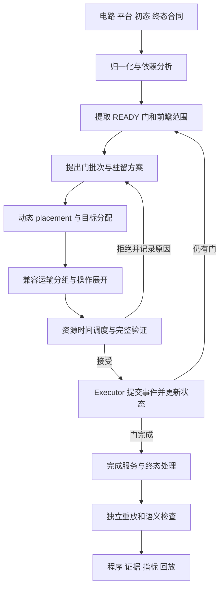

# 中性原子线路如何编译与执行：基于 RAG 的流程指南

日期：2026-09-21。本文衔接 [Placement 初始化指南](placement_initialization_rag_guide.md)，讨论给定物理电路与初态之后，怎样生成可执行、可验证的中性原子操作程序。范围为通用编译流程，不展开 QEC code 设计。

**推荐主线：逻辑依赖分析 → 选择候选门批次 → 决定动态位置与驻留 → 将位置变化编译为装卸和运输 → 安排操作时间 → 验证并执行 → 更新状态，直到满足终态合同。**

各阶段需要清楚的输入输出，也需要失败反馈。例如某个 placement 无法高效路由时，应尝试另一个落点或拆分门批次。一次性分层后不可修改，不是本指南建议的通用结构。

标记约定：**[文献]** 为原文支持的方法；**[现状]** 为本轮源码核对结果；**[建议]** 为综合设计，未因本文而实现。RAG 的 `accepted` 表示证据审阅，不是独立性能复现。

## 1. 什么才算完成了“编译线路”

一份完成的结果，应能回答：每个逻辑门由哪个物理脉冲实现，参与原子如何到位，动作何时发生，占用什么资源，最后原子停在哪里，哪些验证已完成。

| 层级 | 典型输出 | 尚不能推出的结论 |
| --- | --- | --- |
| 逻辑门分层 | 第 k 层包含哪些 CZ/1Q | 这些门在当前几何下可同时执行 |
| 动态 placement | 每个阶段 qubit 的目标 holder/位置 | 存在合法并行运输到达这些位置 |
| 路由与操作展开 | 显式装卸、轴运动、开关、脉冲 | 不同任务在指定时间上互不冲突 |
| 时间调度 | 带开始/结束时间和资源的操作程序 | 程序等价于输入，或连续轨迹必然安全 |
| 验证与模拟执行 | 被接受的操作、trace、末态、验证报告 | 真实光学实验的保真度与设备可运行性 |

**[现状]** 本项目在声明的几何、事件与门作用模型内编译和模拟执行。`ENTANGLING_PULSE` 等是仿真操作，不是 RF/AWG 波形；本指南不声称已有真实设备驱动。

此外要分开两种 scheduling：

- **门调度**决定逻辑先后、可交换范围和候选并行批次。
- **操作时间调度**决定装卸、移动、门脉冲和读出具体在何时发生。

Enola 的近最优结果主要针对特定可交换双比特门组的 Rydberg 阶段数；不能扩展为含运输的最短执行时间。[P03，§III]

## 2. 从哪些文章组合出这套结构

| 文献 | 最值得借鉴的环节 | 使用时保留的边界 |
| --- | --- | --- |
| **Search Smarter, Not Harder，P02** | §2.2/Fig.3 的五步流程：门调度、复用分析、placement、routing、代码生成 | 用作总体导航；论文流程图不是本项目已实现状态 |
| **ZAC，P05** | 相邻阶段复用、动态 gate/storage placement、`rearrangeJob`、资源与依赖调度 | 最大复用数不等于最短时间；多 AOD 能力不能直接移植到单 AOD 项目 |
| **Enola，P03** | 依赖子电路与可交换门组分开调度；移动兼容图与极大独立集分组 | 逻辑分层保证有明确前提；默认路由启发式不提供全局时间最优 |
| **Routing-Aware Placement，N002** | 在放置时提前考虑兼容运输组及重排时间 | 主要改 placement 与 routing 的耦合；不能把 A* 名字当作最优证明 |
| **Weaver，N105** | 硬件无关/硬件感知编译分层、显式动作 IR、从实际位置恢复脉冲对应门并检查等价性 | 论文方法、特定实现与本地验证范围分别记录；等价性不替代全程几何验证 |
| **OLSQ-DPQA，P01** | 将位置、载体、行列和门阶段共同编码进约束模型 | 可作为受限模型的求解对照；最小阶段数不是最短物理时间 |

来源：[P02](https://arxiv.org/html/2512.13790v1)、[ZAC](https://arxiv.org/html/2411.11784v4)、[Enola](https://arxiv.org/abs/2405.15095)、[Routing-Aware Placement](https://arxiv.org/html/2505.22715v1)、[Weaver](https://dse.in.tum.de/wp-content/uploads/2025/01/Weaver-CGO-25.pdf)、[OLSQ-DPQA](https://arxiv.org/html/2306.03487v5)。版本及本地证据见第 14 节。

**[建议]** 用 P02/ZAC 组织整体步骤，用 Weaver 思路规定阶段之间交接的数据，用当前环境负责物理合法性；各阶段算法可以替换。没有必要让每个算法各建一套物理模型、执行器和动画。

## 3. 输入、状态、输出应先固定

### 3.1 编译任务的输入

| 输入 | 必须明确的内容 |
| --- | --- |
| 电路 C | 门类型、参数、gate/qubit ID、依赖、测量输出和条件控制语义 |
| 平台 H | world/zone/trap、AOD 能力和容量、门作用模型、运动与装卸参数 |
| 初态 S₀ | holder、SLM 开关、AOD 轴和 masks、初始时间、已知经典结果；需要时含量子态 |
| 终态 Θ | 合法稳定结束，还是恢复指定绝对 holder/开关/AOD 配置 |
| 优化目标 | 总完成时间及次级指标；是否计入初态装配、最终清理 |
| 搜索合同 | 算法版本、seed、beam/模型/路线/墙钟预算、回退方式 |

静态几何与运行态分开：SLM 站点存在，不代表该站点已开启；原子坐标由其 holder 与当前 AOD 轴推导。初始化优化只在建立环境前选择 S₀，运行中的位置变化必须有真实操作。

### 3.2 中间数据建议分四层

下列是**建议的语义结构，不是声称已有同名 API**：

1. **Circuit DAG**：只保留量子/经典依赖与可证明的交换信息，不放入路线搜索。
2. **StageIntent**：候选 gate IDs、允许的目标区域/位置、驻留偏好、可拆分范围。
3. **MovementJob / OperationGraph**：受影响原子、源/目标 holder、装卸与移动操作、依赖、资源、预测终态。
4. **ExecutableProgram**：具体操作时间、起态版本/指纹、验证结果和 gate-effect 对应关系。

每层都应保留来源关系：输入 gate → 编译后 gate → task/job → operation → 实际事件。准备和搬运任务可以没有 gate ID；一个脉冲可以完成多个 gate；同一个 gate 的语义效果只能完成一次。

### 3.3 最终输出

至少包含规范化电路、完整平台和合同、初末快照、可重放操作计划、逐事件 trace、gate-to-pulse 映射、决策与拒绝日志、物理时间和编译墙钟、验证范围。可视化从执行记录生成，不能另造一条看似相同的运动动画。

## 4. 总体执行流程



图中是建议的统一结构。当前普通有序策略把一个批次的准备、脉冲和返回封装为完整服务；尚不能由图推断它已支持任意跨服务并发。

编译器可以先在私有预测状态中生成整份程序，再执行；也可以在离线模拟器中边编译、边推进并记录计划。本项目当前控制循环主要采用后一种形式。这是生成和验证计划的方式，并不意味着已经接入真实硬件的在线控制。

## 5. 步骤一：规范化电路并建立逻辑依赖

**输入：** 原始门序列及其语义。**输出：** native gate 电路、映射记录、依赖 DAG。

1. 验证 ID 唯一、操作数存在、参数合法，拒绝平台或程序不支持的门。
2. 需要分解时，将门降到 backend 支持的基底，并保存原始门与展开后门的对应关系。
3. 仅使用有语义依据的合并、抵消和交换；含测量/reset 的程序不能只用酉矩阵解释。
4. 建立每个 qubit 的操作顺序和经典结果依赖；暂时未知的分支条件必须在程序或控制流中显式保留。

**[文献]** Weaver 将通用编译与硬件感知优化分开，并在变换后检查等价性。[N105，§3.2、§6]

**[建议]** 第一版可以不做门重综合，直接保留已给定 PhysicalCircuit 的依赖。这样“门恰好执行一次”有清晰含义。后续加入抵消或分解时，验收改为对规范化电路逐门检查，并另验证它与原电路的语义关系。

## 6. 步骤二：选择下一批门

**输入：** 当前已提交状态 S、READY frontier 和有限前瞻。**输出：** 一个或多个 StageIntent。

READY 仅表示前驱已完成。选择 CZ 批次还要考虑 qubit 不重叠、可用作用位置、AOD 容量、区域保护及实际作用集合。

建议先实现依赖保持的 frontier 贪心：保留单门候选作为回退，再逐步增加互不共享 qubit 的门。可以按关键路径、等待年龄、预计服务时间等排序，但它们是策略选择，不是物理约束。

**[文献]** Enola 对保留依赖的子电路使用 ASAP，对给定的可交换门组使用边着色。[P03，§III] 因此，边着色只能应用在交换性和边界已经证明的范围内；不能越过不对易的 1Q 门或测量，把任意 CZ 图直接重新排序。

**[建议]** 不要把最大门批次作为唯一目标。两个候选中，大批次可能要更多装卸、停车或绕路。应保留不同批次大小的少量候选，用已实现的物理服务时间和预测终态比较；若选择吞吐率启发式，也标明它不保证全程序最优。

不要永久规定“所有 1Q 优先于 CZ”：同类型 1Q 合批是可用策略，但未来若支持资源重叠，需要按真实资源和依赖判断，不能无条件套用全局门层屏障。

## 7. 步骤三：动态 placement 与 reuse 联合决策

**输入：** 候选批次、当前 holder/空位、下一阶段交互。**输出：** gate 目标构型、原子目标 holder，以及后续允许的驻留状态。

### 7.1 gate placement 与 storage placement 分开表达

- gate placement：门在哪个合法纠缠位置执行，移动谁、固定谁，目标伙伴间距是多少。
- storage placement：不继续参与作用的原子卸在哪里，哪些空位需要留作 buffer。
- reuse：哪些原子保持当前位置，服务未来门。

**[文献]** ZAC 用相邻阶段门之间的匹配提出复用候选，再比较带/不带复用的放置。其 gate placement 与非复用原子的 storage placement 是不同决策。[P05，§V-B]

**EZ 的 SLM 驻留与留在 AOD 上不同。** 前者可能释放运输设备；后者占据移动 trap 和轴资源，并影响其它原子的抓取。输出必须包含 holder，不能只给一个二维点或 `reuse=True`。

### 7.2 如何比较候选

**[建议]** 同时构造“不驻留”“保留选定原子”以及少量替代落点。在目标站点分配中先满足排他占用和门构型，再估计兼容运输组；不要只求 gate→site 的最短距离匹配。

可用短前瞻目标：

\[
J(c\mid S)=T_{\mathrm{service}}(c\mid S)
+\lambda\widehat T_{\mathrm{future}}(S_c,L_{\mathrm{next}}).
\]

Tservice 来自已展开并验证的候选服务；预测终态 S_c 用于未来评分，未来项仍是估计。λ 是待验证超参数。若候选覆盖的门集合不同，未来项必须包含各自尚未完成的工作，不能简单把“少执行一些门所以更短”的候选判优。

**[文献]** Routing-Aware Placement 将兼容搬运组及其时间纳入放置搜索，并使用后续交互信息。[N002，§IV–V] 这是把 placement 与 routing 联系起来的主要依据，不代表本文已经实现联合全局搜索。

## 8. 步骤四：把目标位置编译为真实运输

这是从“几何答案”到“可执行程序”的关键步骤。输入是源状态和目标 holder，输出应是显式操作序列或操作 DAG。

### 8.1 先做运输分组

对拟同时载运的原子，按 backend 检查同源行/列的目标一致性、行列不交叉/不合并、最小轴间距和容量。

**[文献]** Enola 将移动之间的冲突编码成图，用极大独立集提取兼容组。极大独立集是无法再加入当前顶点的可行集合，并非保证顶点数最多的最大独立集。[P03，§V]

这个冲突图只覆盖被编码的兼容条件。相对行列次序满足，不足以证明路径安全或拾取集合正确；本文建议后端继续做完整检查。

### 8.2 抓取必须检查全体活动交点

AOD 开行集合 R 与开列集合 C 会产生 R×C 的所有活动 trap。希望只抓对角线上的两颗原子时，另外两个交点也可能捕获旁观原子。

处理方式只能使用 backend 真正支持的操作，例如合法分批、逐行抓取、显式 parking 或附带原子运输；后者必须计入状态、路径、门作用和卸载，不能从记录里省略。

**[文献]** ZAIR 的 `rearrangeJob` 是位置变化到机器指令的接口；ZAC 明确描述逐行抓取和必要的 parking，以避免非目标交点拾取。[P05，§IX] parking 也必须占时间并验证扫掠，不能是免费坐标调整。

### 8.3 展开每个运输 job

按当前状态生成所需步骤，而非每次机械追加固定动作：

```text
准备可用支撑及目标空位
→ 空 AOD 定位/轴重配置（需要时）
→ 建立交接对齐与目标支撑
→ LOAD，并确认全部实际捕获原子
→ 分段运动/停车/有序轴变形
→ 目标对齐与 OFFLOAD（该方案需要卸载时）
→ 验证后态及资源释放
```

gate 可以在合法静止 AOD 或 SLM holder 上执行，取决于 backend；不要求所有方案都先卸载。运输到邻近位置也不会自动完成 CZ，门效果只在对应脉冲上提交。

如果目标位置已被占用，先编译搬离操作；置换环可能需要显式空 buffer。不能用同时替换整张 mapping 绕过占用冲突。

### 8.4 路径验证与回退

检查整段轨迹，而非仅起终点：原子间距、活动空 trap 与静态原子、轴次序与范围、停靠与交接期间支撑。非线性时间轨迹按实际运动模型校验；简单稀疏抽帧不足以构成连续安全证明。

路线失败后可尝试不同通道、不同移动端、换落点、拆运输组，最后回退到较小门批次。所有尝试都有预算和拒绝原因。单原子回退也仅是候选方法，不保证任意障碍布局都能完成。

## 9. 步骤五：安排具体时间，再提交执行

### 9.1 调度的是操作图

节点是定位、装卸、运动、脉冲和测量等操作；边包括：

- 原电路的量子与经典依赖。
- 同一原子的准备、门和后处理顺序。
- trap 空出后才能被下一个原子占用的依赖。
- 装卸、轴配置、光照与资源使用的前置条件。

对操作 o，开始时间至少满足：

\[
s_o\ge\max_{p\in\operatorname{pred}(o)}(s_p+d_p).
\]

随后还要寻找资源可用窗口；同 AOD 上不兼容的运动不能重叠。仅取前驱完成时间的最大值，并没有解决资源调度。

**[文献]** ZAC 区分 qubit 与 trap 依赖，并利用 job 内部装卸/运动的完成时刻安排执行；多 AOD 时另有 job 分配。[P05，§VI] 在本项目单 AOD 情形，只借鉴依赖与时间表达，不能宣称多 AOD 并行已实现。

### 9.2 门完成与服务完成分开

准备动作只改变物理状态；脉冲完成提交 gate 效果并释放逻辑后继；后处理可能仍占用该原子或设备。后继 READY 后也必须等物理资源可用。

**[建议]** 开始时可以保持完整服务串行，便于验证。后续若拆分服务实现重叠，需要操作级资源和状态绑定；不能只把原时间戳向前挪来制造并发。

### 9.3 提交时绑定权威状态

计划附起态版本及指纹。在预测分支里得到的末态只用于比较，不能直接安装到 live env。提交前由独立 validator 检查，过期或非法计划整体拒绝；不允许提交一半。

**[现状]** 项目已有 `env.validate(plan)`、`env.submit(plan)`、`env.step()` 和 `env.run()`。`env.run()` 只执行已经提交的事件队列，不会自动编译剩余电路。状态更新由 Executor 完成；策略必须重新读取更新后的状态，才能继续规划。

## 10. 完成条件、验证与失败处理

### 10.1 完成应同时满足三个条件

1. 规范化电路所需门效果已完成，条件控制按实际已报告结果处理。
2. 已接受操作全部结束，无 pending 事件、未完成交接或非法支撑状态。
3. 终态合同 Θ 已满足。

`stable` 允许不同合法末位置，但必须完成服务收尾；`fixed` 要恢复声明的共同绝对末态。不能通过截掉最后归还的日志，把 fixed 的结果改称 stable 的实测结果。

### 10.2 三类验证分别报告

| 验证 | 要检查什么 | 不能替代什么 |
| --- | --- | --- |
| 逻辑语义 | 门参数/依赖、变换等价性；测量和条件门语义 | 物理可执行性 |
| 物理与时间 | 连续运动、活动交点、支撑、资源、脉冲实际作用集合 | 真实光学保真度 |
| 独立重放 | 从同一初态提交保存的计划，核对末态、效果与轨迹 | 编译器或物理模型本身的完整正确性证明 |

**[文献]** Weaver 的 wChecker 根据 transfer/shuttle 后的原子位置，把 Rydberg 脉冲还原为门并进行等价性检查。[N105，§VI] 这支持“检查真实执行对象”的设计，不能仅信任计划中写的 gate label。

在当前 CZ 模型下，一次纠缠脉冲应满足实际作用对集合与预期 gate pair 集合相等；还需核对作用条件。原子之间没有额外近邻 pair，不等于实验旁观原子误差为零。

### 10.3 失败返回什么

失败报告包含当前阶段、状态/checkpoint、未完成 gate、冲突原子/资源、尝试过的候选与预算、最近一次合法状态，以及可重现输入。区分：

- 输入或能力不支持。
- 某个具体候选违反物理约束。
- 路线/模型/墙钟预算耗尽。
- 验证或独立重放发现不一致。

有限搜索未找到解时应返回 stalled/unknown 类结果，不跳过门、不放宽间距、不无限等待，也不把它标为数学意义的物理无解。

## 11. 一个四比特编译例子

输入保持下面的门依赖，不做抵消或跨非对易门重排：

```text
g0 = H(q0)        g1 = H(q2)
g2 = CZ(q0,q1)    g3 = CZ(q2,q3)
g4 = CZ(q0,q2)
```

假设其余初态、平台及终态合同已提供。下面只是解释工作流的设计示例，**本轮未物理运行，也不保证整批可行**。

| 步骤 | 编译器决策 | 必须留下的结果 |
| --- | --- | --- |
| 1 | g0、g1 为同类且操作数独立，尝试合批 | 一个实际 Raman 操作，分别关联两个 gate ID |
| 2 | g2、g3 同时 READY，尝试双 CZ 批次 | 两个合法门目标构型；若运输不兼容保留拆批方案 |
| 3 | 生成拾取、路由、装卸或保持 AOD 的操作 | 所有活动交点、实际被搬原子及轨迹 |
| 4 | 发出纠缠脉冲 | 实际作用对恰为 {(q0,q1),(q2,q3)} |
| 5 | g4 READY，比较返回、驻留及换落点 | 每个候选的实际服务代价、预计末态和剩余工作 |
| 6 | 对 q0/q2 构造合法门配置，处理其它原子 | 下一脉冲不能误作用 q1/q3 |
| 7 | 执行 g4，并完成 Θ | 所有门效果、稳定/固定末态及重放证据 |

如果第二层保留 q0 或 q2 在原 gate site，可能省去运输；也可能让另一颗原子绕远，或增加 q1/q3 的清场成本。若两个原子留在不同站点，仍需搬运才能共同执行 g4。“可复用”只是候选，不是零成本执行保证。

这个例子也说明：两层 CZ 的逻辑深度已经确定，但装卸批数、路径和收尾不同，仍会产生不同的物理总时间。

## 12. 当前程序实际走哪条路径

以下依据本轮源码阅读，不把历史实验结果当作本次重跑。

### 12.1 普通有序工作台

```text
workbench.compile_input
→ build_inputs / initialize_input
→ configured_strategy / ControlProgram
→ ordered_controller.run_ordered
→ CZ planner 或 1Q/readout service
→ CompiledPlan
→ env.submit / env.run
→ Executor 事件与 VisualRecorder
```

关键文件与事实：

| 文件 | 当前实现 |
| --- | --- |
| [workbench.py](../src/neutral_atom_app/visualization/workbench.py) | `compile_input` 组装输入、配置策略、执行与录制；不同入口保留各自策略分支 |
| [ordered_controller.py](../src/neutral_atom_strategies/scheduling/ordered_controller.py) | 有 CZ 且不是所有原子都在 EZ 时，先尝试将配置映射整体搬入 EZ，按容量分批；然后按 READY 循环处理 1Q/CZ/读出 |
| [ordered_greedy.py](../src/neutral_atom_strategies/scheduling/ordered_greedy.py) | 搜索 anchor/mobile、伙伴四邻目标和兼容批次；有限 beam、计划与路线预算 |
| [smt_ordered.py](../src/neutral_atom_strategies/scheduling/smt_ordered.py) | SMT 编码有限批次候选；模型仍要经实际路由和物理验证，不是全线路最优求解器 |
| [ordered_transfer.py](../src/neutral_atom_strategies/motion/ordered_transfer.py) | 具体运输实现；不能由目标位置直接替代运动 |
| [environment.py](../src/neutral_atom_env/environment.py) | 提交、推进、快照与预测分支；不负责选择算法 |
| [placement_worker.py](../src/neutral_atom_app/placement_worker.py) | 初态搜索候选的完整执行、门效果核对、保存计划及独立重放 |

当前普通有序路径有四个需要明确的限制：

1. `run_ordered` 当前先处理 READY 的同类型单比特门，其后 CZ，再处理读出；这是现有控制策略。
2. `OrderedAxisGreedy` 的候选选择按 **门数优先，其次完整候选时长，再其次距离** 排序。因此它没有实现“允许少做几门以换取全局更短时间”的统一代价比较。
3. 普通 CZ 批次起点要求空 AOD、原子位于 SLM；`realize_batch` 包含抓取、运输、脉冲、返回源点、卸载。
4. 当前控制器对一个完整服务 `submit` 后调用 `run`，再规划下一个服务。不能将它说成任意操作级并发调度器。

`restore_layout=False` 只省去整条线路末尾恢复初始配置；第 3 项的批内返回仍然存在。初态优化也不会自动改变这些下游限制。

### 12.2 ZAC reuse 实验路径

项目已有另一条 [ZAC reuse 接入路径](zac_reuse.md)：作者前端产生 CZ 分层、复用与动态映射，本平台使用真实运输和脉冲实现它，并核验跨层 EZ SLM 驻留。

这条路径当前是 CZ-only、单 AOD、有限规模的实验适配，不等于普通工作台已经全面支持任意跨批驻留。原作者 ZAIR 和本地实际计划分别保存；本地动画与指标来自本地执行记录。

### 12.3 推荐的改进顺序

**[建议]** 先统一候选的输入输出与分项记录，再把“批次后必须归还”改为可选择的合法终态，最后增加跨服务资源调度。每一步都保留恢复式合法基线及独立重放。

规划模块可以提出“准备—脉冲—后处理”三个有依赖的任务，但底层状态提交权保持在环境。不要通过改 gate 状态、安装预测 mapping 或移动渲染坐标实现所谓优化。

## 13. 怎样实际运行与比较

### 13.1 使用现有界面

在仓库根目录运行：

```powershell
python demo/launch.py
```

按启动器显示的地址打开可编辑线路工作台，配置平台/初态，编辑门，选择“固定初态”或“优化初态”，选择 `ordered_greedy` 或匹配 backend 的 `smt_ordered`，再点击编译。具体入口和能力边界见[统一编译流程](unified_compilation_workflow.md)。不依赖文档中旧服务器的临时端口。

查看结果时先确认 completed/失败诊断，再定位某个 CZ 的实际 pulse，核对作用原子、抓取/返回和最终状态。播放速度只改变回放，不改变物理时长。

### 13.2 离线编译一份固定输入

已有脚本可以读取工作台导出的输入；例如对仓库中的固定示例：

```powershell
python examples/compile_workbench.py --input configs/workbench/mixed.json --output artifacts/rag-compilation-guide/mixed
```

该脚本调用 `compile_input`，保存 input、recording、diagnostics、checkpoint 与 HTML；它不会因输入含初态搜索字段就自动运行工作台的完整初态比较流程。示例文件中的编译策略以其内容为准，不假定它默认采用有序策略。

上述命令及参数本轮做源码核对，**未运行这次编译、未新开服务或验收 GUI**。普通 CLI 输出也不自动等于本文建议的全部证据包；若要完整 plans/独立重放，需使用已有对应实验入口或补充录制适配。

### 13.3 推荐的研究对照

固定相同电路、初态、平台、gate 模型、终态、编译预算与随机种子，分别比较：

- 当前恢复式批次基线。
- 仅修改批次选择。
- 固定批次，仅修改动态 placement/运输分组。
- 固定其它设置，开启/关闭驻留。
- 最后才比较联合优化。

主指标为满足 Θ 的完成时间 Tcomplete；同时报告最后逻辑门完成时间、CZ 脉冲数、装卸/运输批次、有效候选率、失败分类和编译/重放墙钟。不能用门层数或原子总路程代替 Tcomplete。

不同资源的 busy time 可能重叠，不能直接相加当作总完成时间。多 seed 和负结果都保留；有限 SMT/A* 的模型最优性与全程序物理最优性分开报告。

最小验收用例应覆盖：同类 1Q 合批、双 CZ 与额外作用对、活动交点误捕获、行列顺序冲突、合法端点但途中相撞、换伙伴/驻留、测量依赖、fixed/stable、预算耗尽、独立重放。具体平台不支持的能力标为未覆盖，而非跳过后算通过。

## 14. 本地证据索引与范围

知识库：[qecschedule_RAG](C:/Users/86136/Desktop/qecschedule_RAG)。页码为 PDF 文件页序号。

| 内容 | 本地版本与原文 | 图谱证据 |
| --- | --- | --- |
| 五步编译流程 | P02，arXiv:2512.13790v1，[第 2 页](C:/Users/86136/Desktop/qecschedule_RAG/sources/P02/page-002.txt)，§2.2 | `P02_R06`；`E_P02_R06_01`、`E_P02_R06_02` |
| 依赖/交换分层 | P03，ASPDAC 2025 发表版，[第 3 页](C:/Users/86136/Desktop/qecschedule_RAG/sources/P03/page-003.txt)、[第 4 页](C:/Users/86136/Desktop/qecschedule_RAG/sources/P03/page-004.txt) | `P03_A08`、`P03_A09` |
| 移动冲突与极大独立集 | 同版，[第 5 页](C:/Users/86136/Desktop/qecschedule_RAG/sources/P03/page-005.txt) | `P03_A11`、`P03_A12`、`P03_A13` |
| 复用与动态位置 | P05，HPCA 2025 发表版，[第 5 页](C:/Users/86136/Desktop/qecschedule_RAG/sources/P05/page-005.txt)、[第 6 页](C:/Users/86136/Desktop/qecschedule_RAG/sources/P05/page-006.txt) | `P05_C04`、`P05_C06`、`P05_C07` |
| job、调度与 parking | 同版，第 6–7 页及[第 13 页](C:/Users/86136/Desktop/qecschedule_RAG/sources/P05/page-013.txt) | `P05_C05`、`P05_C08`、`P05_C10` |
| 路由感知放置 | N002，arXiv:2505.22715v1，[第 4 页](C:/Users/86136/Desktop/qecschedule_RAG/expansion/sources/N002/page-004.txt)、[第 5 页](C:/Users/86136/Desktop/qecschedule_RAG/expansion/sources/N002/page-005.txt) | `N002_R02`、`N002_R03`、`N002_R04` |
| IR 与功能等价检查 | N105，CGO 2025 公开论文，[第 4 页](C:/Users/86136/Desktop/qecschedule_RAG/expansion/sources/N105/page-004.txt)、[第 9 页](C:/Users/86136/Desktop/qecschedule_RAG/expansion/sources/N105/page-009.txt) | `N105_A01`、`N105_A02`、`N105_A06` |
| 联合约束与阶段目标 | P01，arXiv:2306.03487v5，[本地文本目录](C:/Users/86136/Desktop/qecschedule_RAG/sources/P01) | `P01_A05`、`P01_A06`、`P01_A07` |

恢复关键原文锚点：

```powershell
python C:\Users\86136\Desktop\qecschedule_RAG\scripts\show_evidence.py E_P02_R06_02
python C:\Users\86136\Desktop\qecschedule_RAG\scripts\show_evidence.py E_P05_C10_02
python C:\Users\86136\Desktop\qecschedule_RAG\scripts\show_evidence.py E_P03_A12_01
python C:\Users\86136\Desktop\qecschedule_RAG\scripts\show_evidence.py E_N105_A06_01
```

本轮仅交付方法与执行说明，并读取相关源码核对当前行为。没有修改算法、物理规则或默认配置，没有新增性能实验或硬件验证。独立重放、功能等价、连续几何和真实设备验证是不同层级，报告时应逐项说明。
