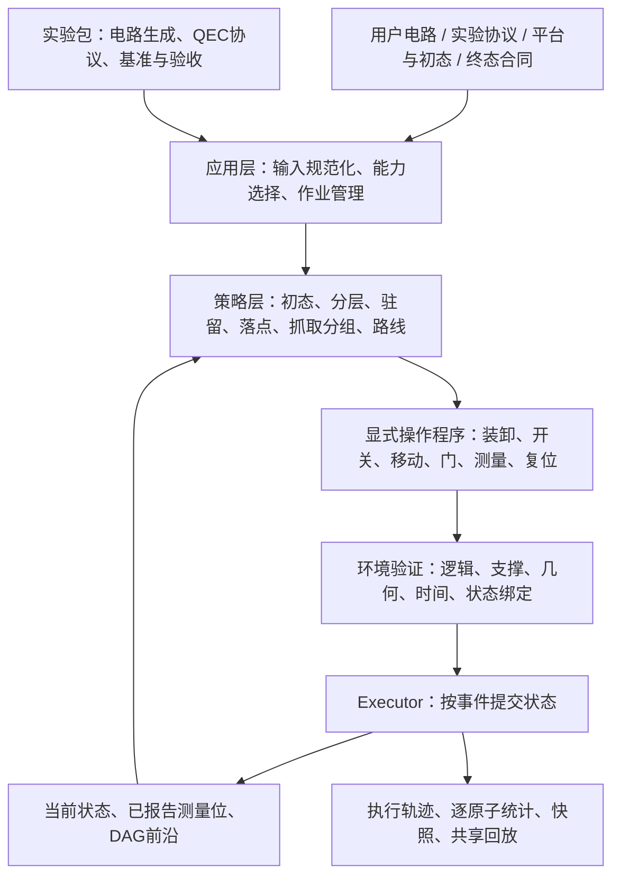

# 程序框架总览：实现、复用、演进与可信边界

核对日期：2026-09-22。对象为本次整理的源码工作区；GitHub 发布状态与本轮复验见 [发布日志](../instruction/logs/2026-09-22-repository-release.md)。本次为源码与证据梳理，不更换编译器、不修改物理模型。

## 1. 系统到底是什么

本项目已经形成一个**中性原子操作模拟平台，以及操控该平台的编译、实验与可视化系统**。它同时承担三项工作：

1. 将电路与实验目标转成显式原子操作，预测模型内的执行时间和资源使用。
2. 对这些操作进行状态、几何、支撑、门作用与时间约束检查，并按事件推进状态。
3. 对不同策略做可重复实验，保存输入、计划、执行轨迹、统计、失败原因和回放。

它不是光场/波包动力学模拟器，不是硬件设备控制系统，也还不是一个所有算法共享同一内部搜索循环的成熟通用编译器。

最稳定的设计是“**环境定义可发生什么，策略选择让什么发生，实验定义为什么这样做，应用负责如何输入和查验**”。



这是主要的本地执行通路。作者原生大规模指令检查器、Parking 分享版和 RL 离散模型有单独的执行/验证范围，不能因为也能播放动画就归为完整 Env 验收。

## 2. 四个包及其所有权

| 包 | 已实现职责 | 最值得复用的部分 | 不能替它承担的职责 |
|---|---|---|---|
| `neutral_atom_env` | 状态、几何、DAG、硬件动作模型、显式操作审核、事件执行、快照、统计和基础回放 | `NeutralAtomEnv`、操作程序、验证器、Executor、trace/recorder/viewer | 不选择电路、初态优化方法、落点或运输策略 |
| `neutral_atom_strategies` | 初态搜索、批次选择、目标分配、驻留、路径、运输、外部编译器适配、学习实验组件 | 共享轴工具、局部运输、配置/结果接口、各策略插件 | 不能擅改 live env 或用收益分数替代物理合法性 |
| `neutral_atom_experiments` | 电路/布局生成、两/四逻辑 GHZ、syndrome 协议、故障场景、对照与验收工具 | 协议生成器、冻结输入、对照和独立审计方法 | 特定 gate ID、历史 guard 和 demo 配方不能成为通用物理规律 |
| `neutral_atom_app` | 配置、控制器组装、HTTP 作业、输入/输出、编辑器、展示页面 | 手动编译流程、作业与产物管理、配置导入导出、共享 viewer 集成 | 页面播放与编辑草稿不能直接改变执行中的原子状态 |

允许依赖为 app → experiments/strategies/env；experiments → strategies/env；strategies → env。环境不反向导入其余三个包。细节见 [边界合同](environment_strategy_boundary.md)。

注意：“模块在 env 中”只表示所有权，不表示它已经被数学证明，或该模块不再需要性能重构。

## 3. 当前已经能做什么

### 3.1 状态与环境

- `Q000…` 是原子/物理比特身份，移动不重新编号。
- `world` 保存静态区域和 SLM 几何；`placement` 保存原子由哪个 holder 支撑；AOD 行列坐标与启用掩码是运行态。
- DAG 表达逻辑依赖。READY 只说明逻辑前置满足，不说明当前物理位置可打门。
- `NeutralAtomEnv.create/observe/validate/submit/step/run/fork/snapshot/restore` 已存在。`env.run()` 只推进已提交操作，不自动完成整条电路。
- 显式程序表达光阱开关、装载/卸载、移动、门、测量、复位及条件效果。程序绑定起始状态，拒绝过期或被篡改的计划。
- 有单份操作程序内部的资源区间与事件并发基础，但提交仍要求空闲边界，保留单个 active plan 和 AOD_0；不是任意多计划异步提交或多 AOD 调度。“环境能表达并发”与“某编译器会找到并发”是两回事。
- 新 `strategies/ir` 已表达 interaction block，并在 zoned 中区分准备、作用与清理；PreparedInteraction 绑定版本、状态和操作前缀。这是策略层复用接口，当前控制器仍将最终完整计划顺序提交。

### 3.2 当前声明的物理与量子模型

- 单 AOD 的活动阱按启用行 × 启用列产生；支持不同间距和有序行列变距，rigid 与 row-column 后端能力不同。
- 检查共享行列、顺序、容量、边界、捕获集合、支撑交接、活动空阱扫掠、连续移动间距和实际门作用集合。
- 选择性 PARK/RECAPTURE 是显式硬件能力，不能从“可编辑 AOD”推导为任意独立交点控制。
- 普通工作台门集为 H/X/Y/Z/T/CZ；特定 QEC 通路支持 MEASURE/RESET 和基于已报告位的条件门。
- 同类型、不同原子的单比特门可合批；1 μs、寻址距离、CZ 几何、EZ 四邻规则等是本项目当前模型/平台约定，不是所有中性原子设备的普适常数。
- 可选 Clifford tableau 跟踪理想量子态、测量投影与复位，区分模拟真值和读出报告翻转。普通几何运行不等于进行了任意量子态仿真；含 T 的通用非 Clifford 态演化不由该 tableau 完整覆盖。

### 3.3 策略与入口并存情况

| 家族 | 当前实现 | 主要边界 |
|---|---|---|
| M3/M4 basic / greedy / critical_path / lookahead 等 | 单阱/历史平台上的归还、驻留、局部并行和有限前瞻 | 保留作基线与回归，不是当前所有 AOD 能力的上限 |
| `ordered_greedy` / `smt_ordered` | 双方谁动、四方向作用、有序轴合批、有限路线；SMT 处理当前批次约束 | 旧通用控制器先整片入 EZ、批内归还；当前批次目标不等于全电路最优 |
| `zoned_ids` | 本地分层调度、未来伙伴、按需入区、有限 IDS 落点、兼容分组、EZ SLM 驻留、物理 codegen | 是本地算法；以 SLM 支撑和空 AOD 服务边界为主，动态落地候选仍受模板限制；QEC 通过与性能改善分开 |
| `qmap_native` | 作者 QMAP 原生内核输出分层/复用/分组/落点/指令，本地适配成动作并由 Env 执行 | 当前 Studio 默认；需要显式成对 SLM 几何和作者映射；测量/反馈不在该通路；原生编译时间不含本地适配和审核 |
| ZAC | 作者分层、复用、动态 placement 与 SA 初态接本地执行；固定/SA × reuse 开/关对照 | 专用 CZ 实验通路；有限路线仍可能失败，不自动支持全部编辑门/QEC |
| `placement/` | 初态问题与结果接口、代理成本、初态算法、空位/形状搜索、真实编译反馈、并行评估 | 自由选址仅在已配置合法 SLM 域；现有 evaluator 接 ordered/SMT/zoned，未统一接 QMAP；并非连续任意造 trap |
| Parking | 逐行/逐列抓取、已对齐轴保留、空位通配、兼容组与方向选择、集体搬远 | `pattern_optimal` 的最优范围是指定整行/整列模板中的最少抓取批数，不是任意运输全局最优 |
| RL | 多套候选调度研究；另有 `placement_rl` 快速离散布局训练、对手场景和独立展示 | 未成为默认生产策略；离散审计不等于连续物理验收，稳定超越启发式的结论尚未成立 |

现在不能用“我们的贪心”概括全部实现。比较结果必须带实际 compiler ID、平台和终态。之前 64435 旧任务整片搬运的分析仍适用于该保存任务，不能外推到新 `zoned_ids` 或 QMAP 通路。

### 3.4 电路、协议与交付

- 保留可编辑物理线路、随机电路、平台/算法配置、手动编译、进度、失败、取消和保存产物。
- 完整 demo 锁定相配的协议/平台；电路示例只负责填入电路；自定义配置不能假装具备专用协议验收。
- 两/四逻辑 surface-code GHZ、稳定子辅助原子、逻辑 CNOT 的物理分解、测量/复位、重复 syndrome 和有限声明故障恢复已经有独立实验实现与历史验收。
- 这些 QEC 成果不等于一般 decoder、全电路随机噪声阈值或任意故障下容错；重复 syndrome 的周期布局联合优化尚未完整实现。
- 共享 viewer 支持格点、原子身份/颜色、线路门与事件关联、暂停/逐事件/跳转/最高 32×；逐原子统计独立于策略，汇总路程、装卸、各类门、活动与等待时间。
- 原生 QMAP 大规模 inspector 展示作者指令和离散 holder；Parking 可分享单 HTML 在浏览器构造模板动作；RL inspector 展示离散见证。三者各自说明范围，不能替代共用 Env 连续轨迹验收。

## 4. 哪些认识在修改，哪些属于算法选择

| 早期认识/实现限制 | 当前认识和处理 | 归属 |
|---|---|---|
| 做门必须每次回原位 | 源位置不是永久 home；终态须声明，跨批可选择 EZ SLM 驻留 | 策略与终态合同 |
| AOD 是固定、等间距小阵列 | 非均匀行列 × 有序变距；所有启用交点共同存在 | 后端能力模型 + 批次算法 |
| CZ 必须靠左对接 | 当前模型在合法条件下考虑四方向；具体设备的光学有效性另需校准 | 物理参数/平台 + 候选方向 |
| 硬编码半格通道即可 | 离散占据预筛、长直线合并、转弯停点、axis-hold、直接/逃逸路线 | 路径策略与运动模型 |
| 有 CZ 就搬整个 patch | 旧 ordered 仍保留；zoned 按需调入，QMAP 使用作者调度 | 控制策略，不是物理要求 |
| 路线失败就多试路径 | 落点非法、捕获不闭合、无路、预算耗尽需分开；新模块已部分提前筛选，未全局统一 | 搜索接口与诊断 |
| 测量必须卸载到首个可用 MZ SLM | 独立读出策略比较 SLM/静止 AOD、多个落点与服务成本 | 读出策略；跨轮任意驻留仍有限 |
| 行字符串相同才兼容 | 空位不约束；要对整组目标/固定集合判冲突，并比较行/列分组 | Parking 组合优化 |
| 优化布局就是更换编号或固定形状排列 | 可以改变合法 SLM 域内的占据位置和形状；初态在创建 env 前确定 | 初态 placement |
| 交互距离最小就会执行最快 | 装卸、兼容抓取、驻留、读出、终态和失败率同样影响成本 | 成本模型，仍在改进 |
| 更多并行门意味着程序更快 | 大批可能引入昂贵运输；编译墙钟、模型执行时间和逻辑效果分别计量 | 调度目标与验收 |
| 完整画出 GHZ 即为纠错实验 | 必须有正确协议、辅助原子、真实测量、报告位与声明故障模型 | 实验协议 |
| 页面显示同一动画就能比较 | 输入、几何、终态、验证层级都要对齐；原生诊断与本地 replay 分开 | 实验与展示 |

这些变化大多是在修正策略假设和模型边界。不应把已经修改过的策略固化为新编译器的硬约束，也不应把局部修复描述为所有入口都已迁移。

## 5. 能信任的基座，准确应怎样表述

不存在仅凭测试即可宣布“绝对正确”的整套软件。这里需要区分三种东西。

### 应长期保持的语义合同

1. **单一状态真值**：身份、holder、静态几何、动态轴/开关分别有所有者，不能靠修改展示坐标冒充移动。
2. **显式物理操作**：装卸/运输/光照/测量都入计划、计时间和指标；门完成不能隐含位置变化。
3. **唯一提交与原子拒绝**：策略只提案，Executor 提交；失败计划不部分污染 live state，过期计划必须拒绝。
4. **逻辑和物理分开**：依赖满足与物理可执行分别检查；真实门效果恰好一次，条件跳过要有记录。
5. **完整 AOD 集合**：按所有活动交点核验共享轴、误捕获和扫掠，不允许只检查想移动的几个点。
6. **终态明确**：门做完、操作排空、达到终态是不同条件；比较算法时不能省略不利的收尾成本。
7. **结果可追溯**：输入/配置/计划/版本与 trace 对齐，统计和 viewer 从已提交记录派生。

这些合同比某个贪心、代价函数或几何模板稳定，应该成为新算法接入时的强制检查。

### 可配置、可校准的模型假设

1 μs 单比特时间、5 μm 寻址判据、2 μm 配对、区域几何、速度/加速度/jerk、四邻保护开关、选择性转移能力等，均属于声明平台模型。后续因实际设备更新它们时，应修改版本和验收合同。它们不是“无论设备如何都成立”的基座公理。

### 已验证实现与仍需认识的限制

负例测试覆盖非法/过期计划、支撑、额外 CZ 对、活动空阱扫掠、资源冲突、恢复一致性等。独立重放从初态重新执行计划，可检查策略产物与状态记录的一致性，但会复用执行器的部分 transition/backend 函数；不是完全独立实现的物理 oracle。部分模块有额外 oracle，例如小 Clifford 电路与稠密态向量对照、Parking 分组与穷举对照。

`env.state` 仍是特权规划视图；冻结数据结构与依赖检查不等于不可信代码沙箱。所有策略只能获得去私有信息观测的隔离目标尚未全系统实现。

## 6. 配置与数据应怎么分类

| 类别 | 例子 | 归属/处理 |
|---|---|---|
| 实验输入 | 电路、原子数、QEC协议、轮数、seed、初态锁定 | 用户/实验前端输入；demo 可整体冻结 |
| 平台模型 | SLM/区域几何、AOD 轴容量、后端、光照与运动参数、能力开关 | 用户选择已声明平台；不能被策略为求成功偷偷改变 |
| 策略配置 | 编译器、搜索预算、路由模式、placement 开关、驻留和终态策略 | 外部算法拥有；每个算法应声明支持范围 |
| 派生量 | AOD 总容量、交点绝对坐标、DAG前沿、兼容组、路径时长、累计指标 | 由输入/运行态计算，不应重复提供矛盾输入 |
| 运行态 | 当前 holder、启用掩码、事件队列、已完成门、测量报告 | 由 Executor 维护，不是用户草稿配置 |
| 输出证据 | 实际采用的映射、计划、失败前缀、计时、trace、验收结果 | 与输入和策略版本绑定，不能仅保存一张图 |

QMAP 是当前需要明确标注的例子：适配器构建成对 SLM 平台及作者初态。因此更换到 QMAP 的实验可能同时改变几何，不能仅以“算法下拉框换了一项”宣称同平台加速。

## 7. 哪些部件可以直接带到下一代 general 框架

- **直接复用并保持合同**：原子/holder模型、PhysicalCircuit/DAG、显式操作与状态绑定、事件推进、后端判据、快照、AtomStatistics、VisualRecorder 和共享 viewer。
- **以能力边界封装复用**：有序轴构造、捕获闭包、OccupiedSLMGrid、局部路线、OrderedTransfer、读出落点策略、Parking 分组、作者原生输入/输出适配器。
- **作为可替换模块或基线保留**：旧贪心/SMT、zoned 的 schedule/reuse/placement/routing、初态搜索与成本代理、RL 的模型和训练环。
- **留在实验层复用**：GHZ/稳定子协议、demo布局、有限历史 guard、噪声场景、冻结基准与报告脚本。

“复用”不等于所有组件可不加适配地组合。下游必须检查后端、门集、初始支撑、是否允许测量、终态与验证模式。

## 8. 尚未统一的地方

1. `Strategy.run(env)` 已统一一部分外部控制接口，QMAP 的 NativeProgramAdapter 也满足它；但多个控制器仍有各自内部循环，QMAP 的原生求解/建平台仍有独立 app 通路。字符串工厂未统一包含 native，`pipeline.run_circuit()` 未传策略时仍走旧 EagerScheduler，不能把 Studio 默认等同于所有 API 默认。
2. `placement/dynamic.py` 的统一边界目前主要提供 proposal 协议和固定返回基线；实际动态落点分散在 zoned、读出和外部适配中。接口存在不代表实现已统一。
3. 初态反馈 evaluator 支持 ordered/SMT/zoned，QMAP 使用作者映射，ZAC 有自己的四组对照；优化 workflow 尚未对所有后端通用。
4. 各路线搜索有限，成本代理不保证可采纳或完备；失败可能表示模型不支持、有限候选耗尽、预算耗尽或真实约束冲突，不能都解释成物理无解。
5. 跨批任意 loaded-AOD 连续驻留、完整操作级重叠和多 AOD 资源调度未作为通用能力完成。
6. 分阶段计时、重复状态/前缀计算缓存和紧凑执行产物已有局部工作，尚无全系统一致、无重复开销的性能框架。
7. QEC 专用协议的效果验收、物理时长、解码性能分开；多轮周期 placement/调度联合优化和通用噪声解码仍有缺口。
8. 原生指令、快速离散模型和本地连续运动模型之间的能力差异需要机器可读合同；当前更多依赖文档与入口校验。
9. 历史 instruction/docs 保留时间顺序增补，一些“当前默认”“全部待实施”“尚未实现”的旧表述已被后续版本局部覆盖。它们适合追溯，不应单独决定当前能力。
10. 新人安装说明没有完全跟上默认内核：主 README/demo README 仍主要说明安装 `.[smt]`，当前 native 还需要 `tools/setup_qmap_native.py` 建立独立运行环境或配置 `QEC_QMAP_PYTHON`。本轮发现的是说明与默认入口不一致，未进行全新克隆安装实验。

## 9. 建议作为后续统一目标的 general 接口

这部分是建议，不冒充已经全量实现：

```text
ProblemSpec
  circuit + platform + initial constraints + terminal + verification mode
       ↓
CompilerPlugin
  schedule / initial placement / dynamic placement / batch / routing
       ↓
OperationProgram + provenance + predicted costs
       ↓
Env.validate → Env.submit/run
       ↓
ExecutionResult + independent checks + metrics + replay
```

允许不同算法拥有自己的内部求解方式，不要求 SMT、QMAP、启发式和 RL 都使用同一个候选生成器；统一其输入语义、能力声明、输出操作和证据。这能保留作者算法的决策能力，同时避免算法绕过环境。

优先补齐能力矩阵与统一结果合同，再收敛重复 orchestration/成本估计/缓存；不要为统一而重写已经有证据的物理语义。多轮 syndrome、动态驻留和 RL 属于插件研究，不应倒置成为 env 的默认行为。

## 10. 本次核验与证据入口

本次执行：

```powershell
C:/python312/python.exe tools/check_architecture.py
C:/python312/python.exe -m pytest -q tests/test_environment_boundary.py tests/test_foundations.py tests/test_atom_statistics.py tests/test_serializer_equivalence.py tests/test_runtime_prefix_cache.py
```

- 依赖审计通过：216 个纳入扫描的 Python 模块，跨包违规 0。
- 上述相关回归：74 passed；一个依赖库日期 API 弃用警告。
- 并行只读交付审查运行 `python tools/check_demo_bundle.py`：134 文件完整性检查通过；这是哈希、大小、链接及交付关系检查，不是重编译或 GUI 验收。
- 本轮未重新执行所有物理实验、噪声/QEC大矩阵、大规模原生编译或 GUI 验收。具体实验结果以各自保存的输入和报告为准。
- 文档更新不改变源程序行为，不提交或推送 GitHub。

相关入口：[包边界](environment_strategy_boundary.md)、[分层驻留](zoned_compiler.md)、[QMAP原生](qmap_native.md)、[QMAP大例范围](qmap_large_benchmark.md)、[ZAC初态](zac_initial_placement.md)、[初态反馈](compiler_initial_placement.md)、[Parking兼容](parking_compatibility.md)、[RL初态范围](rl_initial_placement.md)、[QEC时域验收](qec_temporal_acceptance.md)、[当前交接](../instruction/handoff.md)。
