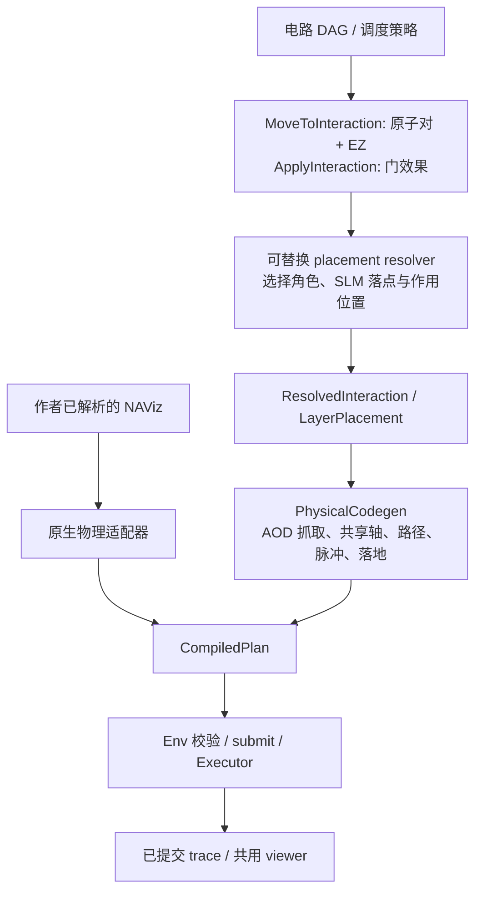

# 交互意图 IR 与物理运动编译

2026-09-22。目标是让策略表达“这两个原子需要在交互区完成指定门”，无需在意图中填写 SLM trap、AOD 行列或路径。具体坐标仍是下层必需的信息，不能从物理执行计划中删除。

发布审查补充：内置 IDS 可以返回部分前沿；控制器适配器只延后与请求精确匹配的合法前缀，随后建立较小的显式 Move/Apply 再求解。它不会将原请求中的门静默删除，也不放宽外部 resolver 的绑定检查。回归验证首个可行服务实际执行、余门仍待执行及独立重放，见 [发布日志](../instruction/logs/2026-09-22-repository-release.md)。

## 审计结果

原有 `zoned/models.py::LayerPlacement` 已包含 anchor/mobile 分工、SLM site 和作用坐标，是**解析后的落点表示**。`PhysicalCodegen` 已把这些目标编译成实际装卸、行列移动、脉冲和落地。缺少的是坐标无关、可序列化、可独立验证的上层交互请求；控制器原先直接从门对象调用 IDS placement。

`env.domain.TaskIntent/TaskTarget` 是物理程序的效果授权和具体终态约束，不是区域交互规划 IR。`TaskTarget` 中的 holder、axes、masks 保留。`qmap_native` 接收作者已经完成落点/路由决策的 NAViz 程序，属于下层入口，不应该丢掉作者坐标后重新运行自己的 placement。



## 语义层

新包 `src/neutral_atom_strategies/ir/` 提供四个不可变值对象：

- `InteractionPair(gate_id, atom_ids)`：关联实际电路门与两个不同原子。
- `MoveToInteraction(id, pairs, zone='entanglement')`：要求每对原子达到可交互构型，不执行门。
- `ApplyInteraction(move_id, gate_ids)`：显式请求上述门效果，必须与 Move 中的门一一对应。
- `InteractionBlock(move, apply)`：可序列化的交互服务；当前服务可按物理兼容性拆批，**不承诺所有对同时打光**。

`site` 在上层是可用交互构型的含义，不能理解成两原子占据同一格点。Move 不要求两原子都必须发生位移；一方可能已经驻留。zone 当前是区域类型，不是具体区域 ID。多 EZ 设备选择、任意门类型和任意已加载起态不是本轮能力。

示例（输入中没有坐标、trap 或 AOD 轴）：

```json
{
  "schema": "interaction-ir-v1",
  "move": {
    "id": "layer-0",
    "zone": "entanglement",
    "pairs": [
      {"gate_id": "cz0", "atom_ids": ["Q000", "Q001"]}
    ]
  },
  "apply": {"move_id": "layer-0", "gate_ids": ["cz0"]}
}
```

同一个 block 只接收互不共用原子的 CZ 对。跨门依赖继续由原 DAG 管理；解析时再次检查门必须 READY，门 ID 与原子必须匹配。反序列化拒绝未知字段，避免静默忽略外部算法提供的具体坐标。

## 落点与物理层

`zoned/interaction.py::InteractionCompiler` 接收可替换的 resolver 和 lowerer，不自行操作 live env：

```python
from time import perf_counter
from neutral_atom_strategies.ir import InteractionBlock
from neutral_atom_strategies.zoned.interaction import InteractionCompiler
from neutral_atom_strategies.zoned.placement import IDSPlacer
from neutral_atom_strategies.zoned.codegen import PhysicalCodegen

deadline = perf_counter() + 90
compiler = InteractionCompiler(IDSPlacer(), PhysicalCodegen(deadline), deadline)
block = InteractionBlock.for_gates(ready_cz_gates, id='layer-0')
bindings = compiler.resolve(env.state, block.move)
# bindings are candidates, not accepted programs. A controller can try later
# candidates if the physical lowerer rejects the first one.
lowered = compiler.lower(env.state, bindings[0], block.apply)
env.submit(lowered.plan)
env.run()
```

`ResolvedInteraction` 保存原始 Move、当前状态指纹和具体 `LayerPlacement`。新的状态不能复用旧绑定。resolver 不能偷偷改门、换操作数或预置无关原子；作用区域在接口边界检查。支撑、捕获闭包、全部实际作用对、四邻保护和连续扫掠继续由现有物理层判断。

`PhysicalCodegen.prepare_interaction(builder, assignments)` 编译抓取/接近，返回绑定状态的 `PreparedInteraction`。它检查实际作用构型但不添加 CZ，不改变门完成状态。`execute_interaction(builder, receipt)` 才加入脉冲及现有稳定落地过程；过期 receipt 被拒绝。`cz_group` 组合两阶段，并保留“接近路径可达但脉冲/落地失败时尝试下一路径”的回退行为。

当已有稳定 SLM 配对恰好满足解析目标且通过后端完整作用集合检查时，prepare 是零操作，随后显式 Apply 只打光。该路径没有给予任意已加载 AOD 跨服务续接的新能力。

语义分离不强制每阶段都提交给 Env。本轮普通控制器仍将准备、效果和稳定落地放在同一个私有事务中，完整验证成功后才提交。避免为了分层而暴露半成品状态。现有 `split_gate_program` 能拆分单效果服务，不等于新接口已经支持任意批量的中途提交/恢复。

## 接入与追踪

`run_zoned` 现在真正经过 `InteractionBlock -> resolve -> lower`，不是增加一套未使用的数据类。每个接受的 CZ 决策记录：

- `interaction_ir`：没有格点的原始 Move/Apply；
- `resolved_interaction`：绑定状态及被选中的具体落点；
- 原有 `cz_batches` 与 CompiledPlan：实际分批、装卸、路径和门效果。

原工作台选择 `zoned_ids`、app 派发与 placement worker 都复用这个入口。默认 `qmap_native`、旧 ordered/SMT 和锁定 QEC 协议不被静默替换；native 已解析输出继续走原适配器。这里统一了一个生产策略的意图边界，**没有宣称所有历史编译器已经迁移到同一个 IR**。

动画只读 Executor 已提交轨迹。动画不能替策略选落点、补出未执行的 AOD 路径，或把几何插值当成物理合法性验证。

## 验证与限制

运行：

```powershell
python -m pytest -q tests/test_interaction_ir.py tests/test_interaction_lowering.py tests/test_zoned_compiler.py tests/test_environment_boundary.py
python tools/check_architecture.py
python examples/interaction_ir_demo.py
```

验收包括 IR 往返与错误拒绝、状态绑定、准备不执行门、显式脉冲恰好一次、私有失败不提交、原 zoned 行为回归和独立 Env 重放。示例导出上层意图、落点、物理计划和报告，以便分别查验各层。

本轮57项分组测试通过；6原子示例中2对CZ实际同批，2个旁观原子在每个事件保持原位，独立重放一致。最终证据位于 `artifacts/interaction-ir-demo/final/`；共用viewer的 `replay.html` 未进行本轮真实GUI验收。完整命令、分组结果和初次录制失败记录见[实施日志](../instruction/logs/2026-09-22-interaction-ir.md)。

本次是架构边界修正，不是新的布局/路由优化成果。没有修改环境物理判据、解除 AOD 共享行列约束、实现全局最优、完成 QEC 性能修复，或为 native 指令增加尚未执行的本地物理保证。
