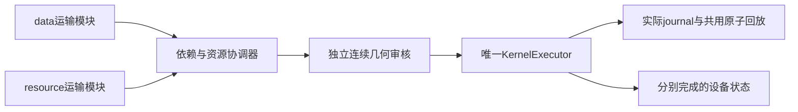

# 两个 AOD 的模块化运输与独立归还

状态：**限定纯运输资格已完成**。用户要求把 data 与右侧 resource 的 AOD 运输作为可复用模块独立推进，取消不必要的跨设备归还等待。[实际回放](http://127.0.0.1:8782/#physical-viewer)、[小型验收](../references/qec_pbc_validation/modular_aod_2026_10_05.json)绑定正式 attempt2；不是完整 syndrome、magic factory 或 Shor 的新编译结果。

当前8778兼容前缀使用整份serial计划：提交后一直推进到该计划结束，集合服务中的两设备去程与归还因此顺序执行。`neutral_atom_kernel` 的scheduled事件和设备资源已支持不同AOD ID；缺口在上层如何生成、协调和独立审核两条操作链。

每个 `AODTransportModule` 负责本设备的完整行列轴、载体身份、LOAD/MOVE/STORE与本模块END依赖，给出运输请求和可开始时间。模块只生成不可变操作，不改live state。`coordinate_aod_modules` 合并各设备操作与实际资源依赖；同设备、同原子或显式共享资源冲突需要等待，不因另一个模块尚未归还而添加全局屏障。两个模块共享一个全局时钟与唯一 `KernelExecutor`，不是两个分别写placement的Executor。



不同设备ID只说明资源可以独立占用，不证明路径安全。独立审核仍检查全部存活原子、两个设备的完整Cartesian活动交点（含空交点）、静态旁观者、完整备用轴域、捕获/支撑/交接、各自运动时长和重叠期间的连续间距。两条共同三次运动的开始/结束可以不同，不能只检查端点或固定采样。

首个资格例为一个17原子d=3角色布局与右侧17个资源模板载体，各自25个RF交点和独立声明域，全部初始/目标SLM位事先声明在5μm格点。它只运行运输与显式dwell，不执行初始化RESET、syndrome、测量或magic生产。要验证的行为是双带载MOVE实际重叠，以及resource已返回原holder时data仍在return MOVE；对照用相同轴、初态、操作和终态顺序执行两条链。

现有冻结core的RF规则为已承载原子所占行/列的union及其完整Cartesian积；未承载交点也审核。额外空活动RF轴的手动持久开关尚不在本资格profile中，必须拒绝需要该能力的请求。第一阶段只接受CONFIGURE/LOAD/MOVE/STORE/WAIT。Shared laser、全x CZ与MZ/RESET权限需要各自后续资格，不能凭运输audit通过放行任意光脉冲。

这轮不会替换8778的3006门历史产物，不修改既有四个轻量kernel核心、single-AOD严格reviewer、共享viewer或工厂冻结profile。完整Shor和工厂接入继续使用各自的完整源依赖、报告完成、token/epoch和唯一消费合同；本模块提供运输接缝。

## 可复用 API 与边界

实现入口为 `src/neutral_atom_strategies/scheduling/aod_modules.py`：

```python
data = AODTransportModule.compile("AOD_0", data_ops, initial,
    initial_axes=full_axes, initial_holders=holders, profile=profile)
resource = AODTransportModule.compile("AOD_MAGIC", resource_ops, initial,
    initial_axes=full_axes, initial_holders=holders, profile=profile)
schedule = coordinate_aod_modules((data, resource), initial,
    initial_axes=full_axes, initial_holders=holders, profile=profile)
block = schedule.bind_block(kernel, "transport",
    geometry_guard=audit_modular_operations)
kernel.run(block)
```

`release_us` 表示模块最早可开始时间；每个模块保留自己的END链。显式 `resources` 或 `shared_operations` 的 WAIT 可以占用真正共享的控制资源，协调器只为这些占用增加必要依赖。`device_completion_us` 分别给出本设备完成时刻。请求绑定完整初态、holder、profile及所有备用轴；运行前要求真实审核的 PASS 和精确 `input_sha256` 收据，旧收据或只有 PASS 标签会被拒绝。

当前 v1 要求两个设备声明域有足够间距。相交域直接拒绝，尚不自动求解交叉路线、空间冲突重排或通用最优调度。该组件在空闲提交边界合并操作链；不支持运行中追加新 Block 或资源模块动态补产。一个执行Block中两台设备可以分别完成，提前完成不会中断另一台设备。

独立审核 `tools/audit_modular_aod.py` 将输入浮点数精确提升为有理数，在所有START/END断点间用共同三次轨迹的Bernstein凸包细分证明连续间距；无法证明的近接触拒绝。LOAD按将要捕获的行列union作保守几何包络，STORE保留旧union至END，实际holder/mask仍仅在END提交。审核实际journal和final checkpoint时，逐项绑定START/END、源身份、完整RF、最终holder和摘要链，不把pre-execution审核当作已执行证明。没有新增空RF交点之间的光场干涉模型。

## 实际成果与复现

| 项目 | 正式 attempt2 |
| --- | ---: |
| 原子 / AOD / 完整RF容量 | 34 / 2 / 每台5×5 |
| 操作 / 实际journal事件 | 14 / 31 |
| 并发完整归还 | 541.260859854213 μs |
| 相同物理primitive、profile、初终态串行 | 992.6458955524499 μs |
| 本运输例模型完成时间减少 | 45.472916% |
| resource归还完成 | 451.385035698237 μs |
| resource完成时data状态 | return MOVE在途，17原子由AOD_0承载 |
| 双带载MOVE重叠 | 190.692518 μs |
| 连续审核 | 42时间分区 / 51,612配对证书 / PASS |
| 实际最小保守间距 | 10 μm；硬运输阈值保持1 μm |

独立审核分别验证并行/串行真实journal与最终checkpoint，并从原初态用公开kernel完整重放。双MOVE在途及resource已完成两处冷恢复都得到精确相同的最终状态和journal；recording开关仅改变日志，语义终态一致。166个不同pytest通过（85冻结回归、26模块、40审核、3演示、12边界）；281源码模块无依赖违规。真实浏览器验证四书签、自然32×播放终态、X/Z与未编码resource角色、同步缩放、主统计/折叠层级、390/320px无文档溢出及console零错误。

```powershell
python -B examples/run_modular_aod_demo.py --output artifacts/modular-aod-NEW
python -B tools/audit_modular_aod.py artifacts/modular-aod-NEW --output artifacts/modular-aod-NEW/independent-audit.json
python -B -m http.server 8782 --bind 127.0.0.1 --directory artifacts/modular-aod-NEW
```

每次使用新输出目录；失败或旧attempt不覆盖。正式源码与产物SHA由CLI manifest和小验收绑定。可使用 `--serve --port 8782` 在生成后直接服务。本机已运行的8782读取 `artifacts/modular-aod-2026-10-05/attempt2`。

报告层位于 `neutral_atom_app/modular_aod_report.py`，使用未修改的共用payload builder/viewer，仅修正本例compiler/report来源与设备名称这些展示元数据。attempt1物理通过，但默认caption误称QMAP；源码修复后实际重跑attempt2，保留旧attempt。共用总类别时间线在同start重叠操作的tooltip可能选择首个operation标签；各设备lane、实际时刻、载体和journal身份正确，查看独立归还以设备lane为准。本例WAIT是声明的运输停留，完整归还时间包含它；设备运输busy统计不计WAIT。

下一接口是服务/资源controller提出运输模块：保留entry/exit物理状态、完整RF、源依赖、原报告与同token载体，再与服务操作组合审核。MZ/RESET与全x CZ必须验证真实共享作用资源和旁观者，不能直接沿用此纯运输PASS。资源提前归还已经有组件和运行证据，工厂连续生产或processor热接入尚未由本次实现。

工厂接缝已另作[静态接口审阅](factory_transport_interface.md)：当前module是完整起态绑定实例，计划时刻为Block相对时间；默认终态该设备无承载，STORE不自动保证home或初始RF。controller拥有运输request和typed completion，原gate/raw报告、token/epoch及MZ/CZ服务资格各自保持。resource独立归还不会解除active Block提交限制，动态补产与新adapter仍为待实现项；此次审阅没有新工厂运行。
