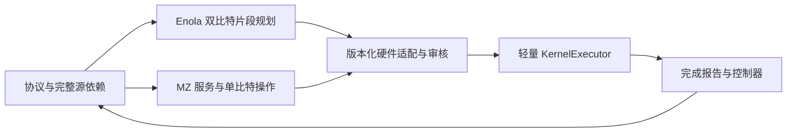

# Enola + MZ：同区计算架构与可组合流程

日期：2026-10-04。状态：**Full Enola＋MZ 轻量内核目标 OPEN；rigid ENV 集合服务已通过限定前缀资格**。依据是用户此次确认的 EZ/SZ 重合、独立 MZ，以及此前的全 x 照明、5 μm SLM 格点、有限 CZ、右侧独立 magic AOD 和轻量内核要求。[流程清单](../references/qec_pbc_validation/enola_mz_flow_catalog_2026_10_04.json)仍用于新内核逐项验收，不以兼容前缀结果填满 E01–E10。

当前已验收的 QMAP d3 attempt5 使用分离的 SZ 与 EZ；它的两轮结果不能作为本设计的验收结果。现有 Enola patch 工具仍只调用作者的初始 SA placement；本次增加的是该布局在现有 rigid ENV 中的稳定 SLM 集合服务。完整作者编译器另在 scaling benchmark 中使用，尚未接入本设计的轻量内核 MZ 闭环。

## 当前协议入口与生效关系

本页是当前 QEC 分区、编译和 MZ 流程的唯一目标入口；[共享工厂协议 v2](../instruction/qec_factory_pipeline.md)继续规定资源生命周期与 S1–S3 的上层目标。下表归并已有用户要求，不改变码、门序或物理阈值。历史平台只承担原版本的实现证据，不能覆盖这里的现行目标。

| 项目 | 当前目标 |
| --- | --- |
| 分区 | COMPUTE＝EZ＝SZ；EZ 横贯 world 全 x，MZ 在照明 y 带之外。 |
| 布局与距离 | 各码块独立停车；SLM 候选间距 5 μm，普通占据/非伙伴间距至少 10 μm。CZ 伙伴实际进入有限 6 μm 范围；10 μm 不是做 CZ 时伙伴的间距。 |
| 编译与执行 | Enola 提出依赖允许的 2Q placement/routing；MZ/1Q 服务接入同一操作流；轻量 KernelExecutor 唯一提交。 |
| routing | 先验证直达，受阻后使用 2.5 μm 半格通道。距离最短性只在声明的合法候选图内成立，不能把 rigid 图结论套给 row/column。 |
| MZ 选点 | 空间距离为第一比较项，完整服务时间用于等距择优；候选须通过整个载体、运输与返程的合法性检查。有界候选只称“候选内最近”。 |
| 普通 syndrome | 每 patch 9 data＋4 X 辅助＋4 Z 辅助；固定四层 coupling。每轮只测量/复位 8 个辅助，再实际返回 compute；data 终端读出单列。 |
| 并行 | 同操作且依赖允许的门可合批；每次 CZ 检查全带所有原子与实际作用对，完整 AOD 行列和旁观者均参与。 |
| 批量 RESET / 终端 MEASURE | 默认跨码块汇集同一依赖允许阶段的目标，在 MZ 汇集后一次并行服务；运输分波与服务分批分别记录，不能因 AOD 一趟装不下就逐波测量。普通 syndrome 仍只服务辅助原子。 |
| 资源设备 | 独立 AOD_MAGIC 位于右侧；属于多设备目标，不能以当前单 AOD 小例声称已实现。 |
| 展示 | 新 demo 必须使用本 profile 的已提交 operation stream。旧回放、协议步骤示意和新 backend 实现分别标明架构/版本/资格范围。 |

当前可运行的 8780 回放是 `native-kernel-d3-global-ez-paired5-sz10/v2` 的 QMAP 分区 **Z memory**：两轮辅助读出 16 个报告，随后 data 终端读出 9 个报告，共 25 个。它包含制备与终端阶段，不能作为纯 round 循环，也不是本页的新 Enola＋MZ demo。步骤图仅解释协议，不能提供物理编译资格。

旧 [rigid 自动选点](qec_rigid_readout_placement.md)生成最近几何候选后，以完整服务时间为优先项选取，属于有界服务成本策略；这与本表的距离优先目标有差异。保留其历史结果，新的 MZ 适配必须显式落实此处目标，不能仅沿用 `nearest_mz` 名称。

本轮修正生效关系和展示口径；新 Enola＋MZ backend、纯两轮操作流和相应物理回放仍为 OPEN。下一项验收只覆盖 E02/E03/E05/E10 的单 patch：16 个辅助报告、16 次辅助 reset、无 data 终端测量，完整往返、作用对与断点恢复一致。

## 1. 分区与职责

采用 `COMPUTE = EZ = SZ`：同一片区域容纳 data、syndrome、资源和库存，EZ 照明横贯声明 world 的整个 x 范围；MZ 位于该照明带之外。具体 world、compute y 带、MZ 和合法 trap 域在新 profile 中一起声明，不能沿用小例范围或只改图形。

5 μm 是 SLM 候选格点间距；占据的普通停车位置按至少 10 μm 稀疏布置。CZ 伙伴须进入有限 6 μm 作用距离；非伙伴至少 10 μm、运输安全 1 μm、Raman 5 μm、RF 轴间距 2 μm 分别检查。这些是本项目的简化参数。处于同一 EZ 的“存储原子”仍参与每个全局 CZ 的作用对审查，所有 SLM/AOD、工厂和缓存原子都算旁观者。CZ 集合按照明 y 带判定；Raman 和运输仍检查全世界原子。



- 协议层保留 stabilizer/hook 顺序、每次重复门的 occurrence ID、1Q、报告依赖和跨线屏障。
- Enola 负责无测量双比特片段的分层、placement 和 routing 提案；同操作码块可合批，但只合并原源依赖允许的门。
- 策略层兼容器把作者提案与 MZ/1Q 服务降为版本化操作流，绑定实际起态、完整 RF、资源和 provenance。
- `neutral_atom_kernel` 继续唯一提交 holder、轴、时间、效果和完成报告；controller 管 token、carrier、epoch、库存、frame 和分支。执行热路径不增加旧 ProgramBuilder/SimulationState。

## 2. 作者实现需要哪些兼容调整

固定作者版本为 [Enola 2944dbf](https://github.com/UCLA-VAST/Enola/tree/2944dbf4e163e8d2eeeec607add0d9139edce689)。[论文 §1–2](https://arxiv.org/html/2405.15095v2#S1)的 SLM/AOD 共用全局交互区域适合本设计，但以下项目需要由本项目明确实现：

| 边界 | 核查结果与适配合同 |
| --- | --- |
| 输入语义 | `setProgram` 接收 2Q pair；不直接承载完整 1Q/M/RESET/经典反馈。保留源 DAG，再取依赖闭合的 2Q 片段；不能删除重复 coupling，也不能把 QEC 当作任意可交换图。 |
| 固定几何 | codegen 使用 19×15 μm coarse site pitch、4 μm paired SLM 和 6 μm 作用半径；现有 setter 的赋值未更新模块全局常量。使用显式版本化的项目 5 μm 硬件 lowering，并重新审核；不把作者坐标取整后声称原样执行。作者固定平台可作独立基线。 |
| 活动轴 | 作者 Activate/Deactivate 可保留没有载荷的活动行列。当前 frozen kernel 从载荷推导活动轴，完整 RF 坐标并不等于完整 enable masks。必须逐步证明具体指令流可等价消去空活动轴，或另立显式轴 IR 版本；新版至少绑定固定轴身份、完整坐标、enabled 集合、开关时刻、捕获闭包、禁用载荷限制、checkpoint、审核和观察器。在此之前不得宣称完整作者指令忠实兼容，metadata 不构成实现。 |
| 起态续接 | `Init` 默认全 SLM，`initial_mapping` 是 coarse-site 布局而非任意 live checkpoint。首阶段绑定已准入的 home layout，采用 `reverse_to_initial`；Init 只作起态核对。布局不同须实际运输和计时，不能覆盖 placement。 |
| 独立审核 | 作者指令校验不构成连续全空间证明，Rydberg 距离校验也不足以替代本项目审核。检查完整活动 Cartesian 交点、空阱/备用轴、静态原子、连续轨迹和全带实际 CZ pair-set。 |
| 多设备 | 作者可执行输出是单 AOD。右侧 AOD_MAGIC 由外部全局调度器接入，所有设备参与空间与照明审核；论文多 AOD 估算不等于已实现的双设备操作流。现 frozen reviewer 仅资格化 AOD_0，E07 引入第二设备前须扩展并验证双设备完整 RF、空交点、跨设备连续扫掠与全带作用审核。 |

具体依据：[入口](https://github.com/UCLA-VAST/Enola/blob/2944dbf4e163e8d2eeeec607add0d9139edce689/enola/enola.py)、[router](https://github.com/UCLA-VAST/Enola/blob/2944dbf4e163e8d2eeeec607add0d9139edce689/enola/router/router.py)、[codegen](https://github.com/UCLA-VAST/Enola/blob/2944dbf4e163e8d2eeeec607add0d9139edce689/enola/router/codegen.py)。上述能力来自源码审查，本轮没有运行新的 Enola 编译。

## 3. MZ 服务与标准流程

MZ 服务输入实际位置/holder、完整 RF 坐标及 enable masks、源 gate/report IDs、起态摘要、slot 预约、token/epoch 和要求的终态。输出不可变操作流、选择证据和后置条件；服务生成器不修改实时状态。

选点从 MZ 内最近合法 SLM 格点开始，检查整个载体、静态支撑、设备 envelope、完整 RF 和返程；记录距离度量、候选、排除原因、所选位置、运输距离及完整服务时间。空间距离优先，等距时比较完整服务时间；有界候选范围须显示，不能宣称全域最近。复用[旧选点实现](qec_rigid_readout_placement.md)的合法性检查，但不沿用它的时间优先排序。新内核首阶段在 MZ 使用稳定 SLM，不继承旧静止 AOD 读出实现。复用[标准路由](qec_routing_standard.md)的直达优先和 2.5 μm 偏移通道原则；其中 fixed-offset rigid 图上的最短性不能直接推广到 Enola 的 row/column 伸缩。新 router 必须声明其候选族或搜索图、最短性范围，距离优先并单列完整 RF 各段实际时间；首个合法候选不能标为全局最短。

一次普通 syndrome visit 为：`RF 配置 → LOAD → route → STORE 到 MZ SLM → MEASURE → RESET（源协议要求时）→ 返程 RF 重新绑定/必要配置 → LOAD → return route → STORE 到准入 compute 位置`。每次 LOAD 前核对当时真实 RF/masks；若读出期间 AOD 被其他计算使用，返程从新起态实际配置并计时，不能沿用去程轴或覆盖轴坐标。MZ 停留保留 atom/slot 预约，是否释放 AOD 由明确调度策略决定。测量报告只在 MEASURE 完成时提交；RESET 不删除历史报告。测量和复位尽量共用一次 visit，批次超过容量时分波并预约 MZ slots，不用原子总数替代 RF 容量。

### 批量 RESET 与终端测量：用户确认的默认方法

2026-10-04 用户确认：RESET 和最后 MEASURE 应利用大规模并行和联合运输，作为标准方法。此规则适用于新的 Enola＋MZ 服务编译。**现有 rigid ENV 集合服务已通过保存 full12 前缀的完整执行、原初态重放与三项独立审核；Full Enola＋MZ kernel 仍 OPEN**。已有 8777 回放保留原操作流，不改称新批量协议结果。

默认先从完整源 DAG 汇集同一协议阶段、同一操作且依赖允许的目标，跨 patch 分配 MZ slots 和联合运输。MZ 可合法同时容纳全部目标时，使用一个服务批次；一趟载体容量不足可分波运入、稳定卸载并汇集，最后仍只做一次共同 RESET/MEASURE。不按 qubit 或 patch 人为拆开服务。典型流程为：

```text
阶段依赖 / 实际测量轴准备完成
  → 跨码块目标汇集与完整 RF / MZ 预约
  → 批量捕获、标准 routing、单趟或分波运输并稳定存入 MZ
  → 同批全部目标到位屏障
  → 同一批 RESET 或同一批 MEASURE
  → 完成提交逐原子 source effect / report
  → 协议要求的 RESET、返程或明确终态
```

联合运输表示每波使用完整合法载体一起运输；目标散布而需要多个捕获动作时，保留所有实际 LOAD/配置成本，不能将其画成一次瞬移。可合批不等于强制所有 patch 等待一个新增全局屏障：保留源屏障和报告依赖，等待与独立计算按实际资源调度。

| 服务阶段 | 标准批量处理 |
| --- | --- |
| 初始化 / 生命周期 RESET | 同一准备边界的全部就绪目标优先合批，完成后才开始相应编码或新 epoch。未请求复位的 live data 不加入。 |
| syndrome MEASURE → RESET | 本轮已完成 coupling 和测量轴准备的辅助原子跨码块合批；在同一次 MZ 停留完成源要求的 M→R，再返回 compute。保留全部 M→R 屏障，不跨 round 合并。 |
| data 终端 MEASURE | 已结束计算且测量轴已确定的独立 data 目标优先合批；X 等读出所需实际旋转先完成。每 patch 的逻辑奇偶按该协议支持计算，保留每个物理报告。 |
| PBC / cat / 资源终端读出 | 仅合并完整源依赖允许的同阶段原生 MEASURE/RESET。终端拉回测量包含 cat 制备、两遍核验、耦合与可能的报告依赖，不能把全部逻辑输出替换成一次 data Z 测量。 |
| 测量后 cleanup | 源要求 RESET 时在同一次 visit 内批量执行，等待对应全部读出完成；终态按显式合同留 MZ、释放/停车或返程，不增加无要求的往返。 |

容量分两层声明：`K_transport` 由完整 RF 行列、活动 Cartesian 交点、捕获闭包和整个路径决定；`K_mz_service` 由稳定 MZ slots、支撑、同次服务的声明光照能力与几何决定。超过运输容量只增加真实运送波次；超过 MZ 共同服务容量或依赖/资源不兼容时才拆服务批次。分别记录 `transport_split_reason` 与 `service_split_reason`，不能把设备原子数上限当可运容量，也不能把运输波次当服务脉冲数。目标是尽量少的合法波次与服务批次，不声称未经证明的全局最优。最近 MZ 和直达/2.5 μm 协议保持。

每个批次保留 `phase_id`、各 `source_gate_id`、target/role、report ID、实际 transport wave/服务批次/操作起止与完整运输成本。同一批 N 个 RESET/MEASURE 的服务时长是一次已声明的 RESET/MEASURE 时长，不乘 N 或运输波次数；实际服务拆批、等待、捕获和运输按时间线计入。所有报告在各自所属 MEASURE 完成后由唯一 Executor 提交一次，批量不改变报告位、frame、token 或 epoch。

E01/E04/E05 后续验收必须覆盖：全批容量足够时单趟单服务；`K_transport+1` 但 MZ 容量足够时多趟汇集、一次服务；`K_mz_service+1` 时有原因服务分批；跨 patch 源效果和报告恰一次、全 M→R 屏障、未就绪/测量轴依赖拒绝、实际完整 RF/旁观几何、批次进行中的冷恢复，以及同一操作流的 viewer 批量标注。下述兼容前缀已完成实际执行、原初态重放与三项独立审核；资格限于保存 full12 初始化/CSS 与第一轮 syndrome，不构成这些新内核流程的完整物理资格。

### 已接入的 rigid 前缀集合服务与当前验收边界

`create_collective_environment` 声明 `collective-mz-platform/1`：保持实际 home 初态、原门、设备 footprint 和物理阈值；为每个设备的完整 home footprint 选择 5 μm 格点上的最近合法**纯竖向平移**，声明独立、初始关闭的 MZ SLM 支撑。该距离优先只在这个有限 footprint 候选族成立，不是任意 MZ 格点的全局最近 packing。EZ 的 x 范围同时扩为 world 全 x，trap inventory 与照明域仍分别声明；平台变化须在新 run 保存，不能沿用旧初态 hash。

`compile_collective_mz` 输出 `collective-mz-slm-rigid-prefix-v1`，仍使用旧 `ProgramBuilder → NeutralAtomEnv → Executor`。策略只在私有预测状态生成计划，不提交 live state；运输每波实际定位、LOAD、标准 route、OFFLOAD，在全部目标到稳定 MZ SLM 后执行一次共同源服务，源要求的后继 RESET 等整个 MEASURE 完成后再执行，最后分波实际返回原 holder。每波捕获检查完整活动 Cartesian 交点，保留空阱、备用轴、旁观者、两设备域、连续运输及完整原初态 replay。当前波次按有界 local-role 束选择并在物理拒绝后尝试下一候选，失败明确终止；不证明最少运输波次或全线路最短时间。

本轮 full12 验收目标保留 **3,006 个源门、413 次投影、221 原子、12 patch 和两 AOD**：初始化 204 算法＋17 资源原子汇集后一次 RESET；第一轮 syndrome 的 96 个辅助原子汇集后一次 MEASURE，再一次 RESET。413 是 317 次 RESET＋96 次 MEASURE 的源投影总数，报告仍只有 96 个，data 不参加本轮末 syndrome 读出。算法设备 12×9＝108、资源设备 4×6＝24 是运输交点上限；221 超过其合计 132，须多波实际停放，不能称一趟装载 221。平台声明 221 个独立 MZ SLM slots；共同服务容量与运输闭包容量分开，脉冲是否一次必须由提交 trace 核对。两台设备分波使用不等于本版已经实现双 AOD 运输并发。

当前 CLI 对非 legacy 布局、`--intra-services`、standard routing 的组合默认 `--mz-service collective`；显式 `carrier_visits` 复现旧分波服务。新 run 的 `producer-source.json` 须绑定 CLI、`patch_layout.py`、`parallel_patch.py` 和 `collective_mz.py` 的实际字节与选项；`decisions.json` 保存 collection/return waves、SLM slots、源 effect/report IDs、脉冲起止和实际成本。详见[编译入口](qec_patch_parallel_layout.md#稳定-slm-集合服务当前兼容接入)。物理资格与同流 viewer 的浏览器呈现验收分别记录；不能用物理审核通过替代浏览器 QA。

实际 `artifacts/collective-mz-2026-10-04/full12-attempt2` 已完成 156 plans，终态 **34,214.388149 μs**，编译、执行及原初态重放合计 wall **1,269.543875 s**，七项 producer checks 全 true。提交记录中的初始 collect/return 各为 **60＋48＋48＋48＋17**，全部 MZ 到位后 RESET221 一次；syndrome collect/return 各为 **48＋48**，到位后 MEASURE96 一次、RESET96 一次。完整回归 home 后保留 96 个报告。source/Stim/时序、patch 与集合服务三项独立审计均已通过，核对 3,006 个 effect、413 投影、9,401 依赖区间和 52 CZ 脉冲／最大 36 对。集合专项核对全部目标在稳定 MZ SLM 后脉冲、MEASURE 完成提交报告、完整 M→R 屏障和实际原 holder 返程。资格限定为 **bounded rigid ENV compatibility collective prefix qualified**；[小型验收摘要](../references/qec_pbc_validation/collective_mz_2026_10_04.json)绑定原源、生产模块、三项审核和全部实际产物 SHA。viewer 浏览器 QA 另列，不据此宣称 Full backend 完成。这一新平台包含实际 MZ SLM 和全 x 光带，不能将它与旧 8777 结果称为同初态纯加速对照。

此兼容实现不调用作者完整 Enola scheduler/codegen，不迁移 frozen kernel，不证明作者空活动轴语义、新内核双 AOD、并发冷恢复、持续两轮 E03 或 factory/injection。新轻量内核的显式 masks、纯 syndrome fragment、slot/token/epoch 和完整照明资源合同继续 OPEN。

现有路径的差异：8777 旧 full12 记录初始 RESET 为 77＋48＋48＋48；syndrome 读出为 48＋48，每批随后在同次停留 RESET。该平台算法 AOD 12×9＝108 交点、资源 AOD 4×6＝24 交点，且受固定轴嵌入和实际捕获闭包限制，不能单凭目标原子数直接合成一趟。轻量内核已能执行带独立 gate/report IDs 的多目标 MEASURE/RESET；当前 `native_kernel_memory` 示例服务仍逐目标运输和服务，新合批应接在策略侧 MZ 服务层。

完整 Shor 原生参考 writer 则给每门附加上一门依赖。八个终端拉回 observable 由最终 frame 决定且两两对易，不是逐终端 bit 改轴；当前共用 cat/verifier 池限制了 gadget 复用。需在生成端保留真实阶段依赖并独立重新审核后，才能把单 gadget 的读出组织为 H_all→M_all→RESET_all；同一个 verifier 的重复核验仍顺序执行。现存原生文件的依赖不能在调度器中直接忽略。

| ID | 可组合流程 | 必需后置条件与验收点 |
| --- | --- | --- |
| E01 | patch 制备/复位，经 MZ 返回 compute | 同准备阶段跨 patch 批量 RESET；源制备门实际执行；controller 只在资源生命周期的实际 reset/reprep 完成后推进 epoch，普通 syndrome reset 不改变 accepted token 的 epoch；无隐式初始化。 |
| E02 | compute 内 2Q 层与同操作合批 | 完整源 occurrence 恰一次；所有 parked 原子纳入全带作用对，7 μm 非伙伴等反例拒绝。 |
| E03 | 普通 d3 syndrome round 连续两轮 | 每轮 8 个 syndrome 报告及协议要求的 8 次 reset；两轮共 16/16，9 data 无终端读出或重新制备。 |
| E04 | X/Z data 终端读出 | 独立终端阶段、每 patch 9 个报告，跨 patch 同阶段目标优先合批；X 读出包含实际 H→M，不能只改 basis 标签或替代 PBC 拉回测量。 |
| E05 | MZ 批量服务、运输分波与返程 | 分别声明运输/共同服务容量，覆盖运输 K+1 多趟汇集但单服务，以及 MZ K+1 服务拆批；分别记录原因，slot 不重占，完整 RF/masks 合法，返回或终态与源合同一致。 |
| E06 | 两个 patch 的交错 QEC | 保留各 patch 依赖和全局 CZ 资源；MZ 独立操作的重叠需要整段审核，不能靠 target-only 锁认定安全。 |
| E07 | 四 patch/143 原子背景扩展 | 包含非参与库存与 magic 设备、空活动交点/备用轴；实际运输容量与 source 完整性分别验证。 |
| E08 | 工厂接受及拒收补产 | 首次最多两次尝试：一次拒收清理后一次接受；全部输入成本、committed reports、实际 cleanup/reset 与新 epoch；失败态不入库。 |
| E09 | 同 token 交付与一次 injection | 使用同一 accepted carrier/token/epoch；从同一合法分支前 checkpoint 分别重放两反馈轨迹，各自只消费一次，完成资源终止读出及实际 reset/release；过早/错 epoch/重复消费反例。 |
| E10 | 服务间断点及并发冷恢复 | LOAD/MOVE/STORE/M/RESET 中断；绑定内核、controller、报告游标、masks 和阶段，精确终态/报告/journal。 |

E03 必须提供纯 round fragment。现有 `canonical_memory_program` 的末尾还包含 data 终端测量，不能把完整 helper 循环调用作为持续 QEC。

并发首先受完整照明资源约束：首阶段 CZ 区间内所有照射原子保持位置和 holder，包含这些原子的 AOD 被锁定，带外运输不能进入照明带。MZ 在带外的读出与独立计算能否重叠，还须由 profile 显式声明 MEASURE/RESET 与计算光脉冲兼容，并证明资源独立及整个区间合法。当前 runtime 的 target 资源锁本身不能保证全带旁观者不移动，scheduler 必须补齐完整资源或提供已审核的调度证明。

## 4. 实施与结果口径

先实现 **单 patch 普通两轮 E02/E03/E05/E10**：绑定 home layout、显式活动轴、nearest-MZ 往返和纯 syndrome fragment。通过后做两 patch E06，再做四 patch/143 背景 E07，最后将同一服务接口接入 E08/E09 的 factory-to-one-T 主线。E01/E04 作为明确的入口和终端服务，不能混入普通 round。

每一阶段交付原源/作者版本、profile、实际计划、独立几何审核、报告和身份生命周期、精确恢复、同一 operation stream 的可视化。阶段失败保留证据，不放宽阈值。可视化展示 compute/MZ 往返、X/Z roles、完整活动轴/空交点、CZ 全带作用集合、slot/排队/报告完成和主要时间指标。

性能比较固定同一协议、硬件、起态和终态，分别记录 cold/warm 编译、placement/template cache、lowering、运行、录制和离线审核；另列实际 μs。Enola 的 Python/SA 开销需要实测，不能从架构匹配直接推断它比 QMAP C++ 快。量子质量沿[共享协议](../instruction/qec_factory_pipeline.md)保持独立，调度报告来源须声明，未知 fidelity 为 null。本轮增加了上述 rigid 前缀兼容服务，保存 full12 前缀已通过三项独审与原初态重放；没有新的 Full Enola＋MZ kernel、持续 QEC、完整工厂或 Shor 资格声明。
