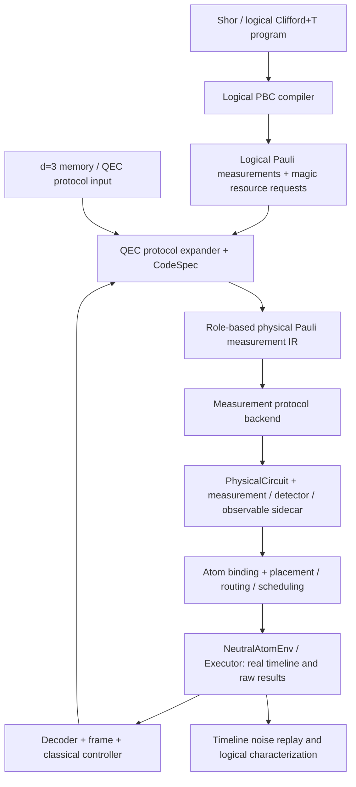

# QEC + PBC → 中性原子：d=3 上游编译架构

2026-10-01。PBC 已由用户确认是 **Pauli-based computation**。本轮新增上游协议和编译层，保留现有 environment / strategies / experiments / app 的依赖方向。物理硬约束、硬件参数、Executor 和旧 demo 合同保持。

## 1. 编译顺序与两种 Pauli 表达

目标系统的数据流如下；图中的算法 PBC 化简、通用容错协议与动态控制器是后续接口，不能当作本轮已实现功能。



这里有两件不同的事：

1. **算法 PBC 化简**：把理想 Clifford+T 算法改写成资源态上的自适应 Pauli 测量，并追踪 Clifford frame。标准 PBC 的资源态和适应性是实现通用计算的关键。[Bravyi–Smith–Smolin 原论文](https://arxiv.org/html/1506.01396)。
2. **QEC 的 Pauli 测量 IR**：把稳定子检查、逻辑 parity、制备与末端读出统一表示，保留 QEC 的测量历史与物理任务。它与 Logical PBC 共用测量语言，但不声称完成标准 PBC 的全部化简。

工程推论：原论文的理想输出分布等价并不保证已编译物理 QEC 的噪声、时间、syndrome 记录和恢复过程等价。因此先做 **算法 → Logical PBC**，再选择编码和 QEC 协议；对已有 QEC 电路，只做保留协议语义的 lowering。不能用“稳定子输入可经典模拟”删除实验实际需要的检查、测量或 reset。

当前可运行路径从 d=3 memory 协议或固定 Logical Pauli measurement 输入开始。已有裸 physical gate 列表若没有 code/role/round/measurement 元数据，不能自动推断成一个可信的 QEC 协议；首版不提供这种猜测式 importer。

## 2. 新增模块与职责

源码位于 `src/neutral_atom_experiments/qec_pbc/`，因为这是实验协议上游，不是环境的物理规律。

| 模块 | 本轮已实现内容 | 后续扩展 |
| --- | --- | --- |
| `pauli.py` | 带 ± 号的 Hermitian Pauli word、乘法相位、对易、角色映射 | Clifford conjugation / frame propagation |
| `ir.py` | role、Pauli measurement、primitive、AND 条件、XOR 位表达、detector、observable、memory contract | typed control flow、工厂请求、保护合同 |
| `surface.py` | 固定 rotated d=3 code、memory、syndrome、logical X/Y/Z representatives | 参数化码距、经验证的逻辑操作模板 |
| `lowering.py` | X/Z parity gadget → 原生 PhysicalCircuit；measurement map、provenance、operation exits | encoded/flag/cat 或其他经过验证的容错 measurement backend |
| `validation.py` | 独立于物理执行的理想 stabilizer 验证、逻辑 PBC parity Bell 示例 | 噪声采样与 flow 验证适配 |
| `neutral_atom.py` | 小规模既有平台适配与单 check 物理验收入口 | 完整 memory 和更多已验证平台适配 |

`neutral_atom_env` 不导入新增协议层。上游输出 `PhysicalCircuit`，现有 strategies 选择路线和批次；生产物理动作仍通过 `NeutralAtomEnv.submit/run` 到唯一 Executor。QEC IR 不指定原子坐标、holder、AOD 路线或虚构门耗时。

## 3. d=3 CodeSpec 的固定约定

本轮采用 rotated \([[9,1,3]]\) patch，与已有 `surface_ghz.py` / `surface_qec.py` 一致。

```text
data 编号：    0 1 2
              3 4 5
              6 7 8

X checks: X0X1X3X4, X4X5X7X8, X1X2, X6X7
Z checks: Z1Z2Z4Z5, Z3Z4Z6Z7, Z0Z3, Z5Z8

X_L = X0X3X6
Z_L = Z0Z1Z2
Y_L = i X_L Z_L = +Y0Z1Z2X3X6
```

每 patch 有 9 个 data、8 个 dedicated syndrome ancilla，共 17 个角色。一个完整 syndrome round 测 8 个 checks，总 24 个 data–ancilla 耦合。角色名如 `A.d0`、`A.X0`、`A.Z0`，实际 atom 绑定如 `A.d0 → Q000` 是另一个明确输入；不能把一个 role 绑定到两个原子，或让不同 role 隐式复用同一个 carrier。

check support 与 coupling order 分开记录。例如 `Z1Z2Z4Z5` 的既有耦合顺序为 `1→4→2→5`。首版保留这套顺序，X bank 后接 Z bank，**逐个完成 check**；没有复用旧 demo 的四层 bank 并行成绩。检查算符对易不意味着任意 ancilla 门顺序或并行方式都经过容错验证。Hook propagation 与门排序会影响保护性能。[中性原子容错架构 Methods](https://www.nature.com/articles/s41586-025-09848-5)。

## 4. IR 必须保存的语义

`PauliMeasurement` 的核心字段是：

```python
PauliMeasurement(
    id="A.r1.Z0",                     # 语义测量 result ID
    product=PauliProduct(..., sign=1), # 有符号 physical Pauli word
    ancilla="A.Z0",
    coupling_order=(...),
    depends_on=(...),
    purpose="syndrome",               # 或 logical_ppm / factory_check
    patch="A", round_index=1,
    protocol="bare_ancilla_ideal",
)
```

规则如下：

- 语义位 `b=0/1` 对应所声明算符的 eigenvalue `+1/−1`。测 `−P` 时，不改量子投影电路；由 `semantic_bit = raw_bit XOR 1` 解释结果，并相应改写条件 bit。
- 测量键、raw MEASURE gate ID、protocol operation ID 不混用。`MeasurementBinding` 连接原生报告位和语义位；`provenance` 把每个 physical gate 连接到原始 operation 和 gadget phase。
- 显式 predecessor 展开到完整 native exit frontier；共享 role 的 parity gadget 保守地保持整个 instrument 生命周期的先后。原生 wire dependency 仍由 DAG 处理。`column` 不充当依赖。
- syndrome measurement 是对 code checks 的测量；logical PPM 是编码逻辑 Pauli product 的测量；末端数据测量具有破坏性。三者不互相替换。
- detector 和 observable 是 `BitExpr` XOR 表达，保存在 sidecar 中。当前环境条件是多个 measurement-bit equality 的 AND，只能控制 X/Z；不得把 XOR 当成已有条件执行能力。
- 标准 PBC 的动态 basis selection、Clifford frame、循环/重试、decoder latency 尚无运行时实现。

## 5. Physical lowering 与能力边界

正号 Pauli product \(P\) 的参考 instrument 为：

\[
\Pi_b=(I+(-1)^bP)/2.
\]

首版 gadget 用一个裸 ancilla：

```text
RESET ancilla → H ancilla
→ 按 coupling_order 逐项 controlled-P
→ H ancilla → MEASURE ancilla → RESET ancilla
```

- Z factor：`CZ(ancilla, data)`。
- X factor：`H(data) → CZ(ancilla, data) → H(data)`。
- Y factor：IR 与逻辑代表元支持；当前 tracked physical backend 缺少 S/Sdg 的已验证执行路径，lowering 明确拒绝。不会默默用原生 T 的组合绕过 QEC tracker。

前、后 RESET 都显式计数，是保守、可验证的首版 ancilla 生命周期。以后可在已证明前置 `|0⟩` 和 reset 生命周期时省去冗余 reset；它的物理耗时必须由后端核验。

**一个裸 ancilla 测量逻辑 weight-3/6 representative 只证明理想 projector 正确，不能称容错逻辑测量。** 多数据错误的传播、测量故障、loss 与 hook 全部需要额外协议和分析。调用 `lower_to_physical(..., require_fault_tolerant=True)` 当前明确拒绝。Repeated rounds 的个数同样不是容错证明。

## 6. 完整 memory 示例与结果解释

入口 `memory_program(basis="Z", rounds=3)` 展开：

```text
9 data RESET 到 |0>（X memory 则再做 H）
→ r0: 8 个 syndrome measurements，记录可能随机的制备 syndrome
→ 依据真实报告位做 X/Z 制备修正
→ r1, r2, r3: 持续 syndrome extraction
→ 全部 9 data 的 Z 读出（X memory 先 H）
→ detector / logical parity / decoder-frame 解释
```

`rounds=3` 是 **三轮存储，另加一轮制备**；不是三轮总计。r0 的随机检查结果不能假装都是 0。

Detector 边界已实现：

1. r0 只对与 product preparation basis 相同的 checks 声明已知结果。
2. r1 的 baseline 来自已经执行的制备修正，不直接把随机 r0 syndrome 当作 baseline。
3. r2/r3 使用相邻 round 同 check 的 XOR。
4. 末端 matching-basis checks 使用 closing syndrome XOR 全数据读出中的 check parity。

logical raw parity 用 `X_L` 或 `Z_L` 的代表链；没有使用全数据多数票。`decode_ideal_memory` 通过显式 `MemoryContract` 和最后一轮八个 **正号固定 d=3 checks**，用 measured-only lookup 构造 Pauli frame，再解释 logical parity。它只覆盖理想读出下的一个 data Pauli，且故障必须在完美 closing extraction 之前；不能处理 noisy readout、任意多故障、末轮后故障或 delayed loss。缺测量位、check/observable 与合同不匹配会拒绝解码。

## 7. Logical PBC 的具体起点

固定逻辑测量可直接送入：

```python
from neutral_atom_experiments.qec_pbc import (
    PauliProduct, PBCProgram, Role, patch_roles,
    logical_measurement, lower_to_physical,
)

logical = PauliProduct((("A", "Z"), ("B", "Z")))
op = logical_measurement(logical, result_id="ZZ", ancilla="bus")
roles = patch_roles("A") + patch_roles("B") + (Role("bus", "parity_ancilla"),)
compiled = lower_to_physical(PBCProgram(roles, (op,)))
# 前置条件：调用方提供处于已声明 codespace 的 A/B。
# 这个片段只展开 measurement，不自动制备编码块。
```

`validation.bell_parity_program()` 补齐实际制备：A/B 都制备为 `|+_L⟩`，测 `Z_L(A)Z_L(B)`，根据逻辑 parity 位对 B 做 `X_L` 修正，再测 `X_L(A)X_L(B)`。无噪声下两个逻辑相关算符均为 +1，因此得到编码 Bell 态。使用 34 个 patch roles 加 1 个 bus，总 35 roles；此 Bell gadget 的物理布局和完整物理时间尚未验收。

## 8. 本轮可复现入口与证据

需要 Python ≥3.11；本机默认 Anaconda 是 Python 3.7，应使用兼容解释器。

```powershell
python examples/compile_qec_pbc.py --output artifacts/qec-pbc-2026-10-01 --rounds 3
python examples/run_qec_pbc_physical_smoke.py --output artifacts/qec-pbc-2026-10-01/physical-smoke
python tools/check_architecture.py
python -m pytest -q tests/test_qec_pbc.py tests/test_qec_pbc_pauli.py tests/test_qec_pbc_instrument.py tests/test_environment_boundary.py
```

第一条命令生成每例的 `bundle.json`、`physical_circuit.json`、`verification.json`。Bundle 同时含 protocol、bindings、原生 gates、measurement map、detectors/observables、native provenance 与 exit frontier。原生 gate JSON 不是完整 platform/placement 输入，17/35 roles 也不意味着旧工作台支持相同 atom 数；不能直接冒充旧 34/68 atom QEC demo。

`build_native_qec_inputs(program).create_environment()` 提供完整既有平台适配：A 的 9 data 绑定 Q000–Q008，8 check ancilla 绑定 Q018–Q025；34 个物理原子均保留，包括未参与协议的 spectators。它能建立完整 memory 的输入，但本轮只物理执行了一个 `Z0Z3` check，不能由此声称完整 memory 物理验收通过。35-role Bell 的独立 bus 需要新增已验证的平台，不会通过复用占用角色塞进 34 原子平台。

本轮单 check 实测：7 native gates、2 CZ、8 accepted plans、150 committed events；统一时钟总完成时间 **3221.711190 μs**，其中 logical completion 为 2482.469981 μs，最终归还至 3221.711190 μs。测量、复位、原子运输、CZ 和 terminal 均由既有物理核执行；raw parity=0、ancilla reset、effects exactly once、完整 DAG 和独立 plan replay 快照一致均通过。这里只是全零输入的一个 physical parity instrument，不是编码 memory 或保真度结果。重跑 smoke 自动保留前次目录，写入 `physical-smoke-attempt2` 等新目录。生成动画尚未做本轮真实浏览器验收。

2026-10-02 发布核验：上述 3221.711190 μs 是 10 月 1 日本地工作树采用 Enola 默认参数的历史证据，该硬件变更不属于此次 QEC/PBC 上传范围。在 GitHub main `04dc69b` 的干净基线上，仅加入 QEC/PBC 文件后重新运行同一 smoke：**3726.6 μs、158 committed events**，logical completion 为 2906.6 μs；仍为7门/2CZ/8计划，所有物理、测量、终态和独立replay断言通过。两种计时的底座/参数不同，不能作为编译性能对照。干净发布快照的274项专项/回归测试及223模块架构扫描通过；详见[发布日志](../instruction/logs/2026-10-02-qec-pbc-publication.md)。此次上传继承远端硬件配置，不上传其他本地物理核、策略或平台修改。

| 示例 | roles | native gate slots | CZ | MEASURE | 验证范围 |
| --- | --- | --- | --- | --- | --- |
| Z memory，r0 + 3 storage | 17 | 416 | 96 | 41 | 理想语义、detectors、完美 syndrome frame |
| X memory，r0 + 3 storage | 17 | 434 | 96 | 41 | 同上 |
| Logical PBC Bell | 35 | 517 | 108 | 34 | 理想编码态与逻辑相关性 |

gate slots 包括条件修正的所有分支声明；不等于所有分支每次都实际执行。重复 RESET 和串行模板也使这些数字不能直接与旧优化 demo 排名。导出报告把硬件时间与 fidelity 留为 null；仿真电脑的运行时间不是量子硬件时间。

独立验证包括 signed Pauli matrix algebra、两分支的密集 projector 概率/poststate（含纠缠 spectator）、d=3 check rank/对易/distance、X/Z memory 和全部 54 个单 data Pauli recovery cases，以及依赖、符号、能力拒绝和 edited contract 的负例。具体结果与物理 smoke 限制以[本轮日志](../instruction/logs/2026-10-01-qec-pbc-architecture.md)为准。

## 9. 后续实施顺序

这些是上游扩展阶段，不把现有 M5/M6 状态改写为完成。

| 阶段 | 下一项具体工作 | 完成条件 |
| --- | --- | --- |
| U1 | 17-atom 完整 memory 的独立平台适配与真实执行 | 所有操作、MZ/reset、终态、独立 replay 与测量 sidecar 一致 |
| U2 | 选定容错 Logical PPM 协议并扩展 measurement backend | 故障模型、hook/传播检查、重复 noisy syndrome 和 decoder 验证；才打开 FT capability |
| U3 | 逻辑 Clifford+T→PBC、Y basis、Clifford frame、magic resource 接口 | 非 Clifford 小电路的输出分布与参考一致；资源态制备/接受/拒绝/交付均有协议 |
| U4 | 实际 timeline→物理噪声→时域 decoder→逻辑标定库 | memory、PPM、工厂的条件错误率、置信区间、时间与资源统计 |
| U5 | Shor arithmetic DAG + 工厂 + 持续 QEC 的联合运行 | 小规模因子后处理真值验证，大规模成功时间与可靠性模型明确 |

未来 `ProtectionContract` 应记录活跃 block、允许插入检查的 safe boundaries 和经标定的保护政策。测量选择/decoder completion/工厂 delivery 都应形成经典依赖；等待变长时，在合法边界追加 memory rounds，不能在一个未完成的逻辑协议任意处插入旧 checks。

Magic-state 请求应声明资源态约定（例如 T-type 与 H-type 不混用）、编码类型、factory protocol、acceptance result、交付时刻、库存年龄、输出条件误差与消费 operation。Loss 仿真要分开 physical truth 与 controller observation；真实丢失时刻不能偷偷交给 decoder。后端 trace 必须保留操作身份、实际等待和移动，使噪声模型能按执行时间回放；完整 fidelity / logical error / Shor success 尚需这条标定链。
