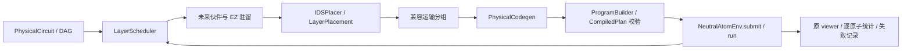

# 分层驻留编译器：QMAP 架构在本地平台上的适配

初始执行合同为原子稳定支撑于 SLM、AOD 空载静止；已加载 AOD 的任意中途续接不属于本版接口。

当前入口为 `zoned_ids`，代码位于 `src/neutral_atom_strategies/zoned/`。原 Atom Studio 的自定义工作区可以选用它；旧 `ordered_greedy`、`smt_ordered` 保留原语义作为对照。锁定 QEC demo 不会被静默替换。

依据是 [Search Smarter, Not Harder](https://arxiv.org/html/2512.13790v1) 的五阶段架构，以及 [MQT QMAP](https://github.com/munich-quantum-toolkit/qmap/tree/e2988b773a36665fd6e5a5e1228fc1df7c4e1ef1) 的有界 IDS 思路。这里是独立适配，**不是作者源码的完整移植，也没有复现千比特性能结论**。本地 CZ 使用 SLM anchor 与 AOD mobile 配对；环境的作用距离、所有活动交点、持续扫掠和开关支撑约束继续生效。

## 模块与数据流



| 文件 | 职责 | 明确不做的事情 |
|---|---|---|
| `schedule.py` | 使用真实 DAG 就绪集合及后继深度调度；同类型单比特门合批 | 不移除测量、条件或显式依赖 |
| `reuse.py` | 找到每个原子的下一 CZ 伙伴 | 不直接修改位置或量子态 |
| `placement.py` | 操作数角色、EZ anchor 落点、四个作用方向、有界即时下降搜索 | 不为每个搜索节点编译完整轨迹 |
| `models.py` | 显式 `PlacementChoice`、`LayerPlacement`，包含按需预置目的地 | 不把几何猜测当成可执行计划 |
| `routing.py` | 基于共享轴、顺序、容量与完整捕获闭包进行合批 | 不是单原子任意轨迹自由度 |
| `landing.py` | 产生 CZ 后的空闲 EZ SLM 落点，并考虑下一伙伴和四邻保护 | 不把距离最近等同于整个电路最优 |
| `codegen.py` | 捕获、正交路径、CZ、落地、恢复；候选在私有 builder 中展开 | 不跳过物理检查、不提交失败候选 |
| `controller.py` | 编排上述层，通过公开 env 接口执行；记录阶段、候选和失败 | 不依赖某份 GHZ 的 gate ID 或固定原子数 |

公共行列匹配与 program 工具已抽到 `motion/ordered_primitives.py`。新编译器不依赖旧 `OrderedAxisGreedy` 搜索类。旧模块重新导出原公共名字以保持兼容。`neutral_atom_env` 没有为本次适配新增算法或放松物理条件。

## 关键行为

1. **取消无条件整片入 EZ。** 只从当前待执行 CZ 的操作数产生搬运意图。成组平移当前前沿是一类候选；逐门选择 anchor 是另一类；已经驻留的规则位置还提供少量统一分工/方向的合批候选，防止有限搜索丢掉显然可行的并行模式。没有 CZ 的原子不因 CZ 预置被顺带搬走；所有活动交点仍须符合捕获闭包。
2. **在路径之前选落点。** 部分布局评分使用硬件装卸时间、按速度/加速度/jerk 的运动估计、兼容组数及下一伙伴距离；这是启发式估计，不是最终执行时长或可采纳下界。
3. **有界 IDS。** 立即向最佳子节点下降，把其他分支放进有界优先队列，达到完整候选数或展开预算即停止。窗口、队列和完整候选数可配；截断不证明没有更优解。全前沿失败时可以尝试较小前沿，剩余门保留在 DAG。
4. **部分矩形允许继续补全。** 搜索中三个角不因第四个角尚未分配就被强制拆开；实际 codegen 对完整批次执行严格闭包检查。这修复了八对 CZ 被拆成小批次的回归。
5. **落地与复用。** 下一伙伴变化且源支撑已在 EZ 时，优先保留合法工作位置，避免反复综合最近空位打散 syndrome 的几何结构。新入区或重复伙伴可在最近合法 EZ 空位稳定卸载。动态落地目前枚举保持批次形状的平移；失败才使用经过检查的源支撑返回路线。AOD 不隐式跨批承载。
6. **路径分级。** 先验证直接正交及少量半格门户构造；失败再展开有限的 `axis_hold` / 离散通道路线。空载变距、转弯停止、连续扫掠和空交点均由现有后端判断。不是完整高维 A* 或 relaxed routing 的等价实现。
7. **终态明确。** `restore_layout=False` 完成所有门并稳定卸载，不追加统一归还；`True` 恢复显式 holder、AOD 和开关。循环换位使用空闲 SLM 作临时支撑；若无合法缓冲位，明确失败。
8. **读出保留。** 继续使用独立的 `ReadoutPlacementPolicy`，比较静止 AOD / SLM 读出方式，并保留测量、重置、条件控制与独立重放。新控制器为读出启用边界内闲置轴配置，避免 EZ 边缘的合法原子因为闲置轴单侧排列越界而没有测量候选；旧调用默认不变。多轮专用协议仍保持原实验入口及其保护条件。

## 配置与接口

```python
from neutral_atom_strategies import make_strategy
strategy = make_strategy('zoned_ids', beam_width=64, plan_budget=4,
                         site_limit=8, route_budget=128,
                         compile_timeout_s=300, restore_layout=False)
result = strategy.run(env)
```

`beam_width` 在新实现中表示 IDS 备选队列容量，`plan_budget` 表示完成候选数，`site_limit` 表示每种操作数分工的近邻站点窗口。保留名称是为了兼容既有配置序列化；UI 根据算法显示实际含义。展开预算为 `max(前沿门数 × plan_budget, beam_width)`。

新草稿默认为固定初态、手动编译，初态优化仍是显式可选的外层实验；新策略已接入并行 placement worker，两种终态都共用同一编译合同。改变电路示例不会改变编译算法。旧 JSON 指定旧算法时保持旧算法，不改写历史结果。

失败包含阶段、未完成门、IDS 统计、物理拒绝原因；失败候选的部分预置不会提交到实时环境。决策日志包含被选门、落点、真实 CZ 批次、候选数、规划时间和 codegen 计数。`codegen` 是累计搜索诊断（包含被拒绝的私有尝试），本次接受批次见独立的 `cz_batches`，实际操作指标以 Executor 为准。编译墙钟含本地物理执行；独立重放另计，不能与作者算法本身耗时直接相比。

## 复现与当前边界

```powershell
python examples/compare_zoned_compiler.py configs/workbench/zoned_sparse20.json --output artifacts/zoned-compiler/sparse20
python examples/compare_zoned_compiler.py configs/workbench/random20_depth4.json --output artifacts/zoned-compiler/random20
python examples/compare_zoned_compiler.py configs/workbench/zoned_repeated16.json --output artifacts/zoned-compiler/repeated16
python -m pytest tests/test_zoned_compiler.py tests/test_studio_placement.py tests/test_environment_boundary.py -q
python tools/check_architecture.py
python tools/build_demo_bundle.py
python demo/launch.py
```

每个策略保存相同输入的初态、最终状态、全部 plans、报告、完整门效果恰好一次和独立重放相等性。比较前固定同一终态；`--fixed` 可以把两者都切换为显式归还。

## 本轮实测：架构可用，性能有得有失

以下三组均固定同一输入、平台和 stable 终态；两策略均完成，逐门效果及独立重放通过。墙钟是开发机单次观测，包含本地环境执行，不是作者算法基准，也不是多次统计均值。原始证据位于 `artifacts/zoned-compiler/final/<case>/<strategy>/`，汇总为 `summary.json`。

| 线路 | 旧版 / 新版编译墙钟 s | 旧版 / 新版物理时间 μs | 说明 |
|---|---:|---:|---|
| sparse20：20 原子、12 门 | 11.41 / 3.85 | 3813.50 / 5131.70 | 实际被抓取原子从 20 降至 8；CZ 脉冲数未下降，物理执行慢 34.6% |
| random20：20 原子、60 门、深度 4 | 41.54 / 18.43 | 11255.34 / 12095.96 | 编译快 55.6%，物理执行慢 7.5%；CZ 脉冲 15→16 批 |
| repeated16：16 原子、四轮重复配对 | 8.79 / 10.81 | 1814.57 / 1658.67 | 两版均每轮 8 对并行；新版物理快 8.6%，编译慢 23.0% |

34 原子两逻辑 QEC 的当前输入为 **480 槽**、105 CZ、32 测量、32 复位，不是历史 483 槽的带故障版本。新版完整编译/执行耗时 186.33 s，物理时间 83766.54 μs，独立重放另耗 145.73 s；同输入、同 stable 终态的旧版为 194.33 s、23472.44 μs、独立重放 56.25 s。**新版 CZ 脉冲从 17 批碎片化为 81 批，物理时间约为旧版 3.57 倍；QEC 性能验收未通过。** 锁定 QEC demo 继续使用原策略。

两版量子态检查均确认逻辑 XX=ZZ=+1、全部 16 个稳定子为 +1、两轮 syndrome 与测量协议完整。相同 RNG 初态在不同合法测量次序下可产生不同报告位和条件纠正，最终验证合同相同；不要求两算法的 quantum trace 逐字相同，各自须与其独立重放一致。证据位于 `artifacts/zoned-compiler/final/qec-ghz2-bounded-readout/<strategy>/`，包含 `report.json`、`plans.json`；新版后验协议检查另存 `protocol-verification.json`。这是理想投影测量及声明纠正模型的正确性验证，不能当作全电路噪声容错或性能优势。

主要缺口已经落在可替换模块中：`placement.cost` 尚未准确估计实际转弯、空轴重配和后继层几何破坏；`routing.compatible_groups` 的贪心分组及失败拆分可能把大批打碎；`landing` 仍是有限平移候选。下一步优先做多层驻留/运输代价及兼容组改进，用上述负例验证，不能通过减少校验来宣称加速。

当前不包含作者的完整 relaxed routing、跨行顺序捕获/卸载的宏观重排优化、全局驻留匹配、物理门与运输时间窗重叠或千比特性能保证。输入允许配置不等于所有实例均可编译；执行时间可能退化，保留旧流程以便同条件对照。本轮具体结果、失败和 GUI 验收见 [实施记录](../instruction/logs/2026-09-21-zoned-compiler-refactor.md)。
