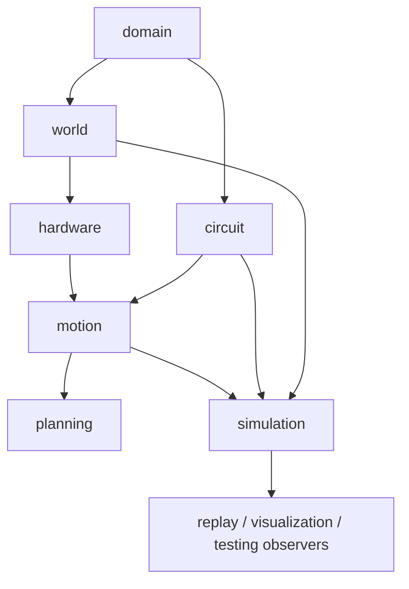

# 工程框架与模块边界

2026-09-13 架构演进设计（PROPOSED，未实施）：[目标结构与决策](../docs/architecture_evolution_plan.md)、[A0–A8实施清单](../docs/architecture_evolution_backlog.md)。下文主体是2026-09-10历史审计，旧schema13及未跟踪量子态描述不代表当前状态；当前schema19、受限QEC测量/反馈和工作台以[handoff](handoff.md)为准。新设计接口不得当作已有API使用。

用途：改依赖、接口或增加模块时读取。状态依据：2026-09-10 源码审计。物理契约见 [physics](physics.md)，状态字段见 [state_circuit](state_circuit.md)，完整进度见 [handoff](handoff.md)。

## 1. 要解决的问题

目标是让持续演化的物理 placement 支持 circuit 的依赖执行，并比较运输、返回、复用与资源占用的调度代价。当前仿真承诺是确定性几何和时间一致性，不是波函数、光学场或保真度仿真。

M1 为这个目标提供单门往返基准。已有通用程序支持不同终态的底座；后续操作级调度沿用同一世界和 holder，不为每个 gate 重建“初始布局”。已确认的目标接口见 [compiler_contract](compiler_contract.md)，其中 M3 的单 trap 持久任务/并发已实现，见 [M3](../docs/milestone3.md)，M4 返修点保留。

## 2. 当前真实目录

| 层 | 已有文件（相对 `src/neutral_atom_env/`） | 职责 |
| --- | --- | --- |
| domain | `models.py`, `operations.py`, `aod.py`, `errors.py` | 不可变值、操作计划、结构化错误 |
| world | `world.py`, `config.py` | 静态世界、holder 映射、AOD runtime、布局配置 |
| circuit | `physical_circuit.py`, `dynamic_dag.py` | 有序输入门集、依赖与门状态 |
| hardware | `rigid_aod.py`, `partial_transfer.py`, `row_column_aod.py`, `__init__.py`, `measurement.py` | 几何/装卸/作用对验证、测量区域权限 |
| motion | `compiler.py`, `single_trap.py`, `program.py`, `rigid_parking_compiler.py`, `parking_validation.py`, `row_column_compiler.py`, `planners.py`, `routing.py`, `validation.py` | 可替换路线规划、backend 计时、独立完整计划验证；见 [接口契约](motion_planning.md) |
| planning | `eager_baseline.py`, `compilers.py` | 只读 eager 意图选择、按完整 READY frontier 找首个可编译计划 |
| simulation | `pipeline.py`, `state.py`, `executor.py`, `physical_executor.py`, `event_queue.py`, `state_factory.py`, `milestone1_factory.py`, `milestone2_factory.py`, `row_column_factory.py`, `rigid_parking_factory.py`, `scheduler.py`, `runtime_validation.py` | 状态、事件提交、当前演示场景 |
| replay | `serializer.py`, `checkpoint.py`, `operation_codec.py`, `trace.py`, `trajectory.py` | schema 13 编解码、可复现记录和采样 |
| visualization | `recording.py`, `summary.py`, `viewer.py`, `viewer.js`, `viewer-shell.html` | 只读 recorder、固定统计、可嵌入运动组件 |
| testing | `scene.py`, `theme.py`, `renderer.py`, `replay.html`, `acceptance.py`, `milestone1_report.py`, `milestone2_report.py`, `row_column_report.py`, `logical_executor.py`, `scenarios.py`, `artifacts.py` | 证据生成及观察型可视化 |

现有代码入口：[src](../src/neutral_atom_env/)。未建立 `rl/`、通用 `CandidateGenerator` 或 `ReservationTable` 类。不要把旧设计的建议文件名当成已存在 API。

## 3. 接口契约

```python
state = make_single_gate_state()
intent = EagerBaseline().choose(state)
plan = MotionCompiler().compile(intent, state)
executor = Executor(state)
executor.submit(plan)
executor.run()
saved = state.snapshot()
restored = SimulationState.restore(saved)
```

对应模块：`simulation.milestone1_factory`、`planning.eager_baseline`、`motion.compiler`、`simulation`、`simulation.state`。代码示例省略 import，仅说明当前调用链。

- `compile` 成功返回 `CompiledPlan`；失败抛出带 `ConstraintViolation` 的 `ValidationError`。当前不是 `result.is_success` 联合返回类型。
- `exact_validate(plan,state)` 位于 `motion/compiler.py`；校验版本、全快照 fingerprint，再独立推演实际 operations。
- backend 的 `load/move/offload` 返回推演状态，不安装实时状态；它们可以被 compiler 用来预测最终 placement。
- `Executor.submit` 入队，`step` 提交一个事件，`run` 清空队列；`run` 不等价于“完成整个 circuit”或“自动发现 deadlock”。
- `EagerScheduler.step()` 推进一个真实事件或返回 `ScheduleResult`；`run()` 连续执行整个电路，返回 completed/stalled，损坏 runtime 则抛错。
- `snapshot()` 返回 JSON 字符串；`restore` 支持 schema 13，旧 schema 显式拒绝。

## 4. 依赖方向



箭头表示能力供给方向；import 的方向通常相反。硬件代码不得调用 policy；DAG 不得查询路径、AOD 或 zone；底层 domain 不依赖 runtime。

当前 `SimulationState` 调用 replay 的 serializer，checkpoint/scene 又使用局部 import 恢复 runtime。这是现有编解码适配，并不意味着可以在底层导入 executor 执行操作。未来若循环依赖扩大，应引入只读状态协议或独立 codec 边界，不以更多延迟 import 掩盖设计问题。

## 5. 新行为应该放哪里

| 新需求 | 所属层 | 不应采用的做法 |
| --- | --- | --- |
| AOD 捕获/转移方式改变 | hardware 新能力或 backend | 在 policy 中偷偷改 holder |
| 作用点/回程/卸载点选择 | scheduler 给目标或允许域；motion 编译局部候选 | 在 scene 中重排原子 |
| 决定返回还是 KEEP | planning/policy | backend 固定读未来电路并选策略 |
| 释放 successor | circuit reducer，由 Executor 安装 | 候选生成时直接完成 gate |
| 资源时间窗口与并发 | simulation + hardware 资源契约 | 仅依赖“门不共享 qubit”判并发 |
| action mask/reward | 未来 RL 接口 | 把非法物理动作交给奖励惩罚补救 |
| 新视觉符号/图层 | visualization component / testing renderer | 修改硬件参数让图更好看 |

## 6. 配置与持续状态

当前配置为 JSON：`configs/world/acceptance.json`、`configs/hardware/milestone1.json`、`configs/hardware/row_column.json`、`configs/visual/default.json`。旧 factory 仍保留测试场景布局；`simulation.pipeline` 已支持独立外部平台/电路/placement 输入，scheduler/runtime_validation 不应承担场景初始化。

平台几何、容量与能力 Config 在 episode 内固定；目标契约中的 SLM/AOD 启用是 runtime 状态，不能继续固化在配置（M3-A 已实现）。runtime 经事件变化；plan 是基于一个版本的不可变推演；snapshot 是完整保存；trace 仅追加。M1 返回起始 trap 来自该次 `CaptureBinding`，不代表 atom 永久拥有 home。

接口字段若改变，应明确 schema 迁移或拒绝旧产物，更新恢复、回放、报告和交接文档。原计划中的 `_advance_until_decision_point`、Gym `step`、候选缓存等仍是 [后续设计](planning_rl.md)，不能假称当前已有。


## 通用输入与编译插件（当前）

`simulation/pipeline.py` 定义 Platform.load、initialize、run_circuit；`planning/compilers.py` 定义 GateCompiler 协议与 CLI 内置策略工厂。`motion/single_trap.py` 是可替换运输策略，`motion/program.py` 是不依赖运输模板的程序构建与独立审核。输入平台/placement 不再必须经固定场景 factory。旧 factory 保留为测试案例。物理 backend（rigid/row_column）与编译策略（single_trap/legacy_eager）为不同选择。通用 plan 保存 initial_placement，逐次装卸显式绑定，checkpoint 当前 schema 13。详见 [接口](../docs/circuit_pipeline.md)。

## 任务 IR 与下一层调度边界

目标任务 → 局部候选 → 全局调度 → 独立校验 → 执行是 [compiler_contract](compiler_contract.md) 的正式方向。保持三种可替换接口独立：hardware backend（能力/合法性/成本）、compiler（目标到原子操作）、scheduler policy（任务选择/时间安排）。替换运输策略无需替换 circuit、Executor 或动画；更换 hardware 需重新验证能力和计划，不能沿用旧 trace。

M3-B 已新增 `TaskIntent`、`TaskTarget`、`OperationInterval`、`TaskProgram` 与 `TargetTaskCompiler`，入口在 domain/operations.py、motion/tasks.py、task_validation.py；零 gate 运输、prepare/effect/cleanup、稳定 SLM 1Q、显式终态与唯一效果经同一 validator/Executor/recorder 执行，见 [任务 API](../docs/task_program.md)。`TaskCompiler` 与原 GateCompiler 协议并存。

M3-C/D 已新增 motion/persistent.py、scheduled.py、family.py 与 simulation/m3.py、operation_program.py。运行时 scheduled program 内支持多个活动操作和按操作释放资源；legacy 路径保留串行语义。只有 Executor 提交最新状态。策略使用有限 Raman/MOVE 窗口，M4 可返修候选与决策边界。
