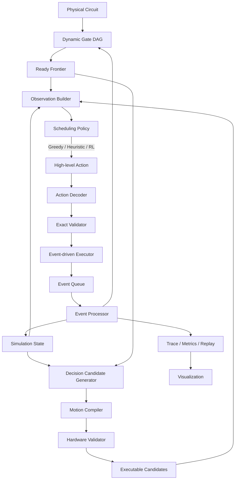

# 面向 RL Agent 的中性原子量子计算模拟环境
> 实施修订：根据用户确认，Milestone 0 将原子与物理比特身份合并为同一个 `Q000、Q001…` 编号。`Atom.id` 直接用于 placement 和 gate operands，不再实现本文早期示例中的 `physical_qubit_id` 映射。以下涉及双身份的示例保留为原始设计记录，以此修订为准。
## V2.1 工程架构：Dynamic Placement + Event-Driven Scheduling + Visual Acceptance

- 文档状态：架构重构版
- 目标版本：V2.1
- 默认空间单位：μm
- 默认时间单位：μs
- 设计目标：正确、可执行、可测试、可维护，并可平滑扩展到 RL
- 主要对象：Physical Circuit、Dynamic DAG、Atom Placement、AOD Motion、Zone Operation、Scheduler / RL
- 核心原则：**Atom 没有必须返回的固定 home；SLM site 是资源，Atom 是持续演化的可移动实体。**

---

# 1. V2.0 重新定义问题

本项目不是“把每个 2Q gate 翻译成一次往返移动”的模拟器。

它要模拟的是一个持续运行的中性原子处理器。处理器在任意时刻都具有一个物理状态：

```text
- 哪些 Atom 仍然存在
- 每个 Atom 在哪里
- 每个 Atom 当前由 SLM 还是 AOD 持有
- 哪些 SLM site 空闲
- AOD 当前处于什么 pose
- 哪些 gate 已经完成
- 哪些 gate 当前 ready
- 哪些资源正被占用
- 当前仿真时间
```

因此，真正的问题是：

\[
\boxed{
\text{Circuit Dependency}
+
\text{Dynamic Placement}
+
\text{Movement Planning}
+
\text{Resource Scheduling}
}
\]

其中最重要的变化是：

> 2Q gate 完成后，不再默认执行 `entanglement -> storage -> original site`。

一次 gate 结束后，Atom 可以：

```text
1. RETURN_AND_OFFLOAD
2. KEEP_LOADED
3. REPOSITION_AND_KEEP
4. OFFLOAD_TO_NEW_STATIC_SITE
```

这些是调度策略，而不是硬件模拟器的固定规则。

---

# 2. V2.0 设计原则

## 2.1 Simulator 与 Scheduler 分离

Simulator 只回答：

```text
“这个动作在当前物理状态下是否合法？”
“执行它需要多久？”
“执行后物理状态变成什么？”
```

Scheduler / RL 只回答：

```text
“当前应该做哪个动作？”
```

禁止以下耦合：

```text
Simulator:
    if gate_finished:
        atom.return_home()
```

应该改成：

```text
Policy:
    choose RETURN / KEEP / REPOSITION

Simulator:
    validate_and_execute(policy_decision)
```

---

## 2.2 DAG 只管理逻辑依赖

Dynamic Gate DAG 不知道：

```text
- Atom 如何移动
- AOD 如何抓取
- Entanglement zone 在哪里
- 某个 gate 是否几何可实现
```

DAG 只维护：

```text
BLOCKED
READY
RESERVED
RUNNING
COMPLETED
FAILED
```

以及：

```text
ready_gate_ids
remaining_predecessors
successors
```

因此：

\[
\boxed{
DAG = logical availability
}
\]

而不是：

\[
DAG = physical executability
\]

---

## 2.3 Placement 是一等公民

V2.0 不把 Atom 的初始 SLM trap 当作永久归属。

初始状态可能是：

```text
a -> SLM(0, 0)
b -> SLM(1, 0)
c -> SLM(2, 0)
d -> SLM(3, 0)
```

执行若干 gate 后可以变成：

```text
a -> AOD cell (0, 0), entanglement zone
b -> SLM(8, 2)
c -> AOD cell (1, 0), transit
d -> SLM(3, 0)
```

这里不存在“a 必须回到 (0,0)”的默认假设。

---

## 2.4 Motion Planner 不做策略决策

Motion Planner 的职责：

```text
给定一个高层意图，
编译出一条合法的物理 motion plan。
```

例如高层意图：

```text
ExecuteGateBatch([g12, g18])
EndDisposition = KEEP_LOADED
```

Motion Planner 可以输出：

```text
LOAD
MOVE_Y
MOVE_X
ALIGN
PULSE
MOVE_TO_STAGING
HOLD
```

但 Motion Planner 不应该自己判断：

```text
“因为下一个 gate 可能还会用 a，所以我决定不返回。”
```

是否返回由 Policy 决定。

---

## 2.5 Executor 是唯一状态写入者

任何模块都不能直接修改 SimulationState。

禁止：

```python
planner.state.atom["a"].position = ...
policy.state.dag.mark_completed(...)
backend.state.aod.pose = ...
```

所有状态变化必须经过：

```text
Operation
-> SimulationEvent
-> EventProcessor
-> State Mutation
```

这是整个项目最重要的工程不变量之一。

---

# 3. 总体架构



从职责上划分成八个主要层：

```text
1. domain
2. world
3. circuit
4. hardware
5. motion
6. planning
7. simulation
8. interfaces / visualization
```

---

# 4. 一次决策到底发生什么

每个 decision point 执行以下流水线：

```text
Step 1
更新 DAG ready frontier

Step 2
读取当前物理状态

Step 3
生成有限数量 high-level candidate

Step 4
将 candidate 编译成具体 motion plan

Step 5
Hardware backend 验证计划

Step 6
形成 action mask

Step 7
Greedy / RL 选择 candidate

Step 8
Exact validation

Step 9
Event-driven executor 启动操作

Step 10
推进到下一个 decision point

Step 11
提交事件、更新 atom placement / DAG / resources

Step 12
重新进入 Step 1
```

因此环境是一个循环：

\[
s_t
\rightarrow
C_t
\rightarrow
a_t
\rightarrow
\text{events}
\rightarrow
s_{t+1}.
\]

---

# 5. Circuit 层：Dynamic Gate DAG

## 5.1 Physical Gate

```python
@dataclass(frozen=True)
class PhysicalGate:
    id: str
    gate_type: str
    qubit_ids: tuple[str, ...]
    metadata: Mapping[str, Any]
```

初版支持：

```text
X
Y
Z
H
RX
RY
RZ
CZ / CPHASE
MEASURE
```

两比特门统一标记：

```python
@property
def is_two_qubit(self) -> bool:
    return len(self.qubit_ids) == 2
```

---

## 5.2 DAG 构造

DAG 只按照 qubit 上操作的偏序构建。

对每个 physical qubit：

```text
找到它的上一个 gate
建立：
previous_gate -> current_gate
```

例如：

```text
g1 = CZ(a,b)
g2 = H(c)
g3 = CZ(a,c)
```

得到：

```text
g1 -> g3
g2 -> g3
```

---

## 5.3 Ready Frontier

```python
@dataclass
class GateNodeRuntime:
    gate: PhysicalGate
    status: GateStatus
    remaining_predecessors: int
    successors: set[str]
```

ready 条件只有一个：

```text
remaining_predecessors == 0
```

不加入：

```text
Atom 是否已经在 entanglement zone
是否有空闲 AOD
当前是否能找到路径
```

这些属于 physical planning。

---

## 5.4 Gate Reservation

Scheduler 选择一个计划以后：

```text
READY -> RESERVED
```

真正 pulse 开始：

```text
RESERVED -> RUNNING
```

pulse 成功完成以后：

```text
RUNNING -> COMPLETED
```

禁止 candidate 一被选中就直接：

```text
READY -> COMPLETED
```

---

# 6. World 层：持续演化的物理世界

## 6.1 Coordinate

```python
@dataclass(frozen=True)
class Position2D:
    x_um: float
    y_um: float
```

SLM 可额外保留逻辑 grid：

```python
@dataclass(frozen=True)
class GridCoord:
    x: int
    y: int
```

---

## 6.2 Zone

Zone 只描述：

```text
在这里允许执行什么操作
```

而不是：

```text
AOD 是否允许经过
```

V2.0 初版：

```python
class ZoneType(Enum):
    STORAGE = "storage"
    ENTANGLEMENT = "entanglement"
    MEASUREMENT = "measurement"
```

可扩展：

```text
RESERVOIR
STAGING
COOLING
DIAGNOSTIC
```

Zone 是配置，不应该被硬编码到 scheduler。

---

## 6.3 SLM Site

```python
@dataclass
class StaticTrap:
    id: str
    grid: GridCoord
    position: Position2D
    enabled: bool
    atom_id: str | None
```

SLM site 是设备资源。

不保存：

```text
home_atom_id
```

如果为了调试希望记住初始位置，应放在：

```python
atom.metadata["initial_static_trap_id"]
```

而不能作为约束。

---

# 7. Atom 模型

```python
class HoldingMode(Enum):
    STATIC_SLM = "static_slm"
    MOBILE_AOD = "mobile_aod"
    LOST = "lost"
```

```python
@dataclass
class Atom:
    id: str
    physical_qubit_id: str | None

    holding_mode: HoldingMode

    static_trap_id: str | None
    mobile_cell: "MobileCellIndex | None"

    alive: bool
    measured: bool

    quantum_state_ref: str | None

    operation_history: list["OperationRecord"]
    metadata: dict[str, Any]
```

Atom 自己不应该保存独立可变的 `position` 作为真值。

位置应该由 holder 推导：

```text
STATIC_SLM:
    position = static_lattice[static_trap_id].position

MOBILE_AOD:
    position = aod.pose + mobile_cell.offset
```

这样避免：

```text
atom.position != trap.position
```

产生重复状态源。

---

# 8. Placement 模型

新增明确的数据结构：

```python
@dataclass
class PlacementState:
    atom_to_holder: dict[str, HolderRef]
    static_occupancy: dict[str, str | None]
    mobile_occupancy: dict["MobileCellIndex", str | None]
```

`HolderRef`：

```python
class HolderType(Enum):
    STATIC = "static"
    MOBILE = "mobile"
    LOST = "lost"
```

```python
@dataclass(frozen=True)
class HolderRef:
    holder_type: HolderType
    holder_id: str | None
```

Placement 必须满足：

```text
每个 alive atom 恰好由一个 holder 持有
```

不允许：

```text
Atom 同时被 SLM 和 AOD 持有
Atom alive 但没有 holder
两个 Atom 占据同一个不可双占用 holder
```

---

# 9. Hardware 层

Hardware 层描述：

```text
机器允许做什么
机器不允许做什么
机器操作的时间 / 几何 / 资源限制是什么
```

主要包含：

```text
AODBackend
EntanglingLaser
MeasurementDevice
HardwareResources
```

---

# 10. AOD Backend

## 10.1 Backend 的目的

不要把某一种实验设备的约束写入：

```text
scheduler.py
planner.py
environment.py
```

统一使用：

```python
class AODBackend(Protocol):
    @property
    def capabilities(self) -> "AODCapabilities": ...

    def enumerate_load_options(
        self,
        state: "SimulationState",
        requested_atoms: frozenset[str],
    ) -> Iterable["LoadOption"]: ...

    def compile_transport(
        self,
        request: "TransportRequest",
        state: "SimulationState",
    ) -> "TransportPlan | MotionFailure": ...

    def validate_transport(
        self,
        plan: "TransportPlan",
        state: "SimulationState",
    ) -> list["ConstraintViolation"]: ...
```

---

## 10.2 初版只实现一个确定 backend

建议 V2.0 首先只完整实现：

```text
RigidRectangularAODBackend
```

它可以对应 Qiuniu/AAM 一类固定矩形动态晶格语义。

核心约束：

```text
rows 固定
columns 固定
cell spacing 固定
所有 occupied mobile cells 共用一个 rigid translation
一次只运行一个 AOD instance
```

先不要同时实现：

```text
独立 row motion
独立 column motion
动态变距
多个 AOD
复杂 crossing
```

这些以后做新 backend。

---

# 11. Capture Closure

如果当前 backend 采用整块 AOD footprint 抓取，则：

```text
requested atoms != captured atoms
```

例如请求：

```text
requested = {a, b}
```

但 footprint 覆盖：

```text
a, b, c, e
```

则：

```text
captured = {a, b, c, e}
incidental = {c, e}
```

所有 incidental atoms 必须参与：

```text
路径检测
安全距离检测
2Q laser effect 检测
offload 检测
reward / metrics
```

不能“逻辑上忽略”。

---

# 12. Motion 层重新划分

Motion 层只负责：

\[
\boxed{
HighLevelIntent
\rightarrow
CompiledPhysicalPlan
}
\]

建议拆成：

```text
motion/
├── compiler.py
├── load_planner.py
├── transport_planner.py
├── interaction_allocator.py
├── offload_planner.py
├── geometry_validator.py
└── plans.py
```

不要让一个巨大 `MotionPlanner` 同时承担所有逻辑。

---

# 13. High-Level Intent

Scheduler 不直接输出连续轨迹。

它输出：

```python
@dataclass(frozen=True)
class ExecuteGateBatchIntent:
    gate_ids: frozenset[str]
    preferred_interaction_region: str | None
    end_disposition: "EndDisposition"
```

还需要两个特殊 intent：

```python
@dataclass(frozen=True)
class ReturnLoadedAtomsIntent:
    preferred_static_region: str | None
```

```python
@dataclass(frozen=True)
class RepositionLoadedAtomsIntent:
    target_region: str
```

因此 agent 可以明确表达：

```text
做 gate
返回
继续保持
重新摆放
```

而不是依赖奇怪的空动作。

---

# 14. EndDisposition

```python
class EndDisposition(Enum):
    RETURN_AND_OFFLOAD = "return_and_offload"
    KEEP_LOADED = "keep_loaded"
    REPOSITION_AND_KEEP = "reposition_and_keep"
    OFFLOAD_TO_NEW_SITE = "offload_to_new_site"
```

其中 V2.0 Milestone 1 只真正执行：

```text
RETURN_AND_OFFLOAD
```

Milestone 3 再开放：

```text
KEEP_LOADED
REPOSITION_AND_KEEP
OFFLOAD_TO_NEW_SITE
```

接口先保留，功能逐步实现。

---

# 15. Motion Compiler

推荐主接口：

```python
class MotionCompiler:
    def compile(
        self,
        intent: "HighLevelIntent",
        state: "SimulationState",
        backend: AODBackend,
    ) -> "CompiledPlan | CompilationFailure":
        ...
```

内部流程：

```text
1. Resolve required atoms
2. Resolve current holders
3. Enumerate load options
4. Compute capture closure
5. Allocate interaction placement
6. Compile transport
7. Simulate laser effect
8. Compile end disposition
9. Estimate duration
10. Validate
```

---

# 16. CompiledPlan

```python
@dataclass(frozen=True)
class CompiledPlan:
    id: str
    state_version: int

    intent: "HighLevelIntent"

    gate_ids: frozenset[str]
    requested_atom_ids: frozenset[str]
    captured_atom_ids: frozenset[str]
    incidental_atom_ids: frozenset[str]

    operations: tuple["Operation", ...]

    resource_requirements: tuple["ResourceRequirement", ...]
    geometry_summary: "GeometrySummary"

    estimated_duration_us: float
    estimated_distance_um: float

    predicted_end_state: "PlacementDelta"
    score_features: Mapping[str, float]
```

CompiledPlan 是不可变对象。

禁止执行过程中修改它。

---

# 17. Operation 层

所有真正改变机器状态的行为都表达为 Operation：

```python
class OperationType(Enum):
    AOD_LOAD = "aod_load"
    AOD_MOVE = "aod_move"
    AOD_HOLD = "aod_hold"
    AOD_OFFLOAD = "aod_offload"

    ENTANGLING_PULSE = "entangling_pulse"
    SINGLE_QUBIT_PULSE = "single_qubit_pulse"
    MEASURE = "measure"

    WAIT = "wait"
```

---

# 18. AOD Motion 的 V2.0 表达

V2.0 不要求一次 movement 一定：

```text
LOAD
-> ENTANGLE
-> RETURN
-> OFFLOAD
```

而是允许 plan 由任意合法 Operation 序列组成。

例如 eager return：

```text
LOAD
MOVE_ESCAPE
MOVE_TO_EZ
ALIGN
PULSE
MOVE_OUT
MOVE_BACK
OFFLOAD
```

keep-loaded：

```text
LOAD
MOVE_ESCAPE
MOVE_TO_EZ
ALIGN
PULSE
MOVE_TO_STAGING
HOLD
```

reuse：

```text
MOVE_FROM_STAGING
ALIGN_NEXT_PAIR
PULSE
HOLD
```

return-only：

```text
MOVE_TO_STATIC_LATTICE
ALIGN_OFFLOAD
OFFLOAD
```

---

# 19. 为什么不要固定“移动回来”

假设：

```text
g1 = CZ(a,b)
g2 = CZ(a,c)
```

执行 g1 后如果 eager return：

```text
a,b -> storage
```

g2 需要：

```text
a,c -> entanglement
```

a 被重复运输。

如果 keep-loaded：

```text
a remains mobile
b returns
c moves
```

可能更快。

但 keep-loaded 也可能造成：

```text
AOD 被长期占用
entanglement zone congestion
offload site 被阻塞
其他 ready gate 无法执行
```

所以策略不是：

```text
“未来还会使用 -> 一定 KEEP”
```

而是比较长期代价。

---

# 20. Return Decision 的正确所属层

Return 决策属于：

```text
planning / policy
```

Return path 属于：

```text
motion
```

Return legality 属于：

```text
hardware + validator
```

Return execution 属于：

```text
simulation
```

这一点必须在代码边界上保持严格。

---

# 21. Planning 层

Planning 层不再叫“全部调度逻辑”。

它主要承担：

```text
1. 生成少量高层候选
2. 调用 MotionCompiler
3. 过滤不可执行计划
4. 计算候选特征
5. 交给 policy 选择
```

目录：

```text
planning/
├── candidate_generator.py
├── candidate.py
├── candidate_cache.py
├── feature_builder.py
├── exact_validator.py
└── policies/
    ├── base.py
    ├── eager_baseline.py
    ├── lookahead.py
    ├── greedy.py
    └── rl_policy.py
```

---

# 22. Candidate 不等于 Gate

Candidate 是：

```text
当前状态下，一个完整可执行的高层动作。
```

例如：

```text
Candidate C1:
    execute {g3}
    return

Candidate C2:
    execute {g3}
    keep_loaded

Candidate C3:
    execute {g3, g4}
    return

Candidate C4:
    return_only
```

同一个 gate 可以出现在多个 candidate 中，因为结束状态不同。

---

# 23. Candidate Generator

推荐流程：

```python
def generate(state):
    ready = state.dag.ready_gates()

    intents = intent_generator.enumerate(
        state=state,
        ready_gates=ready,
    )

    candidates = []

    for intent in intents:
        result = motion_compiler.compile(
            intent=intent,
            state=state,
            backend=hardware.aod_backend,
        )

        if result.is_success:
            candidates.append(
                candidate_factory.from_plan(result.plan)
            )

    return prune_and_rank(candidates)
```

---

# 24. Candidate 数量必须受控

不能枚举：

```text
ready gates 所有子集
× 所有 interaction sites
× 所有 footprints
× 所有 return decisions
× 所有 offload locations
```

否则组合爆炸。

V2.0 使用分层剪枝。

例如：

```text
max_ready_gates_considered = 16
max_gate_batch_size = 4
max_interaction_placements_per_batch = 4
max_load_options = 8
max_end_dispositions = 2
max_candidates = 128
```

这些都放配置。

---

# 25. Gate Batch

初版支持：

```text
batch_size = 1
```

之后再开放：

```text
batch_size > 1
```

批量 gate 必须先满足逻辑条件：

```text
不共享 physical qubit
```

之后才交给 MotionCompiler 判断：

```text
是否能被同一 AOD 动作实现
是否产生额外激光 pair
```

不要在 DAG 层解决这些问题。

---

# 26. Entanglement Zone

Entanglement zone 本质上只定义：

```text
哪里允许 2Q pulse
```

建议初版使用：

```text
rectangle / strip
```

而不是强行建模复杂光束 profile。

---

# 27. 2Q Laser Effect

一次全局 2Q pulse 的语义：

```python
actual_pairs = predicate.eligible_pairs(state, zone)
```

之后必须比较：

```text
actual_pairs
vs
intended_pairs
```

默认：

```text
actual_pairs != intended_pairs
=> candidate invalid
```

以后可以扩展成：

```text
crosstalk noise
probabilistic unwanted coupling
```

但不要在第一版混入。

---

# 28. Interaction Placement

为了便于规划，可以定义虚拟 slot：

```python
@dataclass(frozen=True)
class InteractionSlot:
    id: str
    center: Position2D
    reserved_radius_um: float
```

注意：

> InteractionSlot 只是规划器的离散化工具，不是硬件资源本体。

这样可以减少连续位置搜索。

---

# 29. Simulation 层

Simulation 负责：

```text
时间
事件
资源占用
状态提交
deadlock
metrics
```

目录：

```text
simulation/
├── state.py
├── state_factory.py
├── executor.py
├── event_queue.py
├── event_processor.py
├── decision_clock.py
├── reservation.py
├── metrics.py
└── deadlock.py
```

---

# 30. SimulationState

推荐：

```python
@dataclass
class SimulationState:
    version: int
    time_us: float

    world: "WorldState"
    placement: "PlacementState"

    atoms: dict[str, Atom]

    aod: "AODRuntimeState"
    hardware_resources: "HardwareResourceState"

    dag: "DynamicGateDAG"

    active_operations: dict[str, "OperationRuntime"]
    reservations: "ReservationTable"

    metrics: "MetricsState"
    rng_state: "RandomState"
```

尽量避免重复存储：

```text
atom.position
static_lattice.occupancy
placement.static_occupancy
world.atom_position
```

应明确一个 source of truth。

建议：

```text
placement = holder truth
world = geometry truth
```

Atom 只保存 identity / metadata / quantum handle。

---

# 31. State Version

每次事件提交后：

```python
state.version += 1
```

CompiledPlan 保存：

```text
state_version
```

执行前：

```text
plan.state_version == state.version
```

如果不一致：

```text
revalidate or reject
```

这样可以避免 candidate cache 使用过期物理状态。

---

# 32. Event-driven Execution

不要写成：

```python
step():
    move atom instantly
    gate instantly
    move back instantly
```

而应该：

```text
Operation starts
-> schedule completion event
-> time advances
-> completion event commits state
```

基本事件：

```text
AOD_LOAD_STARTED
AOD_LOAD_COMPLETED

AOD_MOVE_STARTED
AOD_MOVE_COMPLETED

ENTANGLING_PULSE_STARTED
ENTANGLING_PULSE_COMPLETED

AOD_OFFLOAD_STARTED
AOD_OFFLOAD_COMPLETED

MEASUREMENT_STARTED
MEASUREMENT_COMPLETED
```

---

# 33. Decision Point

不是每一个微小 event 都必须询问 agent。

推荐 V2.0 初始规则：

```text
只有当高层策略有新决策空间时才进入 decision point
```

例如：

```text
1. episode 初始化
2. 一个 compiled plan 完成
3. gate pulse 完成并产生新的 ready gates
4. KEEP_LOADED 后等待 reuse / return 决策
5. 当前计划失败
6. deadlock
```

一次 plan 内部：

```text
LOAD -> MOVE -> ALIGN
```

可以由 executor 自动推进，不要求 RL 每段轨迹重新决策。

这样 action space 更稳定。

---

# 34. Environment Step

```python
class NeutralAtomEnv:

    def reset(self, config, circuit, seed=None):
        self.state = state_factory.create(
            config=config,
            circuit=circuit,
            seed=seed,
        )

        self._advance_until_decision_point()

        return self.observation_builder.build(self.state)

    def step(self, action):
        candidates = self.candidate_cache.get(self.state)

        candidate = self.action_decoder.decode(
            action,
            candidates,
        )

        self.exact_validator.validate(
            candidate,
            self.state,
        )

        self.executor.start_plan(
            candidate.plan,
            self.state,
        )

        events = self._advance_until_decision_point()

        reward = self.reward_model.compute(
            previous_snapshot=self.previous_snapshot,
            current_state=self.state,
            events=events,
        )

        observation = self.observation_builder.build(
            self.state,
        )

        return StepResult(
            observation=observation,
            reward=reward,
            terminated=self.state.dag.all_completed(),
            truncated=self.stop_conditions.reached(self.state),
            info=self.metrics.snapshot(),
        )
```

---

# 35. 三种 Scheduler 基线

在 RL 前必须有确定性 baseline。

---

## 35.1 Baseline 0：Eager Return

规则：

```text
每次选择一个 ready 2Q gate
完成后立即 RETURN_AND_OFFLOAD
```

用途：

```text
验证 simulator
验证 movement
验证 gate completion
获得最笨但确定的 baseline
```

---

## 35.2 Baseline 1：Lookahead Return

看未来 K 个 gate。

例如：

```text
K = 4
```

若 loaded atoms 很快再次参与候选 gate：

```text
尝试 KEEP_LOADED
```

否则：

```text
RETURN
```

这不是最终算法，但很适合作为 RL 对照组。

---

## 35.3 Baseline 2：Greedy Cost

为每个 candidate 计算：

\[
score =
+w_g N_{\text{gate}}
+w_c \Delta CP
+w_r V_{\text{reuse}}
-w_t T
-w_d D
-w_i N_{\text{incidental}}
-w_b C_{\text{blocking}}
\]

选择最大值。

---

# 36. Return Cost Feature

不要直接 hard-code：

```text
未来还用 -> KEEP
```

建议提供特征：

```text
next_use_distance
next_use_dependency_depth
ready_partner_count
near_ready_partner_count

estimated_return_time
estimated_reload_time
estimated_reuse_time_saved

aod_blocking_cost
static_site_blocking_cost
interaction_zone_blocking_cost

loaded_atom_count
incidental_loaded_atom_count
```

Policy 根据这些决定。

---

# 37. RL Action Space

V2.0 推荐：

```text
action = candidate index
```

而不是：

```text
直接输出每个 atom 的连续二维终点
直接输出 AOD 频率
直接输出 path waypoint
```

原因：

```text
大幅减少非法 action
硬件 constraint 可以由 deterministic compiler 保证
同一个 policy 可以更换不同 backend
训练稳定性更好
```

---

# 38. 分层 RL 的未来接口

以后可以开放：

Level 1：

```text
选择 candidate
```

Level 2：

```text
选择：
gate batch
interaction slot
end disposition
```

Level 3：

```text
选择：
placement target
staging location
```

不建议短期内让 RL 直接学习低层连续 AOD waveform。

---

# 39. Observation

建议 observation 分成两部分。

第一部分：全局状态。

```python
@dataclass(frozen=True)
class GlobalObservation:
    time_us: float
    ready_gate_count: int
    completed_gate_count: int
    aod_loaded: bool
    aod_atom_count: int
    circuit_progress: float
```

第二部分：candidate table。

```python
@dataclass(frozen=True)
class CandidateFeature:
    gate_count: int

    requested_atom_count: int
    captured_atom_count: int
    incidental_atom_count: int

    estimated_duration_us: float
    estimated_distance_um: float

    end_disposition: int

    estimated_reuse_value: float
    blocking_cost: float
    critical_path_reduction: float
```

---

# 40. 为什么 Candidate-based Observation 更合适

直接给 RL：

```text
几百个 atom 坐标
几百个 grid site
整个 DAG adjacency matrix
完整路径网格
```

虽然信息完整，但第一版训练难度太高。

V2.0 建议：

```text
Global State
+
Ready Gate Features
+
Compiled Candidate Features
+
Action Mask
```

后续再加入：

```text
Graph Neural Network
Atom graph
Spatial graph
DAG graph
```

---

# 41. Reward

初始：

\[
r_t =
-w_t\Delta t
-w_d D
-w_l N_{\text{load/offload}}
+w_g N_{\text{completed gates}}
\]

episode 完成：

\[
+w_f.
\]

推荐：

```text
reward =
    + w_gate * completed_gate_count
    + w_finish * circuit_finished

    - w_time * elapsed_time
    - w_motion * transported_atom_distance
    - w_load * load_offload_count
    - w_incidental * incidental_transport
    - w_idle * resource_idle_time
    - w_invalid * invalid_action
```

---

# 42. 不要直接奖励 KEEP

禁止：

```text
+10 if KEEP_LOADED
```

或：

```text
+10 if RETURN
```

正确做法是让：

```text
移动距离
时间
blocking
gate throughput
```

体现其长期价值。

---

# 43. Resource Model

资源统一抽象：

```python
@dataclass(frozen=True)
class ResourceRequirement:
    resource_id: str
    start_offset_us: float
    duration_us: float
    mode: str
```

第一版资源：

```text
AOD_0
ENTANGLING_LASER_0
MEASUREMENT_DEVICE_0
```

这样以后：

```text
多个 AOD
多个 measurement zone
多个 laser channel
```

无需修改 scheduler 核心。

---

# 44. Reservation

Plan 开始前建立 reservation：

```text
gates
resources
static offload sites
interaction slots
```

Reservation 不改变物理状态，只防止并发计划互相覆盖。

即使第一版只有一个 AOD，也保留 ReservationTable。

---

# 45. Concurrency

V2.0 第一版：

```text
max_concurrent_aod_cycles = 1
```

这会大幅简化。

并行性主要来自：

```text
一个 candidate 内的一批 gate
```

未来才允许：

```text
多个 AOD candidate 并行
```

---

# 46. 冲突检测重新定位

不建议一开始对所有 ready gate 构造一个巨大的静态 conflict matrix。

原因：

```text
很多冲突只有确定：
load footprint
motion path
interaction placement
end disposition
之后才能知道。
```

正确顺序：

```text
ready gate
-> high-level intent
-> compile plan
-> validate
-> executable candidate
```

Conflict matrix 只是已编译候选之间的派生数据。

---

# 47. Hardware Validation

Hardware validator 至少检查：

```text
1. holder consistency
2. AOD availability
3. load legality
4. capture closure
5. workspace boundary
6. minimum atom clearance
7. path legality
8. interaction-zone legality
9. actual 2Q pair set
10. resource availability
11. offload legality
12. predicted end-state consistency
```

---

# 48. Exact Validation

Candidate 生成时做一次 compile-time validation。

执行前还必须：

```text
exact validation against latest state
```

因为 candidate 可能由于其他事件而过期。

错误必须返回结构化原因：

```python
@dataclass(frozen=True)
class ConstraintViolation:
    code: str
    message: str
    atom_ids: tuple[str, ...]
    resource_ids: tuple[str, ...]
    metadata: Mapping[str, Any]
```

---

# 49. Deadlock

以下状态：

```text
DAG 未完成
没有 active event
没有 executable candidate
```

必须报告 deadlock。

报告：

```text
current ready gates
current atom placement
AOD state
occupied SLM traps

每个 high-level intent 的 compilation failure
每个 failure 的 violation code
```

禁止环境静默卡死。

---

# 50. Trace

每个事件写入结构化 trace：

```python
@dataclass(frozen=True)
class TraceEvent:
    time_us: float
    event_type: str

    operation_id: str | None
    plan_id: str | None

    atom_ids: tuple[str, ...]
    gate_ids: tuple[str, ...]

    payload: Mapping[str, Any]
```

Trace 是：

```text
debug
replay
visualization
metrics
regression test
```

的共同数据源。

---

# 51. Visualization

Visualization 不读取并修改 SimulationState。

只消费：

```text
initial snapshot
+
trace events
```

这样保证：

```text
不开可视化
和
打开可视化
```

模拟结果完全一致。

---

# 52. V2.0 推荐目录

```text
neutral_atom_env/
├── pyproject.toml
├── README.md
│
├── configs/
│   ├── world/
│   ├── zones/
│   ├── hardware/
│   ├── motion/
│   ├── planning/
│   ├── rewards/
│   └── experiments/
│
├── src/neutral_atom_env/
│
│   ├── domain/
│   │   ├── coordinates.py
│   │   ├── geometry.py
│   │   ├── atom.py
│   │   ├── trap.py
│   │   ├── zone.py
│   │   ├── gate.py
│   │   ├── operation.py
│   │   └── event.py
│   │
│   ├── world/
│   │   ├── world.py
│   │   ├── static_lattice.py
│   │   ├── placement.py
│   │   ├── spatial_index.py
│   │   └── validation.py
│   │
│   ├── circuit/
│   │   ├── physical_circuit.py
│   │   ├── dag_builder.py
│   │   ├── dynamic_dag.py
│   │   └── critical_path.py
│   │
│   ├── hardware/
│   │   ├── resources.py
│   │   ├── aod/
│   │   │   ├── backend.py
│   │   │   ├── capabilities.py
│   │   │   ├── rigid_rectangular.py
│   │   │   ├── runtime_state.py
│   │   │   └── constraints.py
│   │   ├── laser/
│   │   │   ├── entangling_laser.py
│   │   │   └── predicate.py
│   │   └── measurement.py
│   │
│   ├── motion/
│   │   ├── compiler.py
│   │   ├── intents.py
│   │   ├── plans.py
│   │   ├── load_planner.py
│   │   ├── transport_planner.py
│   │   ├── interaction_allocator.py
│   │   ├── offload_planner.py
│   │   └── geometry_validator.py
│   │
│   ├── planning/
│   │   ├── candidate.py
│   │   ├── candidate_generator.py
│   │   ├── candidate_cache.py
│   │   ├── feature_builder.py
│   │   ├── exact_validator.py
│   │   └── policies/
│   │       ├── base.py
│   │       ├── eager_baseline.py
│   │       ├── lookahead.py
│   │       ├── greedy.py
│   │       └── rl_policy.py
│   │
│   ├── simulation/
│   │   ├── state.py
│   │   ├── state_factory.py
│   │   ├── executor.py
│   │   ├── event_queue.py
│   │   ├── event_processor.py
│   │   ├── decision_clock.py
│   │   ├── reservation.py
│   │   ├── metrics.py
│   │   └── deadlock.py
│   │
│   ├── rl/
│   │   ├── observation.py
│   │   ├── action_space.py
│   │   ├── reward.py
│   │   └── gym_env.py
│   │
│   ├── replay/
│   │   ├── trace.py
│   │   ├── serializer.py
│   │   └── replay_engine.py
│   │
│   └── visualization/
│       ├── renderer.py
│       ├── animation.py
│       └── adapters.py
│
├── examples/
│   ├── run_single_gate.py
│   ├── run_eager_baseline.py
│   ├── run_lookahead.py
│   ├── run_greedy.py
│   └── run_rl_env.py
│
└── tests/
    ├── unit/
    ├── integration/
    ├── scenarios/
    └── regression/
```

---

# 53. 目录依赖规则

为了防止工程失控，明确单向依赖：

```text
domain
  ↑
world
  ↑
hardware
  ↑
motion
  ↑
planning
  ↑
simulation / rl / visualization
```

`circuit` 可以依赖 `domain`，但不能依赖 `motion`。

更准确地：

```text
domain:
    无项目内部依赖

world:
    -> domain

circuit:
    -> domain

hardware:
    -> domain
    -> world

motion:
    -> domain
    -> world
    -> hardware
    -> circuit

planning:
    -> circuit
    -> motion
    -> simulation state interface

simulation:
    -> all runtime modules

rl:
    -> planning
    -> simulation

visualization:
    -> replay / trace
```

禁止循环 import。

---

# 54. Config 与 State

严格区分：

```text
Config:
    episode 内只读

State:
    runtime 可变

Plan:
    基于某个 state version 的不可变编译结果

Snapshot:
    不可变调试 / replay 副本

Trace:
    append-only event stream
```

---

# 55. 推荐配置

```text
configs/
├── world/default.yaml
├── zones/default.yaml
├── hardware/rigid_aod.yaml
├── hardware/laser.yaml
├── motion/default.yaml
├── planning/eager.yaml
├── planning/lookahead.yaml
├── planning/greedy.yaml
├── rewards/default.yaml
└── experiments/debug_small.yaml
```

---

# 56. 示例配置

```yaml
world:
  lattice_spacing_um: 5.0

  bounds_um:
    x_min: -100
    x_max: 100
    y_min: -100
    y_max: 100

zones:
  storage:
    type: rectangle
    x_min_um: -80
    x_max_um: 80
    y_min_um: -90
    y_max_um: -40

  entanglement:
    type: horizontal_strip
    y_min_um: -10
    y_max_um: 10

  measurement:
    type: rectangle
    x_min_um: -80
    x_max_um: 80
    y_min_um: 40
    y_max_um: 90

hardware:
  aod:
    backend: rigid_rectangular
    instances: 1

    rows: 4
    columns: 4

    spacing_x_um: 5.0
    spacing_y_um: 5.0

    capture_all_covered_atoms: true

    load_duration_us: 100.0
    offload_duration_us: 100.0
    speed_um_per_us: 0.5

  entangling_laser:
    addressing: global_zone
    interaction_distance_um: 2.0
    reject_unintended_pairs: true
    pulse_duration_us: 0.3

motion:
  interaction_slots_enabled: true
  max_load_options: 8
  max_interaction_placements: 4

planning:
  max_ready_gates_considered: 16
  max_gate_batch_size: 1
  max_candidates: 64
  default_end_disposition: return_and_offload

reward:
  gate: 10.0
  finish: 100.0
  time: 0.01
  distance: 0.01
  load_offload: 0.5
  incidental_atom: 0.5
```

---

# 57. Milestone 0：架构骨架

目标：

```text
只保证模块边界正确
不追求复杂功能
```

必须完成：

```text
domain models
SimulationState
PhysicalCircuit
DynamicGateDAG
Static lattice
Atom placement
event queue
trace
```

验收：

```text
可以初始化
可以查看 ready gates
可以得到完全 deterministic snapshot
```

---

# 58. Milestone 1：单 Gate Eager Baseline

只实现：

```text
single 2Q gate
single AOD
single rigid footprint
single interaction slot
round trip
```

流程：

```text
STATIC
-> LOAD
-> MOVE
-> PULSE
-> MOVE BACK
-> OFFLOAD
-> STATIC
```

完成这个 milestone 前，不做 RL。

---

# 59. Milestone 2：连续 Circuit

加入：

```text
Dynamic DAG
多个 gate
gate completion 后立即释放 successor
连续运行多个 motion plan
```

但仍使用：

```text
EAGER_RETURN
```

此时应该已经可以运行：

```text
g1 = CZ(a,b)
g2 = CZ(a,c)
g3 = CZ(b,d)
```

并产生完整 trace。

---

# 60. Milestone 3：Dynamic Placement

这是本次重构最关键的 milestone。

加入：

```text
KEEP_LOADED
RETURN_ONLY
REPOSITION_AND_KEEP
OFFLOAD_TO_NEW_SITE
```

Atom 开始真正没有固定 home。

需要：

```text
loaded-state candidate generator
offload allocator
future reuse features
blocking features
```

---

# 61. Milestone 4：Lookahead / Greedy

实现：

```text
lookahead policy
greedy candidate scoring
critical path feature
reuse feature
```

建立 benchmark：

```text
eager vs lookahead vs greedy
```

指标：

```text
total makespan
total moved distance
load count
offload count
AOD utilization
gate throughput
```

---

# 62. Milestone 5：Batch Gate

再开放：

```text
max_gate_batch_size > 1
```

实现：

```text
batch intent
multi-pair interaction allocation
actual pair enumeration
unintended coupling check
```

---

# 63. Milestone 6：RL

最后加入：

```text
Gym API
candidate observation
action mask
reward
random policy
RL policy adapter
```

RL 的第一个 benchmark 必须同时报告：

```text
vs eager
vs lookahead
vs greedy
```

否则没有意义。

---

# 64. 第一版明确不做的事情

为了保证工程可完成，V2.0 初始实现不包括：

```text
真实量子态模拟
完整光学波形
AOD RF waveform
原子温度动力学
复杂随机噪声
多 AOD
动态 row/column spacing
任意 crossing
复杂 collision-free continuous optimization
复杂 quantum error correction
```

这些作为独立 extension。

---

# 65. 测试与验收策略：Visual-First Acceptance

V2.1 对验收方式做一个重要调整：

> **测试是否正确仍由机器断言决定，但每个测试执行结束后都必须能够生成一个人类可读的可视化验收结果。**

原因是本项目的核心对象本来就是：

```text
Atom placement
AOD movement
Zone
Gate execution
Dynamic placement
```

这些状态仅靠日志和数值很难快速发现：

```text
原子抓错
路径方向错
返回位置不合理
AOD footprint 过大
interaction placement 奇怪
zone 使用错误
不必要的往返运动
```

因此测试框架采用：

\[
\boxed{
Machine Assertion
+
Visual Artifact
+
Trace
}
\]

三层验收。

---

## 65.1 每个测试必须产生什么

每个测试至少产生一个 `TestArtifactBundle`：

```python
@dataclass(frozen=True)
class TestArtifactBundle:
    test_id: str

    passed: bool
    assertion_summary: str

    initial_snapshot_path: str
    final_snapshot_path: str

    timeline_path: str | None
    animation_path: str | None

    trace_path: str
    metrics_path: str

    failure_overlay_path: str | None
```

对应目录：

```text
artifacts/tests/
└── <test_id>/
    ├── initial.png
    ├── final.png
    ├── timeline.png
    ├── animation.html
    ├── trace.jsonl
    ├── metrics.json
    └── failure_overlay.png
```

其中：

```text
initial.png
    测试开始时的物理布局

final.png
    测试结束时的物理布局

timeline.png
    关键事件的静态时间线

animation.html
    可播放的完整移动过程

failure_overlay.png
    测试失败时将非法位置、路径、冲突对象直接标红
```

---

## 65.2 单元测试也必须可视化

这里不再把“unit test”理解为只能测试一个纯函数。

项目中的所有可观察物理行为测试，都必须具有最小可视化。

例如测试：

```text
Capture Closure
```

不仅：

```python
assert captured == {"a", "b", "c"}
```

还必须输出：

```text
SLM lattice
AOD footprint
requested atoms
incidental atoms
captured atoms
```

这样可以一眼看出：

```text
为什么 c 被抓走
footprint 到底覆盖了哪里
```

---

## 65.3 纯逻辑测试如何可视化

对于 DAG、State Version、Reservation 等本身没有二维运动的测试，也不允许只留下 console 输出。

它们使用统一的 inspection panel。

例如 DAG 测试：

```text
┌────────┐       ┌────────┐
│ g1 CZ  │──────▶│ g3 CZ  │
└────────┘       └────────┘
                    ▲
┌────────┐          │
│ g2 H   │──────────┘
└────────┘
```

颜色/状态显示：

```text
BLOCKED
READY
RESERVED
RUNNING
COMPLETED
FAILED
```

State ownership 测试显示：

```text
Atom a
    holder = SLM_03

Atom b
    holder = AOD[1,2]

Atom c
    holder = NONE   <-- violation
```

因此：

> “每个 test 有可视化”并不意味着每个 test 都必须画运动动画，而是每个 test 都必须产生最适合它的人工检查视图。

---

# 66. Visual Test Renderer

新增独立模块：

```text
testing/
├── artifact_bundle.py
├── visual_test_runner.py
├── snapshot_renderer.py
├── timeline_renderer.py
├── dag_renderer.py
├── state_inspector.py
├── failure_overlay.py
└── visual_theme.py
```

注意：

```text
testing renderer
```

和正式：

```text
visualization renderer
```

应共享底层绘制 primitive，但测试 renderer 需要额外显示调试信息。

例如：

```text
Atom ID
physical qubit ID
SLM trap ID
AOD cell index
requested / incidental 标记
collision radius
motion waypoint
gate pair
reservation
```

正式演示 UI 可以隐藏这些内容。

---

# 67. VisualTheme：允许快速调整美术资源

所有颜色、尺寸、字体、线条和标记不能散落在 renderer 代码中。

统一定义：

```python
@dataclass(frozen=True)
class VisualTheme:
    atom_radius_px: float
    slm_trap_radius_px: float
    aod_trap_radius_px: float

    motion_line_width_px: float
    zone_border_width_px: float

    show_atom_ids: bool
    show_trap_ids: bool
    show_grid: bool
    show_motion_trails: bool
    show_collision_radius: bool
```

视觉语义也集中配置：

```text
static atom
mobile atom
requested atom
incidental atom
selected atom
lost atom

storage zone
entanglement zone
measurement zone

legal path
illegal path
reserved path
completed gate
unintended pair
```

推荐：

```text
configs/visual/
├── default.yaml
├── debug.yaml
├── presentation.yaml
└── compact.yaml
```

你调整美术资源时只修改 theme/config，不触碰 simulator、planner 或测试逻辑。

---

# 68. Visual Acceptance Mode

测试命令建议支持两种模式。

快速机器测试：

```bash
pytest
```

执行：

```text
assertion
trace generation
```

人工验收：

```bash
pytest --visual
```

执行：

```text
assertion
trace generation
snapshot rendering
timeline rendering
animation rendering
failure overlay
```

如果你希望本地开发阶段默认始终输出可视化，可以：

```yaml
testing:
  visual_artifacts: always
```

CI 环境可设置：

```yaml
testing:
  visual_artifacts: on_failure
```

这样既满足开发时“每次都看”，也避免远端 CI 因大量图片变慢。

---

# 69. 单元测试验收模板

每个测试文件建议按照统一结构：

```python
def test_capture_closure(test_context):
    # Arrange
    state = make_state(...)

    # Act
    result = backend.capture_closure(...)

    # Assert
    assert result.captured_atom_ids == {...}

    # Human acceptance artifact
    test_context.visualize(
        state=state,
        result=result,
        view="capture_closure",
    )
```

测试结束由 fixture 自动：

```text
写 trace
渲染 snapshot
生成 index.html
```

测试代码本身不负责图片路径管理。

---

# 70. 必须覆盖的 Visual Unit Tests

第一阶段至少包含以下视觉单元测试。

```text
01_world_layout
02_zone_layout
03_static_slm_occupancy
04_atom_holder_state
05_aod_load_footprint
06_capture_closure
07_aod_escape_motion
08_aod_transport
09_interaction_alignment
10_entangling_pair_detection
11_unintended_pair_detection
12_offload_alignment
13_offload_occupancy_conflict
14_dag_ready_frontier
15_gate_state_transition
16_state_version_invalidation
17_resource_reservation
18_return_and_offload
19_keep_loaded
20_return_only
```

每个测试目录都必须可以单独打开检查。

---

# 71. 场景测试：优先动画验收

Integration / Scenario Test 必须优先输出动画。

例如：

```text
CZ(a,b)
CZ(a,c)
```

Eager Return：

```text
Frame 0
a b c static

Frame 1
a b loaded

Frame 2
a b enter entanglement zone

Frame 3
CZ(a,b)

Frame 4
a b return

Frame 5
a c loaded

Frame 6
CZ(a,c)

Frame 7
all static
```

Keep Loaded：

```text
Frame 0
a b c static

Frame 1
a b loaded

Frame 2
CZ(a,b)

Frame 3
a kept mobile
b returned

Frame 4
c introduced

Frame 5
CZ(a,c)

Frame 6
return / next decision
```

人工验收时应能并排播放：

```text
Eager baseline
vs
Keep/reuse policy
```

这样可以直接看出动态 placement 是否真的减少了无效运动。

---

# 72. Visual Regression Test

除了数值 regression，再增加视觉 regression。

保存少量标准场景的：

```text
expected final snapshot
expected key frames
expected trajectory geometry
```

推荐不要直接用“像素完全一致”作为唯一判断，因为字体和渲染环境可能有差异。

优先比较结构化 scene representation：

```python
VisualSceneSnapshot(
    atoms=...,
    traps=...,
    paths=...,
    zones=...,
    labels=...,
)
```

然后 renderer 再将其画成图片。

因此 regression 分两层：

```text
Scene regression
    必须严格一致

Pixel regression
    可设置容差
```

---

# 73. Failure Visualization

测试失败时，可视化应该比成功时更详细。

例如路径碰撞：

```text
正常路径：实线
非法 segment：高亮
collision point：叉号
minimum-clearance circle：显示
涉及 Atom：显示 ID
```

Offload conflict：

```text
目标 static trap
当前 occupant
mobile atom
冲突箭头
```

Unintended 2Q pair：

```text
intended pair
actual pair
extra pair
```

必须同时显示。

目标是：

> 打开一张图就知道 assert 为什么失败，而不是继续翻几十行日志。

---

# 74. Test Report 首页

每次测试完成生成：

```text
artifacts/tests/index.html
```

内容使用缩略图网格：

```text
PASS 01_world_layout
PASS 02_zone_layout
PASS 03_static_slm_occupancy
FAIL 04_atom_holder_state
PASS 05_aod_load_footprint
...
```

点击一个测试进入：

```text
initial
timeline
final
animation
assertions
metrics
trace
```

这应该成为本项目日常验收的主入口，而不是 pytest console。

---

# 75. 新的验收定义

以后一个 milestone 不再因为：

```text
pytest 全绿
```

就算验收完成。

必须同时满足：

```text
A. Functional
    所有 machine assertions 通过

B. Visual
    所有指定 visual artifacts 成功生成

C. Human-readable
    打开 test report 可以快速理解行为

D. Deterministic
    相同输入产生相同 scene/trace

E. Debuggable
    失败场景具有 failure overlay

F. Adjustable
    VisualTheme 修改后可以重新渲染全部 artifact，
    不需要重新实现 simulator
```

---

# 76. Milestone 验收方式调整

每个 milestone 最后增加一个：

```text
Visual Acceptance Gallery
```

例如 Milestone 1 必须展示：

```text
1. 初始 SLM layout
2. AOD footprint
3. load 完成
4. escape movement
5. transport movement
6. interaction alignment
7. 2Q pulse
8. return movement
9. offload
10. final layout
```

Milestone 3 Dynamic Placement 必须额外展示：

```text
Eager Return
Keep Loaded
Reuse
Return Only
Offload To New Site
```

并允许同场景并排比较。

---

# 77. 开发循环

新的推荐开发循环：

```text
修改代码
    ↓
运行相关 unit tests
    ↓
打开 visual test artifact
    ↓
确认位置 / 路径 / zone / holder 正确
    ↓
若视觉不合理，立即定位
    ↓
调整代码
    ↓
重新生成 artifact
```

而不是：

```text
修改代码
    ↓
pytest PASS
    ↓
继续开发很多模块
    ↓
最后才发现运动动画整体不合理
```

---

# 78. Codex 的新增验收要求

Codex 每实现一个独立行为，都必须同时提交：

```text
implementation
unit test
visual artifact generation
```

禁止：

```text
只写 implementation
只写 assert
以后再补 UI
```

但要严格保持：

```text
visualization 不参与 simulation state mutation
```

也就是说：

\[
\boxed{
Visualization = observer
}
\]

而不是 simulator 的一部分。

---

# 79. 最小 Visual Acceptance Demo

最先实现下面这个场景：

```text
Atoms:
    a, b, c

Circuit:
    CZ(a,b)
    CZ(a,c)
```

要求生成两套结果：

```text
A. eager_return
B. keep_and_reuse
```

每套输出：

```text
initial.png
timeline.png
final.png
animation.html
trace.jsonl
metrics.json
```

并生成：

```text
comparison.html
```

其中至少并排显示：

```text
Total moved distance
Total execution time
Load count
Offload count
Atom trajectories
```

这个 demo 是整个 Dynamic Placement 设计的第一个人工验收基准。

---

# 80. Metrics

基础指标：

```text
circuit_makespan_us
completed_gate_count

total_atom_distance_um
total_aod_distance_um

aod_load_count
aod_offload_count

captured_atom_count_total
incidental_atom_transport_total

aod_busy_time_us
aod_idle_time_us

laser_busy_time_us
measurement_busy_time_us
```

动态 placement 指标：

```text
keep_loaded_count
reuse_success_count
return_only_count
relocation_count
saved_reload_estimate
```

---

# 81. Debugging 输出

每个 decision point 建议可输出：

```text
time
ready gates
current placement summary
AOD pose
loaded atoms

candidate count

Top-K candidates:
    gate ids
    end disposition
    duration
    distance
    reuse score
    blocking score
```

这对调试 RL 极其重要。

---

# 82. Candidate 编译失败也要记录

不仅记录成功 candidate。

需要：

```python
@dataclass
class CandidateGenerationReport:
    attempted_intents: int
    successful_candidates: int
    failures: list["CompilationFailure"]
```

失败原因例如：

```text
NO_LOAD_FOOTPRINT
AOD_BUSY
PATH_BLOCKED
NO_INTERACTION_PLACEMENT
UNINTENDED_PAIR
NO_OFFLOAD_SITE
OUTDATED_STATE
```

这样才能判断：

```text
RL 不会学
```

究竟是 RL 问题还是环境根本不给合法动作。

---

# 83. 对旧设计的关键调整

V2.0 相对旧设计最重要的变化不是增加更多类，而是重新收敛职责。

旧设计中：

```text
MotionPlanner
Candidate
ReturnPlanner
Scheduler
```

之间的界限比较容易互相渗透。

V2.0 改为：

```text
Policy:
    决定意图

CandidateGenerator:
    枚举有限意图

MotionCompiler:
    编译物理计划

HardwareValidator:
    判断机器是否合法

Executor:
    唯一提交状态变化
```

---

# 84. 关键接口总览

```text
PhysicalCircuit
    -> DynamicGateDAG

DynamicGateDAG
    -> ready frontier

CandidateGenerator
    (state, ready frontier)
    -> HighLevelIntent[]

MotionCompiler
    (intent, state, backend)
    -> CompiledPlan

CandidateFactory
    CompiledPlan
    -> Candidate

SchedulingPolicy
    Observation + Candidates
    -> Candidate ID

ExactValidator
    Candidate + latest state
    -> valid / invalid

Executor
    CompiledPlan
    -> SimulationEvents

EventProcessor
    Events + State
    -> Updated State
```

---

# 85. 工程不变量

以下规则必须写入测试。

1. 每个 alive Atom 恰好拥有一个 holder。
2. Atom 不拥有固定 home 语义。
3. SLM trap 是资源，不绑定特定 Atom。
4. DAG 只表示 logical dependency。
5. Ready 不等于 physically executable。
6. Policy 不修改 state。
7. MotionCompiler 不修改 state。
8. HardwareValidator 不修改 state。
9. Executor / EventProcessor 是唯一 runtime state mutation 路径。
10. CompiledPlan 是不可变对象。
11. 每个 plan 带 state version。
12. 过期 plan 执行前必须重新验证。
13. 2Q pulse 必须根据真实 placement 枚举 actual pairs。
14. incidental atoms 不能被忽略。
15. KEEP_LOADED 必须产生合法持续状态。
16. KEEP 后必须允许未来显式 return。
17. 没有 event、没有 candidate、DAG 未完成时必须报告 deadlock。
18. visualization 不参与状态变化。
19. 相同输入必须可复现。
20. backend-specific rule 不进入 generic scheduler。

---

# 86. Codex 实现要求

实现时严格按照 milestone 推进。

不要：

```text
一次性写完整 RL
一次性加入多 AOD
一次性加入复杂 collision planner
```

每个 milestone 必须：

```text
1. 写单元测试
2. 写 integration scenario
3. 可以从 CLI 独立运行
4. 输出 trace
5. 输出 metrics
```

建议 CLI：

```bash
python examples/run_single_gate.py
python examples/run_eager_baseline.py
python examples/run_lookahead.py
python examples/run_greedy.py
```

---

# 87. 最小可运行 Demo

第一版 demo：

```text
4 atoms
4 SLM traps

Circuit:
    CZ(a,b)
    CZ(a,c)
```

只运行 eager return：

```text
g1:
    load
    move
    gate
    return
    offload

g2:
    load
    move
    gate
    return
    offload
```

确认正确后才实现：

```text
g1:
    load
    gate
    keep a

g2:
    reuse a
    bring c
    gate
    return
```

这一对实验将直接验证 V2.0 架构最核心的价值。

---

# 88. 最终执行模型

V2.0 最终应形成如下概念：

```text
Circuit
不是
“固定 layer 序列”

而是
“不断变化的 ready frontier”
```

```text
Atom
不是
“绑定在原始 SLM site 的 qubit”

而是
“被某个 holder 持有的可移动实体”
```

```text
2Q Gate
不是
“移动过去 -> 打门 -> 强制回来”

而是
“当前动态 placement 上的一次可执行物理计划”
```

```text
Return
不是
“motion cycle 的固定尾部”

而是
“调度策略对未来 placement 的决策”
```

```text
RL
不是
“负责把所有物理细节从零学出来”

而是
“在经过硬件编译和物理约束过滤的 candidate 中，
学习长期更好的调度策略”
```

---

# 89. 最终架构判断

这个模拟平台真正要优化的不是单次移动路径，而是：

\[
\boxed{
\text{在动态 circuit frontier 下，
持续维护一个好的 atom placement}
}
\]

AOD movement 是改变 placement 的手段。

Entangling zone 是执行某类 operation 的区域。

SLM 是静态 holding resource。

DAG 是逻辑依赖。

Policy / RL 的任务是：

\[
\boxed{
\text{决定下一步值得把系统带到哪个物理状态}
}
\]

因此，V2.0 的核心架构应固定为：

```text
Dynamic DAG
    ↓
Candidate Intent Generation
    ↓
Motion Compilation
    ↓
Hardware Validation
    ↓
Policy / RL Selection
    ↓
Event-driven Execution
    ↓
Dynamic Placement Update
    ↓
Dynamic DAG Update
    ↓
Next Decision
```

第一版以 `EAGER_RETURN + single-gate candidate + single AOD` 建立确定性基线。

第二阶段开放 `KEEP_LOADED / RETURN_ONLY`。

第三阶段再引入 batch gate 和 RL。

这样可以保证项目首先是一个正确的模拟器和调度框架，然后才是一个 RL 环境。
