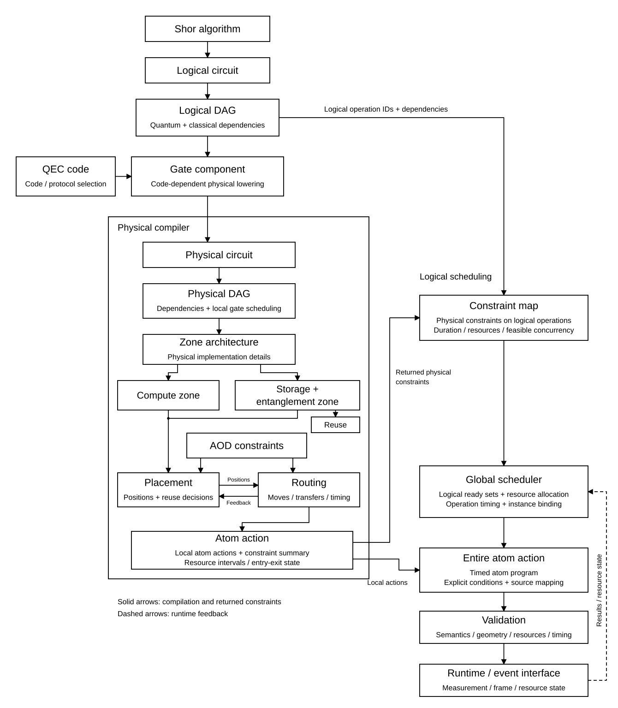

# 中性原子平台仿真框架（Surface Code 版本）

更新日期：2026-10-10

本文说明当前 Surface Code 路线下的整体编译与执行框架，并区分目标架构与已验证范围。流程图来自用户提供的 `flowchart-recommended.svg`，原图作为同目录资源保留。

## 一、要解决的问题

输入端是 Shor-15 等逻辑量子程序；输出端是能在声明的中性原子设备模型里执行的、带依赖和时间的原子动作。系统还要保留测量反馈、工厂资源生命周期、结果来源和从逻辑操作到物理动作的映射。

系统不是把一长串逻辑门一次性交给单个路由器。它先把逻辑层要做的事讲清楚，再调用经过检查的组件实现物理操作；调度器把多个组件接在同一个设备现场里，运行结果再决定后续分支。图中的实线表示主要编译和约束返回关系，虚线表示运行时反馈。

当前实现以 Surface-17 / d=3 为明确对象。码块几何、朝向、稳定子协议和设备资源均有适用范围。换成一般 qLDPC 时，码结构、稳定子测量、逻辑门和约束映射都需要新的协议与资格检查，不能只替换一个“code”标签。

## 二、从 Shor 逻辑电路到码块依赖图

Shor 前端产生量子和经典操作。每个操作保留来源、参数、目标逻辑码块、测量结果依赖和条件。以 Shor-15 为例，模乘、相位寄存器测量、经典反馈和后处理必须在同一份源计划中可追溯。

这些操作组成 **LogicalDAG（逻辑依赖图）**。它回答：

- 哪些操作必须先后执行；
- 哪些测量结果是后续操作的输入；
- 条件分支依赖哪个已发布的经典结果；
- 哪些操作作用在同一个码块，哪些涉及多个码块。

逻辑 DAG 表达程序依赖，本身不能证明两项操作可以在设备上并行。数据码块之间可能有依赖，物理组件可能争用 AOD、测量区或共享门资源；因此“逻辑上同时 ready”只是进入后续资源判断的候选。

### QEC code 与逻辑门组件

QEC code / protocol 选择为每类逻辑操作指定有正确编码语义的实现。单码块维护和门（如 SE、逻辑 H）与跨码块操作（如 CX/CZ）要保留不同的作用数、方向、输入输出码块状态和测量关系。

经审核的组件把这些逻辑操作展开成有源映射的物理门、测量、复位、局部依赖与资源摘要。组件目录可复用相同的内部实现和选定批次；每次调用仍要绑定当前码块、码位对应关系和结果端口。静态组件不保存这次运行的测量值、Pauli frame、token 或 epoch。

## 三、物理编译器：区域、布局和路由

物理编译器把组件所需的原子操作放到具体设备上，并检查位置、操作区、时间和搬运是否可行。

**Zone architecture** 属于物理编译部分。Compute zone、storage zone 和 entanglement zone 的功能与容量要由设备配置约束。门和读出各自在其支持区域中执行；跨区移动需明确产生运输动作和时间，不能只修改坐标或播放动画。

**Placement（布局）** 决定码块在设备上的位置。码块内部的 canonical 结构与码块之间的整体布局是两层问题：内部结构说明逻辑码位如何落到原子上；整体布局还要兼顾数据码块之间的门、工厂区域、读出服务和后续运输。完整运行应记录布局算法使用的输入、配置和输出，让最终布局确实影响物理计划。

**Routing（路由）** 把当前位置连接到门、测量或存储所需的位置，并核对 AOD/SLM 捕获、扫掠、占用、运动、共同广播和接近距离。新位置可以需要一条新的几何连接；已有组件中可复用的内部门序列和批次则保持不变。

图中的 AOD constraints 不是布局完成后的装饰条件，而是布局和路由求解时必须满足的设备约束。物理编译器应返回所选位置、运输动作、持续时间、资源占用以及无法执行时的冲突原因。

## 四、两层调度与 conflict map

调度包含两个互相反馈的层次：

1. **逻辑调度**从 LogicalDAG 中找依赖已满足的操作，再根据码块关系和物理约束摘要筛选并发组合。
2. **物理调度**为筛选后的组合分配实际位置、AOD 行列、门时段、测量服务和运输动作，形成 PhysicalDAG 与带时间的 AtomProgram。

两层之间的 constraint map / conflict map 把物理约束翻译成逻辑调度能使用的信息：哪些门组合可共时，哪些会争用共享资源，哪些位置或路由不可行，需要延后或重新布局。物理编译器把约束和可行窗口反馈给逻辑调度器；逻辑调度器再根据 ready 节点和资源状态选择下一组操作。

调度不能只按 DAG 顺序把操作排成队，也不能因为两个节点逻辑上独立就直接并发。并行必须能在实际动作与资源区间中看到，并通过几何、依赖和共享资源检查。当前完整的通用 conflict map、任意双运动并行和 surgery 条件下的通用调度仍是架构工作，不能从单个并行小例外推出已普遍解决。

## 五、完整原子动作与持续运行时

物理 DAG 展开为 **Entire atom action（完整原子动作计划）**，每项动作都能追溯到源逻辑操作、码块与物理原子，同时记录条件、依赖、时间和资源。随后经过语义、几何、资源和时序验证，才交给单一持续运行会话。

运行时推进同一个原子现场：前一组件的实际出口位置、码位映射、测量结果与资源状态成为下一组件的入口。结果未 ready 时，只阻塞依赖该结果的后续操作；共享资源冲突时，按约束安排等待。运行日志、测量分支和动画都来自同一份执行记录，避免独立动画拼接后看起来连贯、现场却没有接续。

新主线的入口是 `entry_mode=preinitialized`：初始量子比特已按合同初始化，不额外加入 initialization zone 或启动搬运。初始编码、物理身份和布局仍需声明。运行中的 SE、门、测量、复位和魔态流程仍须按电路实际执行。

## 六、魔态工厂与注入

Magic-state factory 是逻辑程序的资源生产方，不是 T 门的绘图素材。生产、接受/拒收、输出转换、ready、预约、注入、条件修正和释放都要留下资源身份、carrier、token、epoch 与时间记录。T 请求只有在兼容输出可用后才能继续，等待期间也要占用对应的资源。

目标架构还要求工厂生产能独立于数据运算持续推进，借助异步供给减少数据码块等待；注入时再把已 ready 的魔态输出接到算法指定的数据码块。算法请求已经绑定具体操作数时，接口必须保留其目标，不能把另一个数据块偷偷替换进来。

当前单工厂兼容路径曾完成一次 no-loss fake-event Shor-15 pipeline：2102 个源节点均有终态，包含真实条件跳过；完整 1082 个运行窗口及 35 份工厂消费记录经独立检查，模型时间约 6.088 秒。这证明受限单线基线具备一条连续运行路径，不代表多工厂架构已交付。用户拒绝把它作为总体目标完成，因为布局没有按要求优化，魔态供给没有实现独立异步的多线运行，现有双 AOD 声明也没有接成所要求的持续生产调度。

## 七、loss、实时后选择与失败恢复

带 loss 的动态设计需要明确损失发生时能观察到什么、影响哪些码块和结果、当前操作能否继续、后续布局如何更新、是否需要丢弃或重建组件，以及 token、载体和任务依赖怎样安全收尾。

实时后选择还需要根据刚刚提交的测量结果，决定接受当前输出、拒绝并清理、请求补产，或调整还未执行的后续模块。已提交的物理动作和已经发布的测量不能被修改；重排只作用于未来。每条动态路径都要可回放、可审查，不能用预填入动画的结果代替运行时决策。

这些部分目前尚未完成通用实现。设计时也必须把 waiting、back-pressure、资源释放、loss recovery 和后选择连接到同一状态机和事件记录中；只在图上画出反馈箭头并不代表动态能力已经通过验收。

## 八、当前完成范围与未完成项

| 范围 | 当前记录 | 边界 |
|---|---|---|
| Surface-17 逻辑门及物理组件 | 已有一批可调用、限定设备与码块合同的组件 | 不自动推广到 qLDPC、任意码距或所有布局 |
| 单工厂 Shor-15 | 无 loss fake-event 条件场景下有完整运行和独立窗口检查 | 205 原子基线布局；用户已拒绝将其作为总体交付 |
| 组件接口和连续调用 | 入口绑定、运行上下文及局部调用已有实现与检查 | 并不等价于通用、多线路、异步工厂接口全部交付 |
| 多工厂与双 AOD | 资源和部分接口有局部设计/fixture | 独立持续生产、左右工厂布局和异步共享调度尚无完整运行资格 |
| loss 与实时后选择 | 已明确是后续架构工作 | 无通用动态状态机和端到端验收 |
| 量子态、含噪保真度与硬件 | 不属于上述 fake-event Shor 运行证明 | 不能由动画、组件覆盖或 schedule 结果推断已完成 |

验收应依次确认：源逻辑与两个 DAG 的映射完整；布局与设备约束实际参与编译；组件入口/出口与同一运行连续；工厂 token、carrier、epoch 和等待/释放一致；loss/后选择路径能按已提交结果控制未来动作；最终日志、viewer 与事件记录出自同一运行。只有符合用户提出的布局和异步供给目标，并通过相应运行检查，才能更新总体交付状态。

